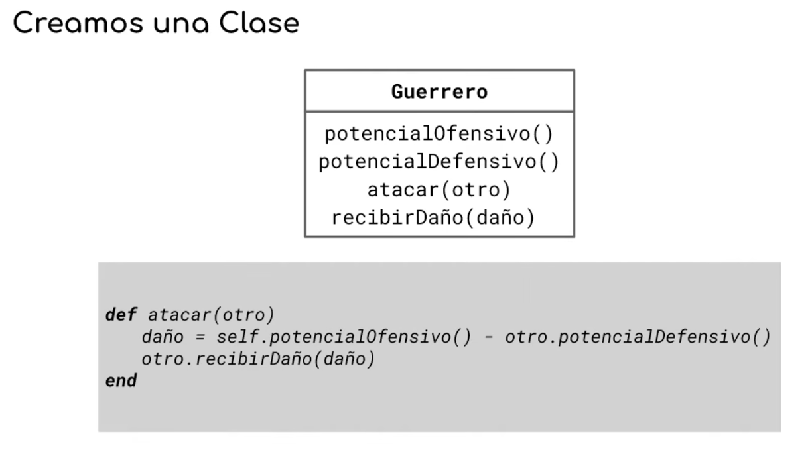
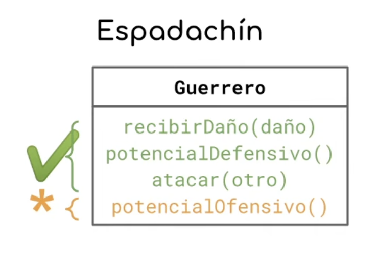

# Apunte Maestro — Clase 01 — Parte 1: El modelo base y la primera decisión de diseño

> **Técnicas Avanzadas de Programación (TADP) — UTN FRBA — 2C 2026**
> **Nota de lectura:** los diagramas anotan los mensajes en notación genérica (`potencialOfensivo()`); el código Ruby los escribe `potencial_ofensivo`. Es el mismo mensaje escrito de dos maneras.

---

## Cómo se trabaja en esta materia

Antes de arrancar conviene entender la mecánica, porque cambia lo que hay que estudiar.

Acá se plantea un problema chico, se proponen soluciones, y se las somete a presión hasta encontrar dónde revientan. Va a pasar seguido que **tengas razón y aun así la solución se descarte**. Vas a decir una serie de afirmaciones impecables, sin un solo error, y ser una respuesta perfecta a la pregunta equivocada.

Eso no es un juego retórico: lo que se evalúa nunca es la respuesta, es **el porqué**. Y hay un tipo de argumento que directamente no cuenta: *"la herencia es mala"*, *"esto no escala"*, *"no se copia y pega"*. Son heurísticas heredadas de alguien, repetidas sin el problema concreto que las originó. Si no podés nombrar **qué se rompe exactamente y cuándo**, no tenés un argumento, tenés una consigna.

La regla de la materia es al revés: primero el problema concreto, después la herramienta.

---

## 1. 🔴 El dominio: un juego de estrategia

Todo el hilo de hoy se construye sobre un juego de estrategia estilo *Age of Empires*.

El planteo mínimo: existen **guerreros que pueden atacarse entre sí**. Cada guerrero tiene tres números —un **potencial ofensivo**, un **potencial defensivo** y una cantidad de **energía**— y una regla de combate:

> Cuando un guerrero ataca a otro, compara su potencial ofensivo contra el potencial defensivo del otro. Si el ofensivo del atacante es mayor o igual al defensivo del defensor, el defensor pierde en energía la diferencia entre ambos.

Nada más. El dominio es deliberadamente ridículo de simple, porque lo que interesa no es el juego: es **qué estructuras elegimos para representarlo y por qué**.

> **⚠️ El código es secundario, la estructura es el tema.** Vas a ver implementaciones que podrían mejorarse (por ejemplo, `atacar` no contempla qué pasaría con un daño negativo). Eso no es un descuido a corregir: es que la discusión pasa por otro lado. Guardá esa energía crítica para las decisiones de modelado.

---

## 2. 🔴 El primer modelo: la clase Guerrero

Lo más obvio: modelar a los guerreros como objetos, instancias de una clase `Guerrero`, con los tres números como variables de instancia.

```ruby
class Guerrero
    # attr_accessor genera automáticamente el getter y el setter de cada
    # variable de instancia listada. Sin esto, las variables existirían pero
    # nadie de afuera podría leerlas ni escribirlas.
    attr_accessor :energia, :potencial_ofensivo, :potencial_defensivo

    # Recibe por parámetro al otro guerrero: el guerrero no "sabe" a quién
    # ataca de antemano, se lo dicen en el momento del mensaje.
    def atacar(otro_guerrero)
        # Guarda: si mi ataque no supera su defensa, el ataque simplemente
        # no produce nada. Sin este if, un ataque débil "curaría" al otro.
        if(self.potencial_ofensivo >= otro_guerrero.potencial_defensivo)
            # El daño es la diferencia. Lo que la defensa alcanza a frenar,
            # no llega.
            danio = self.potencial_ofensivo - otro_guerrero.potencial_defensivo
            # No le bajo la energía yo: le pido a él que sufra el daño.
            # Quién modifica el estado de un objeto es el objeto mismo.
            otro_guerrero.sufri_danio(danio)
        end
    end

    def sufri_danio(danio)
        # Acá sí hay modificación de estado: la energía baja.
        self.energia = self.energia - danio
    end
end

# ¿CÓMO FUNCIONA?
# 1. Le mandás `atacar` a un guerrero, pasándole otro guerrero.
# 2. El atacante compara sus propios números contra los del defensor.
# 3. Si supera la defensa, calcula la diferencia...
# 4. ...y le manda `sufri_danio` al defensor con ese número.
# 5. El defensor se baja la energía a sí mismo.
# El atacante nunca toca la energía del otro directamente: se la pide.
```

Ejemplo completo y ejecutable, con el resultado esperado ya anotado:

```ruby
espartano = Guerrero.new                 # Guerrero.new crea una instancia nueva
espartano.potencial_ofensivo  = 30       # los setters vienen de attr_accessor
espartano.potencial_defensivo = 20
espartano.energia             = 100

hoplita = Guerrero.new
hoplita.potencial_ofensivo  = 25
hoplita.potencial_defensivo = 18
hoplita.energia             = 100

espartano.atacar(hoplita)
puts hoplita.energia
# Resultado esperado: 88
# (30 >= 18, entonces daño = 30 - 18 = 12; energía = 100 - 12 = 88)

recluta = Guerrero.new
recluta.potencial_ofensivo  = 10
recluta.potencial_defensivo = 5
recluta.energia             = 100

recluta.atacar(espartano)
puts espartano.energia
# Resultado esperado: 100 (sin cambios)
# (10 >= 20 es falso: el if no entra y no pasa absolutamente nada)
```



*La clase `Guerrero` expone cuatro mensajes: `potencialOfensivo()`, `potencialDefensivo()`, `atacar(otro)` y `recibirDaño(daño)`. Esos cuatro mensajes son su interfaz completa, y conviene retenerlos: van a funcionar como línea de base para todo lo que venga después.*

### La sintaxis de Ruby que hace falta acá

Tres cosas nuevas, porque el lenguaje va a aparecer sin presentación previa:

**`class ... end`.** Ruby no usa llaves ni indentación significativa para delimitar bloques: abre con la palabra que define la estructura (`class`, `def`, `if`) y **cierra con `end`**. El contexto empieza apenas se define la estructura y termina en su `end`.

**`attr_accessor`.** Define de un saque los *accessors* —el getter y el setter— de cada variable de instancia que le pases. Es lo que te permite hacer `guerrero.energia` para leer y `guerrero.energia = 50` para escribir, sin escribir esos métodos a mano.

**Los símbolos (`:energia`).** Los nombres de las variables no se pasan como strings sino con dos puntos adelante. Esa sintaxis define un **símbolo**: un tipo de objeto que se usa como identificador, y cuya propiedad clave es que **es único en el sistema**. Cada vez que escribís `:bleh` en cualquier parte del programa, es literalmente el mismo objeto.

```ruby
a = :bleh
a == :bleh
# Resultado esperado: true
# No son dos símbolos iguales: son el mismo objeto.
```

> **🕳️ Madriguera — snake_case y otras batallas**
> En este código los nombres van en `snake_case` (`potencial_ofensivo`), no en `camelCase`. Es la notación de Ruby, y pelearse con la notación del lenguaje que estás usando es una batalla que no conviene elegir: más adelante la sintaxis del lenguaje va a hacer que la convención propia se ponga directamente engorrosa.
> *Volvé al camino — es convención, no diseño.*

---

## 3. 🟡 ¿Por qué una clase y no un objeto suelto?

Vale la pena frenar acá, porque la decisión pasó demasiado rápido.

Muchos lenguajes permiten crear objetos directamente, sin pasar por una clase. Entonces, ¿por qué una clase?

Porque **anticipo que voy a necesitar muchos guerreros**. Ya el requerimiento mínimo —que dos guerreros se ataquen— exige dos. Una clase es un molde del que se instancian múltiples objetos que se comportan igual, cada uno con su propio estado interno. Ese es todo el criterio: necesito varios individuos con el mismo comportamiento y estado distinto.

Y una segunda pregunta, igual de válida: ¿por qué una clase **nueva**, y no alguna que ya exista? Porque **necesito esa interfaz**, y ningún número ni string sabe responder `atacar`.

Fijate lo rápido y automático que fue todo eso. Ese automatismo es cómodo hoy y va a ser un problema más adelante, cuando el algoritmo que corremos en la cabeza para decidir qué construcción crear tenga que volverse bastante más complejo que "aparece un sustantivo, hago una clase".

> **📝 Para el parcial, si te preguntan: ¿por qué modelaste esto como una clase y no como un objeto?**
> Porque necesito múltiples instancias con el mismo comportamiento y estado propio: el requerimiento ya pide como mínimo dos guerreros para que uno ataque al otro. Si necesitara un único individuo, un objeto alcanzaría y la clase sería estructura de más.

---

## 4. 🟡 El único mensaje que tiene efecto

De los cuatro mensajes del guerrero, tres responden algo y no modifican nada. `sufri_danio` es distinto: **es el único que tiene efecto**, es decir, el único que cambia el estado del sistema.

Es una distinción chica que conviene tener nombrada, porque cuando más adelante se discuta qué le corresponde saber hacer a quién, la diferencia entre "responder algo" y "cambiar algo" va a pesar.

Con esto quedan repasados los conceptos base sobre los que se apoya todo lo que sigue: **objeto, clase, instancia, mensaje, método, atributo, accessors y efecto**.

---

## 5. 🔴 Primer requerimiento: aparece el espadachín

Nuevo requerimiento:

> Aparecen los **espadachines**. Son muy parecidos a los guerreros: hacen exactamente lo mismo, solo que además de su potencial ofensivo propio tienen **una espada que les suma un extra**. Para calcular el potencial ofensivo de un espadachín hay que mirar su potencial ofensivo propio y sumarle el de la espada.

La respuesta llega casi instantánea, y es correcta: hace falta una entidad nueva. Con la información disponible es tan obviamente correcta que parece ridículo detenerse.

Detengámonos igual, porque adentro de esa obviedad hay dos decisiones distintas metidas en la misma bolsa, y solo una es obvia.

---

## 6. 🔴 ¿La espada es un número o es un objeto?

El requerimiento dice "tiene una espada". Eso admite dos modelados completamente distintos:

**Opción A — la espada es un número.** No creamos nada nuevo para la espada. El guerrero pasa a tener un atributo más, un `potencial_ofensivo_de_arma`, que vale `0` para la enorme mayoría de los guerreros y `5` para uno que lleve espada. El cálculo del ataque suma ese número.

**Opción B — la espada es un objeto.** Existe una clase `Espada`, con su propio potencial ofensivo, y el espadachín la tiene como atributo:

```ruby
class Espada
    # Una clase mínima: solo estado, todavía sin comportamiento propio.
    attr_accessor :potencial_ofensivo
end
```

Ahora la parte incómoda: **las dos están mal**, y cada una tiene un nombre.

Quien elige el número está **subdiseñando**, y comete una falta conocida como **primitive obsession** —"obsesión con los primitivos": usar tipos básicos (números, strings, booleanos) para representar conceptos del dominio que merecerían su propia entidad. *Un "smell" es un síntoma en el código: no es un error, no rompe nada, pero avisa que hay una decisión de diseño floja debajo.*

Quien elige el objeto está **sobreingenierizando**: creando estructura para resolver problemas que todavía no tiene. También es un smell.

**Cualquier cosa que hagas está mal.** Bienvenido al diseño.

---

## 7. 🔴 Por qué el número se queda corto

Modelar con un número no es gratis. Tiene un problema inmediato: **¿cómo distinguís un espadachín de un guerrero?**

Supongamos que mañana baja este requerimiento: *los espadachines tienen que poder pulir su espada, y pulirla le suma dos puntos*.

¿Dónde ponés `pulir_espada`? Se lo tenés que poner **a todos los guerreros**, porque ya no tenés una entidad que represente a los espadachines y otra que represente a los guerreros: tenés **una sola**. Y como tenés un solo lugar, tenés un solo origen para todo. No hay dónde poner algo que sea de unos y no de otros.

Además, un espadachín con una espada de mierda que suma `0` y un guerrero que nunca tuvo espada te quedan **indistinguibles**. Son el mismo objeto con el mismo número.

### La salida que parece obvia y es peor

Llegado ese punto, el reflejo es agregar una etiqueta: un campo que diga "esto es un espadachín" y otro "esto es un guerrero". Un **type check** — un valor guardado dentro del objeto cuyo único propósito es indicar de qué tipo es.

¿Cuánto tiempo aguanta eso? Hasta que aparece la primera lógica que difiere. Y ahí empezás a escribir:

```ruby
# Lo que pasa cuando el tipo es un dato en vez de una estructura:
if guerrero.tipo == :espadachin
    # una cosa
else
    # otra cosa
end
```

Eso es un **switch statement**, y en objetos es un antipatrón conocido: la forma de reemplazarlo es **polimorfismo**. Pero fijate el detalle que importa —y es el que va a volver una y otra vez en esta materia:

> **Para tener polimorfismo necesitás múltiples entidades.** Clases, objetos, lo que sea, pero más de una. Porque el único lugar donde podés poner un método que se comporte distinto **es otra estructura**. Un solo lugar no puede responder de dos maneras.

O sea que el camino "no creo entidades nuevas" te lleva, en pocos pasos, a escribir código que va **activamente en contra** de lo que el paradigma propone. Y esa es una señal fuerte: cuando tu solución te empuja a pelearte con las herramientas del paradigma, lo más probable es que hayas errado el modelado.

### El fondo del asunto

Hay algo más profundo que la comodidad: **la forma del dato es parte de la semántica**.

Solo por ser un espadachín ya es distinto. No es "un guerrero más con un número diferente": es otra cosa. Si el modelo no puede expresar esa diferencia, el modelo está perdiendo información que el dominio sí tiene.

---

## 8. 🟡 Qué te compra modelar la espada como objeto

Del otro lado, ¿qué ganás concretamente al crear la clase `Espada` en lugar de poner un número?

Por ser un objeto, la espada:

- **tiene estado propio** —puede guardar sus propias cosas—;
- **tiene interfaz** —puede saber hacer cosas que solo una espada hace—;
- **puede recibir lógica delegada**: cualquier cálculo que ibas a hacer con el número podés mudarlo adentro de la espada si te parece que ahí corresponde;
- **puede subclasearse**: podés tener variantes de espada, hacerla abstracta, modelar una jerarquía de armas.

Todo eso es potencial. Y acá viene la pregunta que ordena la decisión:

> **¿Importa hoy la diferencia, si no tenés lógica para subclasear ni estado que aprovechar?**

No. Hoy no importa.

---

## 9. 🟢 ¿Y la performance?

Alguien lo va a plantear, así que resolvámoslo y sigamos.

Con la espada como número, un espadachín es **un objeto**. Con la espada como objeto, son **dos**. Multiplicado por la cantidad de espadachines vivos, eso es memoria.

Es cierto, y es **lo último que uno mira**. Necesitarías cientos de millones de espadachines simultáneos para que esto se vuelva el problema de tu sistema. Cuando tengas un problema de performance real, casi con certeza va a ser una consulta mal hecha a la base de datos, un pedido por cliente que debería ser uno solo, o una colección mal manejada. Recién después de descartar todo eso se mira la cantidad de instancias.

**Se puede optimizar, sí, pero siempre después de medir.** Nunca antes, porque vas a estar apostando a ciegas sobre dónde está el problema.

Y si un día resultara ser el problema, la solución es fácil y no te obliga a tirar el diseño: **una sola espada compartida por configuración posible de valores**. Si hay una cantidad limitada de tipos de espada, tenés esa cantidad de instancias en total, sin importar cuántos espadachines haya. El problema de memoria se disuelve y el modelo queda igual.

> **🕳️ Madriguera — Optimización estructural en motores de videojuegos**
> En motores reales (Unreal, Godot) las optimizaciones estructurales existen y pesan de verdad, porque hay que sostener una cantidad de cuadros por segundo. Aun así, ahí tampoco hay fobia a la herencia ni a multiplicar clases: primero se resuelven otras cosas.
> *Volvé al camino — no es el criterio de esta decisión.*

---

## 10. 🔴 El criterio que sí sirve: el costo de salida

Si las dos opciones están mal y la performance no decide, ¿con qué criterio elegís?

Con este:

> **Una decisión de diseño no vale por lo que cuesta tomarla, sino por lo que cuesta deshacerla.**
> No pienses solo en el precio de entrada. Preguntate: si todo esto se va a la mierda, **¿qué tan difícil sería irme de acá?**

Aplicado al caso: si modelaste la espada como el número `0` y mañana baja una lógica que claramente le corresponde a una espada, **creás la espada y listo**. Es un cambio chico, local, sin ondas expansivas. El costo de salida es bajísimo.

Por eso hoy las dos soluciones son defendibles y la elección es casi de gusto. **Y es importante no confundir cuándo algo es cuestión de gusto**: cuando lo es, la decisión no es importante y no hay que quemar tiempo en ella. Cuando no lo es, hay que decidir con el mejor criterio disponible.

> **📝 Para el parcial, si te preguntan: ¿la espada va como número o como objeto? Justificá.**
> Depende, y hoy da igual: no hay ni lógica ni estado propios de la espada que aprovechar, así que el objeto sería estructura sin uso y el número no pierde nada. Lo que inclina la balanza es el **costo de salida**: si mañana aparece comportamiento propio de la espada, pasar del número al objeto es un cambio local y barato. Cuando ese comportamiento aparezca, el objeto pasa a ser la opción correcta.
>
> *Ojo con el "depende" pelado.* Es la mejor respuesta que puede dar un ingeniero —salvo cuando quien pregunta es otro ingeniero, porque ahí lo primero que te van a pedir es **de qué depende**. El "depende" solo vale acompañado de la variable que lo define.

---

## 11. 🟡 El futuro, la entropía y lo que no podés saber

Detrás de casi toda discusión de diseño se cuela el mismo argumento: *"¿y si mañana pasa tal cosa?"*. Vale la pena desarmarlo, porque es el que más se abusa.

**Ningún sistema resiste cualquier cambio.** Está demostrado: siempre existe un requerimiento capaz de romper cualquier diseño que hagas. Todo sistema tiende a la entropía y contra eso no se gana. Así que "yo puedo imaginar un requerimiento que rompe esto" **no es un argumento**: siempre se puede.

La pregunta correcta no es si el sistema resiste *cualquier* cambio, sino si resiste **los cambios que efectivamente van a venir**:

> El mejor sistema es el que soporta los cambios que van a venir.

Lo cual deja una conclusión incómoda: el mejor feature que podés tener para desarrollar software es **ver el futuro**. Y eso se gana con experiencia, no con inteligencia. Alguien que lleva cuarenta años en un dominio ya vio el futuro: es su pasado. Sabe por dónde crece el negocio, qué cosas juraron que nunca iban a cambiar, y cuáles cambiaron igual. Vos no tenés esos datos y no hay forma de deducirlos.

Un caso concreto de cómo se siente eso: un sistema para un servicio de limpieza de veredas, construido sobre el supuesto de que cada cliente tiene una vereda. Entregado el sistema, aparece el dato: hay clientes con dos o tres. Toda la lógica estaba pegada al cliente asumiendo que la vereda era un valor y no una colección de objetos, y hubo que rehacer para atrás.

¿Fue mal diseño? No. **No podés saber lo que no sabés, y no podés saber lo que no te dijeron.** Era perfectamente razonable asumir una sola vereda.

De ahí salen dos ideas que conviene llevarse:

**Los problemas de diseño que tenés son los de ahora.** El presente es ineludible: los requerimientos de hoy hay que resolverlos hoy. El futuro es donde viven todas las heurísticas de diseño —"¿es escalable?", "¿es mantenible?", "¿y si el dominio cambia?"— y es también donde más fácil se justifica cualquier cosa.

**En esta disciplina no existe el sistema bien hecho.** Nada de lo que hagas va a estar *bien*; va a estar **suficientemente bien**: lo bastante bien parado como para que cuando llegue el problema —y va a llegar— puedas verlo venir, esquivarlo por un costado, y saber más o menos cuánto va a costar. Eso es todo el objetivo, y abrazarlo temprano ahorra mucha frustración.

---

## 12. 🔴 Dónde quedamos

La decisión sobre la espada quedó abierta a propósito, porque hoy no cambia nada. Lo que **sí** quedó cerrado es que el espadachín necesita ser una entidad propia: no alcanza con un guerrero con un número distinto.

Y ahora mirá con precisión qué forma tiene esa entidad nueva:



*De los cuatro mensajes del guerrero, el espadachín necesita los cuatro. `recibirDaño(daño)`, `potencialDefensivo()` y `atacar(otro)` los quiere **idénticos**. Solo `potencialOfensivo()` —marcado con un asterisco— se calcula distinto, porque tiene que sumar el aporte de la espada.*

Ese es el planteo exacto: **necesito algo que sea una copia completa del guerrero, con una sola diferencia.**

Escrito así, la pregunta que sigue se cae de madura, y es la que abre la Parte 2: **¿cómo se construye "lo mismo que aquello, pero con un cambio"?** Hay una respuesta inmediata que todos tenemos a mano, y vamos a tener que discutir en serio por qué no nos gusta —porque las razones que solemos dar para rechazarla no son las verdaderas.

---

**FIN DE LA PARTE 1 — El modelo base y la primera decisión de diseño**
