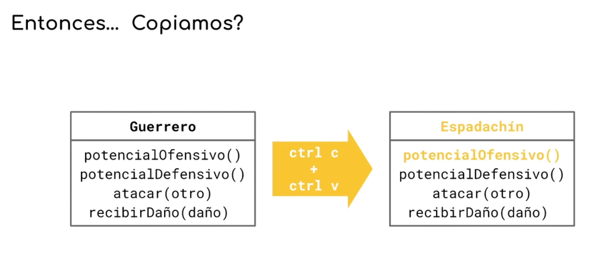
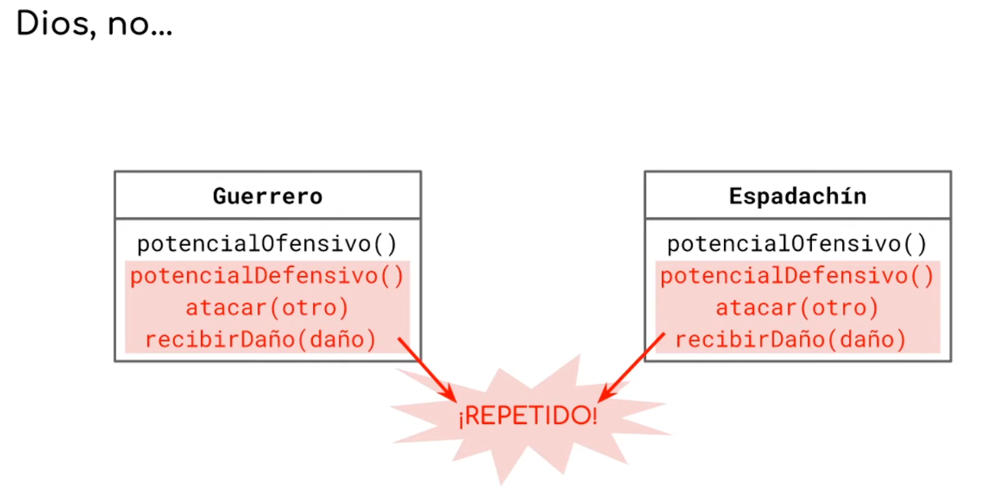
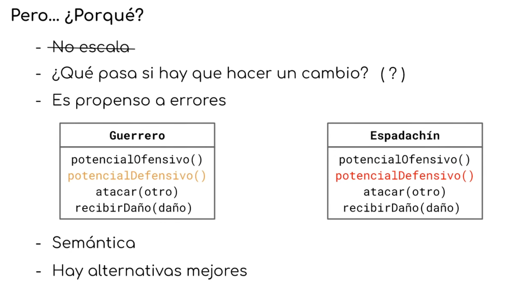
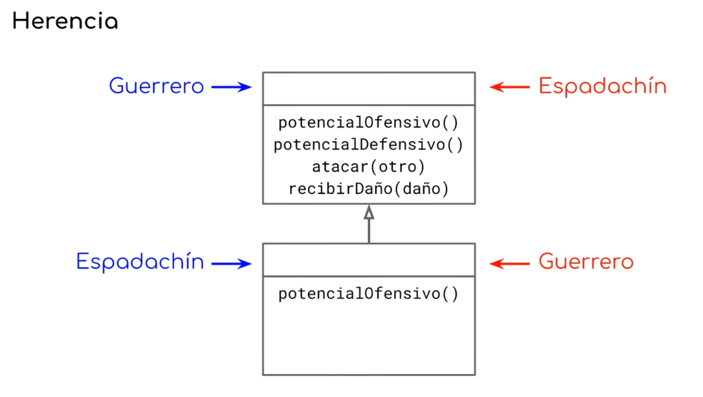
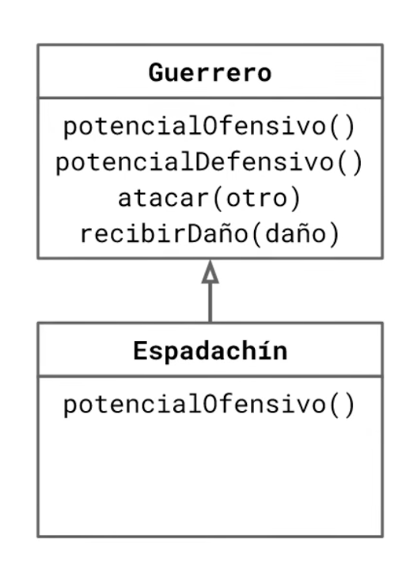

# Apunte Maestro — Clase 01 — Parte 2: Copiar y pegar, y las dos caras de la herencia

> **Técnicas Avanzadas de Programación (TADP) — UTN FRBA — 2C 2026**

Quedamos en un planteo preciso: necesitamos una entidad que sea **una copia completa del guerrero con una sola diferencia** —el cálculo de su potencial ofensivo—. Veamos cómo se construye eso.

---

## 1. 🔴 La respuesta inmediata: copiar y pegar

Hay una forma que resuelve el problema en dos segundos y funciona perfecto: agarrás la clase `Guerrero`, copiás todo su contenido, lo pegás en una clase nueva, le cambiás el nombre a `Espadachin` y le cambiás el único método que difiere.



*La clase `Guerrero`, con sus cuatro mensajes, se duplica entera. El resultado es `Espadachín`, idéntico salvo `potencialOfensivo()`, que se reescribe.*

El resultado:



*`potencialDefensivo()`, `atacar(otro)` y `recibirDaño(daño)` ahora existen dos veces, con exactamente el mismo código, en dos clases distintas.*

Y acá viene el reflejo colectivo: **no**. Copiar y pegar es malo, todos lo sabemos, no se hace.

Perfecto. Ahora justificalo.

---

## 2. 🔴 "Copiar y pegar es malo": desarmando los argumentos

Que quede claro antes de empezar: **no estamos haciendo apología de copiar y pegar**. Está mal y lo vamos a evitar activamente. El punto es otro.

El punto es que probablemente vos *no elegiste* esa convicción: alguien te martilló durante años "no se copia y pega" y lo compraste. Y **el problema de tener una idea que compraste pero no podés vender es que no sabés defenderla cuando alguien la discute.** El día que un jefe de proyecto o un compañero te diga "copiá y andate a tu casa", vas a tener que argumentar. Es literalmente parte de lo que te distingue de alguien que hizo un curso de veintidós semanas.

Así que veamos cuáles de los argumentos habituales aguantan.

### Argumento 1: "No escala" ❌

**Es falso.** Copiar y pegar **escala buenísimo**.

Copio, pego, ahora tengo dos: 100% de productividad. Copio todo y vuelvo a pegar: 200%. Es la forma más barata y rápida que existe de meter lógica nueva en un sistema. Escala muchísimo mejor que diseñar, porque diseñar implica sentarse, mirar el código, entenderlo, acomodarlo, mover cosas.

De hecho **ese es justamente uno de los problemas**: es tan barato que cualquiera lo hace, y no hay ningún mecanismo que lo detecte.

"No escala" pertenece a la misma familia que "no lo hagas porque sos de Capricornio". Es un gran argumento en el sentido táctico, porque deja al otro desarmado: nadie sabe bien qué significa escalar, igual que nadie sabe qué significa ser de Capricornio. Ninguna de las dos cosas tiene fundamento razonable. Como argumento técnico, no vale nada.

### Argumento 2: "¿Y si hay que hacer un cambio?" ⚠️

Este ya es mejor, pero se defiende solo a medias. Si mañana los guerreros y los espadachines tienen que hacer algo distinto, hay que ir método por método a cambiar.

¿Y? Hay herramientas automáticas. `Ctrl+H`, reemplazar todas las instancias, listo. Es incómodo, no es la muerte de nadie.

Ahora, apretemos un poco más. **¿Qué pasa si lo que hay que cambiar aparece también en otros contextos?**

Supongamos que el potencial ofensivo con el que se configuran ciertos guerreros es `17`, y ahora tiene que ser `18`. Pero `17` también se usa para otra cosa completamente distinta en el sistema. Ya no es `Ctrl+H` y listo: ahora es `Ctrl+H` y revisar setecientos noventa y nueve casos a ojo, decidiendo uno por uno si ese `17` es el que hay que tocar.

¿Y si te comés uno?

### Argumento 3: **Es propenso a errores** ✅

Este es el bueno, y conviene tenerlo en la punta de la lengua.

El problema del copiado y pegado **no es que sea incómodo, lento o feo**. El problema es que **puede haber lugares donde tenés que hacer el cambio y vos no sabés que tenés que hacerlo ahí**.

El escenario concreto: baja un requerimiento que dice "hay que cambiar el potencial defensivo de los guerreros". Alguien que no conoce el sistema —o vos mismo un martes cualquiera— entra, modifica el potencial defensivo del guerrero, y **se olvida del espadachín**. Porque el requerimiento decía "guerreros", y nadie le dijo que hay otra clase con el mismo código adentro.

El sistema ahora anda mal. Y anda mal de la peor manera posible:

> **Todos los tests van a seguir en verde.**
> Los tests del espadachín fueron escritos para verificar lo que el espadachín hacía **antes**. El espadachín no cambió, así que sigue haciendo exactamente lo que esos tests esperan. El test que debería romperse para avisarte no se rompe: te dice que todo está bien.

¿Cuándo lo vas a detectar? En ejecución, no en compilación. Y podrían pasar años sin que nadie use a ese tipo de guerrero en esa situación particular. Alguien podría incluso extender esa clase y seguir desarrollando encima durante mucho tiempo antes de que el sistema en producción muestre el síntoma.

Y ahí está el fondo: **"¿dónde hay que hacer el cambio?" es una pregunta que no se puede atajar ni automatizar.** No hay herramienta que la responda, porque dónde vive cada pedazo de lógica es una decisión de diseño tuya, no un dato que el lenguaje conozca.

> **🟡 Por qué objetos es un poco más generoso acá.** En un paradigma donde los datos y la lógica están separados —funcional, por ejemplo— no hay un núcleo centralizador: si no sos riguroso poniendo toda la lógica que corresponde a la misma forma de datos en el mismo lugar, no tenés cómo saber qué funciones ya existen, y duplicás por accidente.
> En objetos, **el objeto se autodescubre**: te dice qué te permite hacer. Si no está en el objeto, no lo podés hacer. Retené esta idea —el objeto como menú de lo que sabe hacer— porque va a volver enseguida y va a pesar mucho.

### Argumento 4: **La semántica** ✅

Hay una diferencia que parece filosófica y es totalmente práctica:

> **No es lo mismo que dos cosas sean *iguales* a que sean *la misma cosa*.**

Que el potencial defensivo del guerrero y el del espadachín sean **la misma cosa** —y no dos cosas que hoy casualmente coinciden— tiene connotaciones importantes. Al poner el método en un solo lugar no solo ganás la garantía de que no habrá desincronización: ganás **una referencia dura en el lenguaje**, una construcción que hace estructuralmente imposible que se separen.

Lo que le falta al copiar y pegar es justamente eso: **la idea de que espadachín y guerrero están asociados**. Y ojo con esto, porque es sutil: el requerimiento te dijo *"un espadachín es muy parecido a un guerrero"*. No te dijo que sean la misma cosa, ni que uno sea un caso del otro. Te habló de **cómo se comporta**, no de la naturaleza de lo que estás modelando. Esa asociación es **una decisión de diseño tuya**, no un dato que te bajaron.

### Argumento 5: **Hay alternativas mejores** ✅

Y usarlas es responsabilidad profesional. Somos ingenieros: si existe una herramienta mejor para el trabajo, elegir la peor por capricho o comodidad no es una opción neutra. Guardá este argumento, porque va a reaparecer cuando las decisiones sean bastante más difíciles que ésta.



*El repaso completo: "no escala" tachado por falso; "¿qué pasa si hay que hacer un cambio?" con un signo de pregunta, porque se defiende a medias; y tres que sí sostienen —es propenso a errores, la semántica, y que hay alternativas mejores—. Abajo, el mismo `potencialDefensivo()` resaltado en las dos clases: el mismo método que quedó cambiado en una y sin cambiar en la otra.*

> **📝 Para el parcial, si te preguntan: ¿por qué evitar copiar y pegar?**
> Porque es propenso a errores de una forma que las herramientas no detectan: puede haber lugares donde hay que replicar un cambio y no hay manera de saber cuáles son, y los tests existentes siguen en verde porque verifican el comportamiento viejo. Además, tener la lógica en un solo lugar expresa que se trata de **la misma cosa** y no de dos cosas casualmente iguales, y eso lo sostiene el lenguaje, no la disciplina del equipo.
> **No respondas "porque no escala": escala perfecto.** Ese argumento se cae en la primera repregunta.

---

## 3. 🟡 Los límites del DRY: cuándo la repetición es inevitable

Antes de seguir, hay que ponerle un techo a todo esto, porque llevado al extremo el principio se vuelve absurdo.

**Hay repetición que no podés evitar.** Ejemplos:

- Dos clases en ramas completamente distintas de la jerarquía que ambas tienen nombre. Las dos van a tener un método que devuelve el nombre, con el mismo código. Tener nombre es una cosa muy común. Ese código va a estar repetido y no hay forma de evitarlo. Incluso si lo extrajeras a algún lugar común y lo incluyeras en ambas, **el código de la inclusión** queda repetido.
- `Guerrero.new` escrito dos veces porque necesitás dos guerreros. Es repetición literal. Es inevitable.

Y un caso que muestra el fondo del asunto: yo tengo cuarenta años y mi casa tiene cuarenta metros cuadrados. Si ambos datos van al mismo programa, o tengo un número repetido, o tengo algo bastante peor: mi edad atada al tamaño de mi casa. Y ojalá que no, porque me gustaría mudarme a una más grande sin cumplir años.

> **Es imposible saber, mirando el código, que ciertos pedazos está bien que estén en dos lugares.** A veces dos cosas tienen la misma implementación por pura casualidad, y unificarlas sería el error.

De acá salen dos conclusiones:

**Primera:** evitar copiar y pegar es una **cuestión de criterio**, no una regla mecánica. Se evita activamente por los problemas concretos que trae, no porque esté prohibido.

**Segunda —y explica algo que quizá te llamó la atención—:** si estamos tan convencidos de que copiar y pegar está mal, **¿por qué no tenemos herramientas que lo rechacen?** Tenemos chequeadores de tipos, chequeadores de efectos, verificadores de estilo, herramientas formalistas de todos los colores. Mandamos un disco al espacio con las proporciones del cuerpo humano y una canción de Tina Turner. Pero no hay un compilador que te frene por duplicar código.

No lo hay porque **el síntoma no es el problema**. El síntoma es "hay dos pedazos de código iguales". El problema es "hay una misma lógica viviendo en dos lugares". Y desde afuera, sin entender el dominio, esas dos cosas son indistinguibles.

---

## 4. 🔴 La salida: herencia

Ya que el guerrero y el espadachín son tan parecidos, hagamos que **uno herede del otro**: una de las clases define todo el comportamiento, y la otra —una especificación de la primera— redefine lo único que las diferencia.

La herencia es una herramienta bien conocida y muy robusta, y resuelve el problema del código repetido de raíz. Pero apenas la elegimos aparece una segunda pregunta, **sutilmente más difícil que "¿usamos herencia o no?"**:



*Las mismas dos cajas, una arriba con los cuatro mensajes y otra abajo redefiniendo `potencialOfensivo()`. La pregunta no es si hay herencia: es qué nombre va en qué caja. En un camino, `Guerrero` va arriba y `Espadachín` abajo; en el otro, al revés.*

**¿Cuál de las dos va arriba?**

Fijate que mecánicamente da exactamente lo mismo. En las dos direcciones el código llega a donde tiene que llegar, los métodos quedan disponibles donde se los necesita, y el sistema funciona hoy sin una sola diferencia observable.

Y sin embargo una está bien y la otra está mal.

---

## 5. 🔴 La herencia hace dos cosas a la vez

Acá está la idea central de la clase, y conviene que quede grabada porque todo lo que sigue se apoya en ella:

> **Usamos herencia por dos motivos distintos, y solemos confundirlos:**
>
> **1. La mecánica.** Que los métodos lleguen a donde tienen que llegar. Lo que está definido arriba queda disponible abajo. Es el aspecto puramente operativo.
>
> **2. La naturaleza.** Qué tan bien lo que diseñaste **acompaña al modelo del dominio**. Es el aspecto semántico, y solo se manifiesta **en función del tiempo**.

Hoy, las dos direcciones funcionan idénticamente: la mecánica está resuelta en ambas. La naturaleza es lo que las diferencia, y solo se cobra la factura más adelante.

### Qué dice el dominio

En este dominio, **un espadachín es un guerrero**. Un guerrero **no** es un espadachín. Eso no es capricho ni gusto: es lo que te bajaron como requerimiento cuando te dijeron que el espadachín es un guerrero que además usa espada.

Hay entonces un entendimiento **previo** a la decisión técnica: mirás el dominio y decís *esto es un caso particular de aquello*. Y necesitás ver que ese entendimiento está completamente separado de la parte mecánica.

### Por qué importa: el paso del tiempo

Traigamos de vuelta el requerimiento que ya usamos antes: **los espadachines tienen que poder pulir su espada.**

- Con **`Guerrero` arriba**: agrego `pulir_espada` en `Espadachin` y afecta únicamente a los espadachines. Perfecto.
- Con **`Espadachin` arriba**: agrego `pulir_espada` y **el guerrero también lo recibe**. Un guerrero que no tiene espada ahora sabe pulir una espada que no tiene.

Y funciona igual de bien en la otra dirección: si mañana baja lógica nueva para todos los guerreros —digamos, que se puedan comer un sándwich—, con el árbol bien orientado la agrego una sola vez en `Guerrero` y **automáticamente la reciben también los espadachines**, porque un espadachín es un guerrero. El programa fluye junto con el dominio.

Ese es todo el punto de la naturaleza: **si el árbol refleja el dominio, los cambios del dominio se propagan solos y en la dirección correcta.** Si no lo refleja, cada cambio hay que duplicarlo a mano o pelearlo.



*`Guerrero` arriba con los cuatro mensajes; `Espadachín` abajo, heredando de él, redefiniendo únicamente `potencialOfensivo()`.*

Y el código, ahora sí:

```ruby
class Espada
    attr_accessor :potencial_ofensivo
end

# El < es la herencia en Ruby: "Espadachin es una subclase de Guerrero".
# Hereda energia, potencial_defensivo, atacar y sufri_danio sin escribir
# una sola línea de esos.
class Espadachin < Guerrero
    # Lo único propio del espadachín: su espada.
    attr_accessor :espada

    # Redefinimos SOLO este método. Los otros tres quedan como los del guerrero.
    def potencial_ofensivo
        # `super` sin paréntesis invoca el método del mismo nombre en la
        # superclase y devuelve su valor: acá, el potencial ofensivo base
        # que el guerrero ya sabía calcular. Le sumamos el de la espada.
        self.espada.potencial_ofensivo + super
    end
end

# ¿CÓMO FUNCIONA?
# 1. Le mandás `atacar` a un espadachín. Ese método NO está en Espadachin:
#    lo busca hacia arriba y lo encuentra en Guerrero.
# 2. Dentro de `atacar`, el guerrero hace `self.potencial_ofensivo`.
# 3. Pero `self` es el espadachín, así que el mensaje arranca la búsqueda
#    en Espadachin, y ahí SÍ hay una redefinición: la usa.
# 4. Esa redefinición pide `super`, que sube a Guerrero por el valor base,
#    y le suma el de la espada.
# El método heredado termina usando la versión redefinida sin saberlo.
# Eso es polimorfismo, y es exactamente lo que hace que esto valga la pena.
```

```ruby
katana = Espada.new
katana.potencial_ofensivo = 5

samurai = Espadachin.new
samurai.potencial_ofensivo  = 30
samurai.potencial_defensivo = 20
samurai.energia             = 100
samurai.espada              = katana

puts samurai.potencial_ofensivo
# Resultado esperado: 35   (5 de la katana + 30 propios)

hoplita = Guerrero.new
hoplita.potencial_ofensivo  = 25
hoplita.potencial_defensivo = 18
hoplita.energia             = 100

samurai.atacar(hoplita)
puts hoplita.energia
# Resultado esperado: 83
# (35 >= 18, daño = 35 - 18 = 17; energía = 100 - 17 = 83)
# Compará con la Parte 1: el mismo ataque sin espada dejaba 88.
```

> **📝 Para el parcial, si te preguntan: ¿quién hereda de quién, y por qué?**
> `Espadachin` hereda de `Guerrero`, porque en el dominio un espadachín **es** un guerrero y no al revés. Mecánicamente las dos direcciones funcionan igual —el código llega a destino en ambas—, así que la mecánica no decide nada. Lo que decide es la **naturaleza**: con el árbol orientado según el dominio, la lógica que baje para guerreros alcanza sola a los espadachines, y la que sea propia de los espadachines no contamina a los guerreros. Con la dirección invertida, el guerrero terminaría exponiendo mensajes que no le corresponden.

---

## 6. 🟡 Cuidado con la fobia a las construcciones

Un aviso, porque a esta altura alguien ya está pensando que la herencia es el diablo.

*"La herencia es mala"*, *"la herencia no se usa"*, *"herencia versus composición"* tirado como consigna: son exactamente el tipo de afirmación sin justificación detrás que en esta materia no cuenta como argumento.

Los datos, después de cuarenta años haciendo esto: **todos los programas orientados a objetos tienen una cuota de herencia.** Hay tecnologías que la favorecen más y otras menos. A veces uno implementa construcciones accesorias sobre la herencia a propósito, y a veces uno la evita activamente —por ejemplo, porque viene de una manera de pensar más cercana a funcional—. Pero decir que es raro ver herencia en un sistema es sencillamente falso.

**La herencia es una buena herramienta.** Es genial, está bien conocida, es robusta, y nos ahorra un montón de trabajo en la enorme mayoría de las situaciones.

Ahora bien: sí está discutida, y viene con un montón de construcciones incómodas. Pero la forma de discutirla no es *"mucha gente lo dice"* ni *"lo leí en un blog"*. Es: **¿qué problema concreto tiene esto, y ese problema aplica a mi contexto?** Si tenés una propuesta fundada sobre por qué la herencia sirve o no sirve acá, se profundiza y se discute con gusto.

Guardá esa pregunta, porque en un rato le vamos a encontrar un límite bien concreto —y no va a ser una opinión: va a ser una demostración.

---

## 7. 🔴 Dónde quedamos

El modelo cerró bien y sin deuda: dos clases, una jerarquía que refleja el dominio, cero código repetido, y la lógica llegando a donde tiene que llegar por mecánica y por naturaleza.

Todo esto sirvió para mostrar que **crear una clase no es automático**. Cada vez que aparece una entidad nueva hay que decidir si necesita una construcción propia o no, y si la necesita, hay que decidir **de quién cuelga** —y para eso hace falta entender la relación de esa entidad con el resto del sistema.

En la Parte 3 aparecen dos requerimientos nuevos. Ninguno de los dos es raro, ninguno es rebuscado, y son tan chicos que van a parecer un trámite. Con los dos juntos vamos a llegar a un punto donde el modelo de objetos que venimos usando **no puede seguir cumpliendo sus propias reglas**, y la única salida disponible va a ser algo que hoy consideraríamos una chanchada.

---

**FIN DE LA PARTE 2 — Copiar y pegar, y las dos caras de la herencia**
