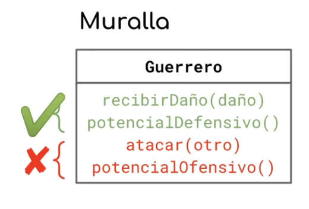
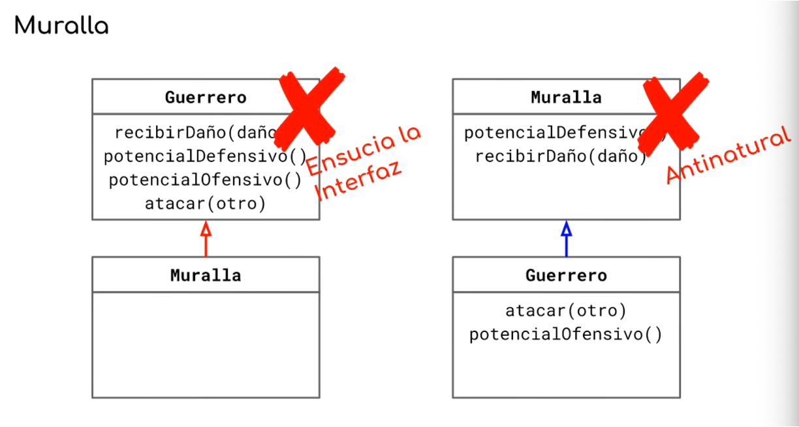
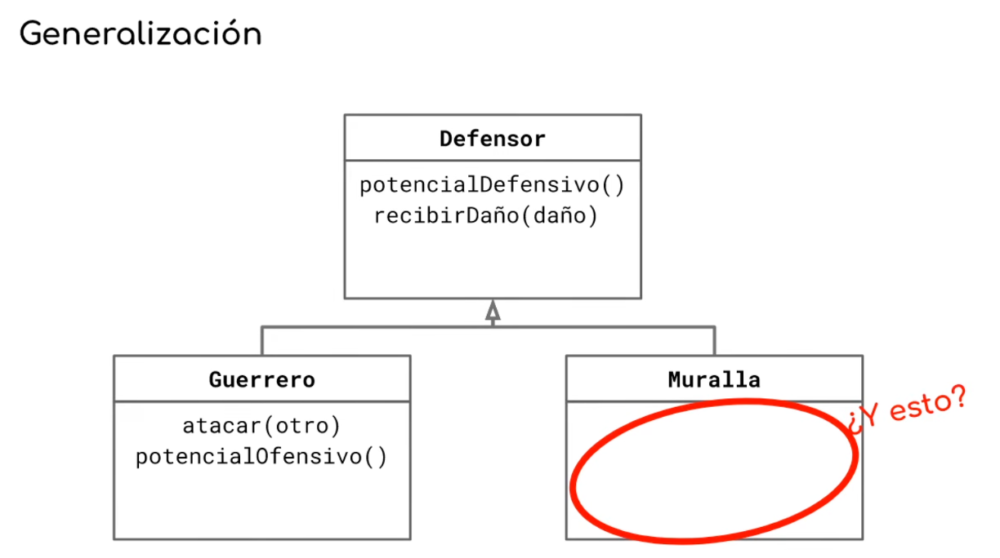
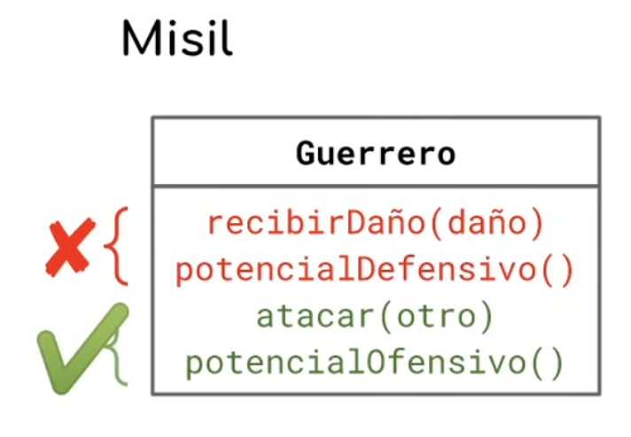
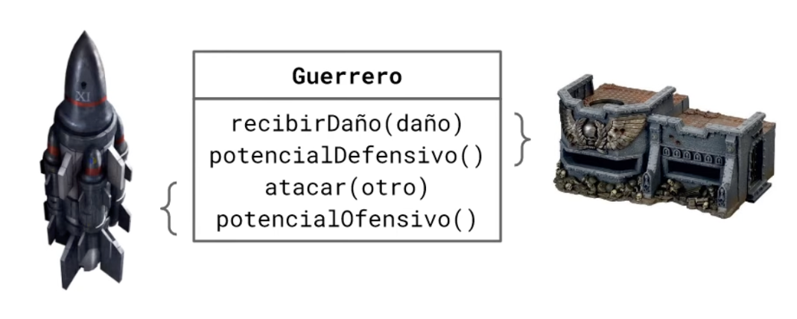
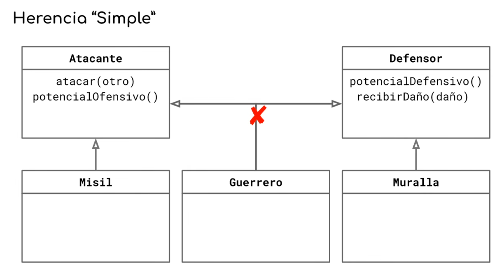

# Apunte Maestro — Clase 01 — Parte 3: La muralla, el misil, y el callejón sin salida

> **Técnicas Avanzadas de Programación (TADP) — UTN FRBA — 2C 2026**

---

## 1. 🔴 Segundo requerimiento: aparecen las murallas

> Aparecen las **murallas**. Son cosas que **pueden ser atacadas, pero que no pueden atacar**. No son particularmente agresivas.

De nuevo la respuesta es casi instantánea: hace falta una clase `Muralla`. Y podemos descartar rápido una serie de ideas que ya sabemos malas —ponerle una bandera al guerrero que diga "esto es una muralla"— por todas las razones que discutimos en la Parte 1.

Pero mirá con cuidado **qué forma** tiene esta entidad nueva, porque es distinta de lo que pasó con el espadachín:

*De los cuatro mensajes del guerrero, la muralla quiere `recibirDaño(daño)` y `potencialDefensivo()` —marcados con un tilde— y rechaza `atacar(otro)` y `potencialOfensivo()` —marcados con una cruz—.*

Con el espadachín queríamos **toda** la interfaz del guerrero y cambiar un método. Acá queremos **una porción**, y —esto es lo importante— de las otras dos no queremos que "no hagan nada":

> **Queremos que esos métodos no estén.** Que no formen parte de la interfaz de la muralla, en absoluto.

---

## 2. 🔴 Las dos opciones conocidas, y las dos están mal

Con las herramientas que tenemos, las opciones son las mismas de antes: que la muralla herede del guerrero, o que el guerrero herede de la muralla.

*Izquierda: `Muralla` hereda de `Guerrero`, tachado con la leyenda **"Ensucia la interfaz"** —la muralla recibe `potencialOfensivo()` y `atacar(otro)`, que no debería tener—. Derecha: `Guerrero` hereda de `Muralla`, tachado con la leyenda **"Antinatural"** —la muralla queda arriba con `potencialDefensivo()` y `recibirDaño(daño)`, y el guerrero abajo agrega `atacar(otro)` y `potencialOfensivo()`—.*

Cada una falla por un motivo distinto, y los dos motivos merecen desarrollo, porque son los dos criterios con los que vamos a juzgar todo lo que venga después.

---

## 3. 🔴 Ensuciar la interfaz: por qué es grave

En la Parte 2 quedó dicho al pasar que en objetos **el objeto se autodescubre**. Ahora hay que tomárselo en serio, porque es la gracia central del paradigma:

> Agarrás un objeto, le das `Ctrl + barra`, y **te dice todo lo que puede hacer**. No necesitás leer su código, ni buscar documentación, ni preguntarle a nadie. El objeto es un menú de sí mismo.

Eso se sostiene con una condición: que lo que el objeto ofrece sea efectivamente lo que el objeto puede hacer.

Si empezás a meter mensajes que no le corresponden, estás **poniendo trampas**. El objeto dice "sé hacer esto", pero si se lo mandás rompés el sistema. Y entonces el que lo use tiene que hacer exactamente lo que el paradigma prometía evitar: ir a leer el código para saber cuáles de los mensajes que ofrece son de verdad.

**Estás haciendo que el objeto sea más difícil de usar.** Y esa es una pérdida concreta, no estética.

Además hay un costo que llega después, con el tiempo: ir en contra de la naturaleza de tu dominio hace que **todo cambio haya que duplicarlo o pelearlo**. Si tenés lógica que es solo para el guerrero, la va a terminar teniendo la muralla. La conclusión hacia la que esto empuja es clara:

> Necesito una manera de diseñar en la que **cada cosa tenga solamente los métodos que le corresponden a sí misma**. Nada debería recibir un método que es propio de otro.

Retené esa frase. Es el requisito que vamos a estar tratando de cumplir toda la clase, y el que nos va a dejar sin herramientas.

---

## 4. 🔴 La naturaleza: mecánicamente perfecto y aun así mal

Miremos la otra opción, la de `Guerrero` heredando de `Muralla`.

Mecánicamente **está impecable**. Cada cosa tiene el método que tiene que tener: la muralla sabe recibir daño y conocer su potencial defensivo, el guerrero hereda eso y le agrega atacar y su potencial ofensivo. Nada sobra, nada falta, nadie expone lo que no debe. Si te dejás llevar por la mecánica, es la solución.

Y aun así está mal, porque **un guerrero no es una muralla**. Es abiertamente un pedido de problemas: no tiene sentido reparar un guerrero, ni escalarlo, ni ninguna de las cosas que en algún momento van a bajar como requerimiento para las murallas y que aplicarían al guerrero por herencia.

> **La herencia no es solamente hacer que las cosas lleguen a quien tienen que llegar.** Es también entender que estás dejando algo **cableado** para que se adecue al paso del tiempo.

Y de acá sale un mapa útil: la necesidad de herencia te llega por **uno de dos caminos**.

- **Por el camino mecánico:** te das cuenta de que estos métodos tienen que estar en dos lugares, hay que hacer algo, y entonces tenés que decidir qué cosa es un caso particular de qué otra.
- **Por el camino de la naturaleza:** simplemente *sabés* que un espadachín es un caso particular de guerrero, y querés reflejarlo en el programa —porque si queda reflejado, cuando aparezca un cambio el programa va a fluir junto con el dominio.

---

## 5. 🔴 La generalización

Si ninguna de las dos puede ser superclase de la otra, la salida es la que venimos usando hace décadas: **generalizar**.

> **Generalizar** es extraer una clase nueva a partir de clases que ya existen, poniendo arriba lo que tienen en común. Es la operación inversa a especificar —que es lo que hicimos con el espadachín, creando una subclase de algo existente—.

La pregunta que la guía no es "¿la muralla es un guerrero?" sino **"¿qué tienen en común el guerrero y la muralla?"**. Y la respuesta es: ambos pueden recibir daño y tienen un potencial defensivo. A esa abstracción le ponemos un nombre —`Defensor`— y la usamos como superclase de las dos.

*`Defensor` arriba con `potencialDefensivo()` y `recibirDaño(daño)`. De él heredan `Guerrero`, que agrega `atacar(otro)` y `potencialOfensivo()`, y `Muralla`, cuyo cuerpo está **vacío** —rodeado en rojo con la pregunta "¿Y esto?"—.*

La solución es francamente satisfactoria: cada entidad expone exactamente lo que le corresponde, la lógica compartida vive en un solo lugar, y el árbol acompaña al dominio.

Salvo por ese círculo rojo.

---

## 6. 🔴 La clase vacía

`Muralla` no tiene nada adentro. ¿Está mal?

Preguntémoslo en serio: **¿nadie tiene ningún reparo con una clase vacía?** No mientas.

Existe la alternativa. Si `Defensor` es una clase concreta, podés instanciar murallas directamente como defensores y borrar `Muralla`. Tenés todo lo que necesitás y una clase menos. **Es una solución perfectamente válida y no hay nada intrínsecamente malo en ese planteo.**

Pero hay algo que la otra solución ataja y ésta no.

Si creás todas tus murallas como instancias de `Defensor`, en caliente —en memoria, en la base de datos, en una colección— **todas tus murallas son defensores indistinguibles de cualquier otro defensor**. Y el día que baje un requerimiento que aplica solo a las murallas, no tenés cómo separarlas: perdiste la identidad de qué cosa es cada cosa. Se podría argumentar que les ponés un campo para distinguirlas, pero ya sabemos a dónde lleva ese camino: al `if`, al `switch`, y a pelearse con el polimorfismo.

Hagamos entonces el balance honesto de tener la clase vacía:

- **¿Qué perdés?** Absolutamente nada. Ni en tiempo de ejecución ni estructuralmente. El riesgo es nulo.
- **¿Qué ganás?** Una identidad. Un nombre. Un punto de crecimiento para cuando aparezca comportamiento propio. Y evitás la confusión de instanciar algo abstracto que no tenías intención de instanciar.

### Entonces, ¿por qué te enseñaron que están mal?

Porque es una **ruedita de auxilio**.

Cuando estabas aprendiendo a modelar, en el noventa y pico por ciento de los casos una clase vacía era el síntoma de algo real: habías agarrado el enunciado, subrayado todos los sustantivos, y creado una clase por cada palabra sin saber después qué poner adentro. **Eso sí es modelar mal**, y la regla existía para atajarlo.

> **🔴 No todo sustantivo es una clase.**

Pero eso solo vale en condiciones de laboratorio controladas, donde los ejercicios están cuidados para que la clase vacía sea siempre un síntoma. En la vida real la clase vacía puede tener valor **solo por la información que le agrega al sistema**, y no hay que tenerle fobia.

Cerrando el caso: se podría resolver de otra manera —un comentario que diga "esto solo se usa para instanciar murallas", una regla del linter—, pero llegado ese punto es más fácil crear la clase `Muralla` y terminarla. Con `Defensor` como clase abstracta y `Muralla` como la clase concreta que se instancia.

> **📝 Para el parcial, si te preguntan: ¿está mal tener una clase vacía?**
> No. Está mal **crear clases sin criterio**, y la clase vacía suele ser el síntoma de eso —de ahí la regla—. Pero una clase vacía que aporta identidad al modelo tiene riesgo nulo y beneficio concreto: distingue instancias que de otro modo serían indistinguibles, y deja un punto de crecimiento para cuando aparezca comportamiento propio. La pregunta correcta no es "¿está vacía?" sino "¿aporta algo al sistema por el solo hecho de existir?".

---

## 7. 🔴 El nombre importa

Frenemos en algo que parece una pavada y no lo es.

Mirá las dos alternativas que acabamos de discutir. En una, la clase concreta que se instancia se llama `Muralla`. En la otra, se llama `Defensor`. **Es exactamente el mismo código.** Los mismos métodos, la misma posición en el árbol, la misma mecánica.

¿Cómo puede ser que el mismo código esté bien si se llama `Defensor` y mal si se llama `Muralla`? Es un cambio de texto.

La respuesta: **no tiene semántica en el código, pero tiene una semántica clarísima en el dominio y para las personas que vengan atrás.**

Pensalo operativamente. Baja un requerimiento que dice "las murallas tienen que poder tal cosa":

- Si existe una clase `Muralla`, un junior hace `Ctrl` + buscar "Muralla", cae en la clase, pone el método ahí, y terminó.
- Si solo existe `Defensor`, ese mismo junior tiene que buscar, preguntar, entender el modelo e identificar de dónde salen las murallas. **No es de ninguna manera lo mismo**, porque "defensor" es una cosa más abstracta.

Y el nombre además **setea expectativas sobre la clase**. Si se llama `Muralla` y alguien empieza a meterle comportamiento genérico ahí adentro, salta una alerta: *esto no parece de una muralla*. Si se llama `Defensor`, no te tiembla el pulso para meterle cualquier cosa.

Si el nombre no importara, todas las clases se llamarían `Object`. Podrías tener todos tus métodos en una sola clase llamada así. ¿Y qué son? Objetos. Técnicamente correcto e inútil.

> **🔴 Pensar el nombre correcto es el 90% de tu trabajo.** Lo que hace un nombre es poner **la idea correcta en la cabeza** de quien lee la clase o el método. Al principio suena a pavada —"¿para qué vas a perder tiempo pensando un nombre?"— y es una de las decisiones que más lejos llegan en el tiempo.

---

## 8. 🔴 Tercer requerimiento: aparecen los misiles

> Aparecen los **misiles**. Los misiles **pueden atacar, pero no tiene sentido que se defiendan**. No se ataca a un misil.

Es la contrapartida exacta de la muralla:

*El misil quiere `atacar(otro)` y `potencialOfensivo()` —con tilde— y rechaza `recibirDaño(daño)` y `potencialDefensivo()` —con cruz—. Exactamente el complemento de lo que quería la muralla.*

Y visto de conjunto, la relación entre las tres entidades queda perfectamente simétrica:

*La interfaz del guerrero partida en dos mitades: la de abajo —`atacar(otro)` y `potencialOfensivo()`— corresponde al misil; la de arriba —`recibirDaño(daño)` y `potencialDefensivo()`— corresponde a la muralla. **El guerrero es la unión mecánica de un misil y una muralla.** Cada uno puede tener su propia implementación, pero la interfaz que el guerrero expone es la unión de ambas.*

Apliquemos entonces el mismo patrón que ya nos funcionó. Si cuando apareció algo que **solo podía ser atacado** generalizamos un `Defensor`, ahora que aparece algo que **solo puede atacar** generalizamos un `Atacante`: le movemos `atacar` y `potencial_ofensivo`, y el misil hereda de ahí.

Y eso está muy bien. Salvo por un detalle.

---

## 9. 🔴 El callejón sin salida

*`Atacante` a la izquierda con `atacar(otro)` y `potencialOfensivo()`; `Defensor` a la derecha con `potencialDefensivo()` y `recibirDaño(daño)`. Abajo, `Misil` hereda de `Atacante` y `Muralla` hereda de `Defensor`, ambas sin problema. En el medio, `Guerrero` tiene una flecha que se abre hacia los dos y **una cruz roja la corta**: no puede heredar de ambos.*

**El guerrero necesita ser las dos cosas a la vez, y no puede.**

Cuando generalizamos `Defensor` para poder compartir con la muralla, resolvimos ese problema —y sin darnos cuenta **nos gastamos la única bala que teníamos**. El guerrero ya hereda de algo. Ese truco se puede hacer una sola vez.

Esto que estamos tocando tiene nombre, y el nombre lo dice todo:

> **Herencia simple.** Y se llama simple **porque es simple: no admite una segunda herencia.** Simple de *una*, no de *fácil*.

Así es como llegó el paradigma de objetos al mundo en los años ochenta, de la mano de Alan Kay, y así se sigue enseñando.

### ¿No habrá alguna forma?

No la hay. Y no es que exploramos, buscamos mucho tiempo y no la encontramos:

> **Se puede demostrar que si querés que algo sea dos cosas, y cada cosa admite solo una, no hay ningún cableado posible.** Ningún mecanismo de herencia simple te lleva a un modelo donde nadie quede con interfaz de más.

Y fijate **qué poquito hizo falta** para llegar acá. Tres clases. Un dominio de juguete. Un requerimiento que no tiene nada de rebuscado: **una cosa que quiere ser dos cosas a la vez.** Es una locura que eso sea un problema para una herramienta de diseño, y sin embargo lo es.

### "¿Y cómo no me pasó hasta ahora?"

Porque **nos aseguramos de que no te pasara**.

Cada ejercicio que hiciste en la carrera, cada enunciado de paradigmas y de diseño, cada lugar donde te dieron herramientas para modelar: todos fueron pensados y cuidados para que no te cruzaras con esto. En condiciones de laboratorio el problema no aparece.

Si venís de la industria, en cambio, es probable que ya te lo hayas encontrado —y también es probable que te hayas auto-convencido de que la solución que improvisaste ahí estaba suficientemente bien.

---

## 10. 🔴 Dónde quedamos

Estamos en un lugar incómodo a propósito: **el modelo de objetos, tal como lo conocemos, no puede resolver esto cumpliendo sus propias reglas.**

Ojo con la conclusión apurada. Esto **no** quiere decir que la herencia simple no sirva ni que sea una mala herramienta: es genial y nos ahorra trabajo en la enorme mayoría de las situaciones. Quiere decir que tiene un límite, que el límite está bastante más cerca de lo que parecería, y que del otro lado de ese límite no hay nada elegante.

En la Parte 4 vamos a probar **tres formas distintas de zafar**, con las herramientas que tenemos y sin inventar nada nuevo. Ninguna de las tres va a ser buena. Y la más inofensiva de todas va a resultar ser, incómodamente, la que estuvimos despreciando desde el principio de la clase.

---

**FIN DE LA PARTE 3 — La muralla, el misil, y el callejón sin salida**
