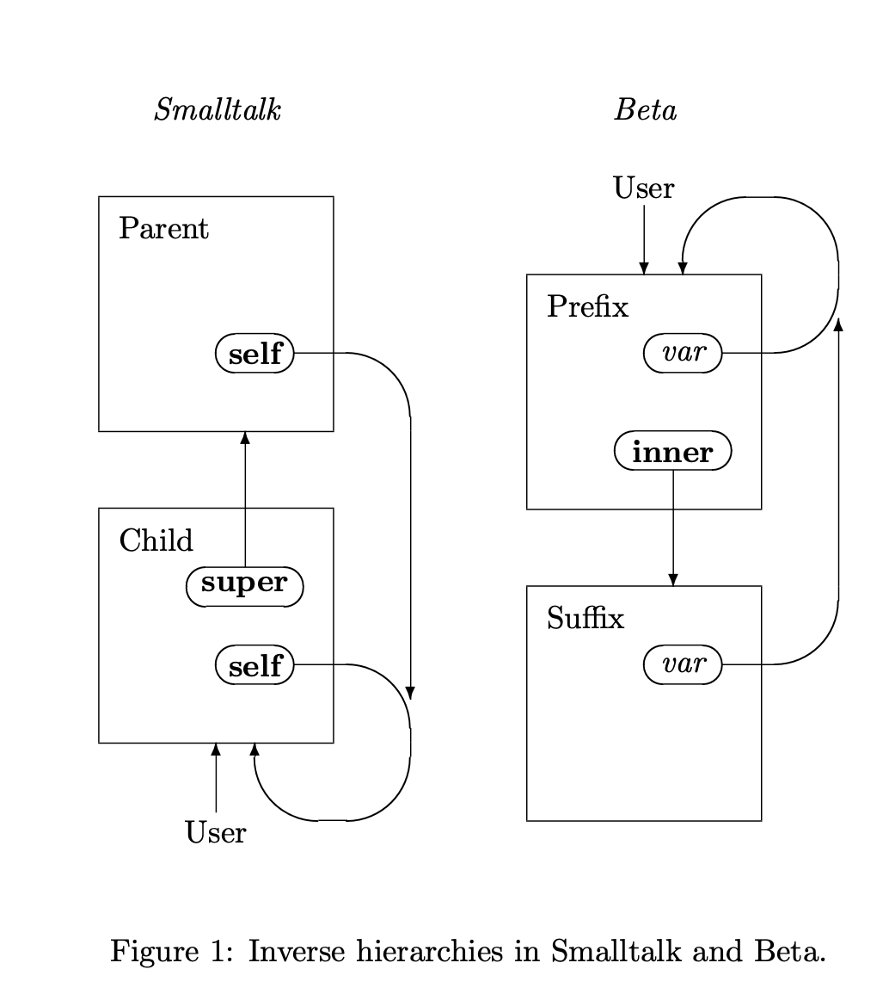

# Herencia basada en mixins (Mixin-based Inheritance)

> Traducción interpretativa al español de oopsla90.pdf (9 páginas). Prioriza que se entienda por sobre la literalidad; la versión fiel en inglés es `fuente-oopsla90-mixin-based-inheritance.md`. Código, fórmulas y Figura 1 quedan idénticos al original.

**Terminología que conviene conocer en inglés** (se usa así en todo el texto, con su equivalente):

- **mixin**: "subclase abstracta" — una definición de subclase que no tiene padre fijo y puede aplicarse a distintas superclases. Es EL término del paper; no se traduce nunca.
- **inheritance** = herencia · **subclass/superclass** = subclase/superclase.
- **super**, **inner**, **self**, **call-next-method**: palabras clave de los lenguajes; quedan tal cual.
- **pattern / subpattern / prefix** (Beta) = patrón / subpatrón / prefijo.
- **linearization** = linealización: aplanar el grafo de ancestros en una lista.
- **encapsulation** = encapsulamiento · **record** = registro · **delta** = el conjunto de cambios que aporta una subclase.
- **method override** = redefinición de un método · **subtype/supertype** = subtipo/supertipo · **typechecking** = chequeo de tipos.

---

**Gilad Bracha**[^*]
Department of Computer Science
University of Utah
Salt Lake City, UT 84112

**William Cook**
Hewlett-Packard Laboratories
1501 Page Mill Road
Palo Alto, CA 94303-0969

[^*]: Financiado por el subsidio CCR-8704778 de la National Science Foundation.

> Publicado en los Proceedings de la ACM Conference on Object-Oriented Programming: Systems, Languages, and Applications (OOPSLA), 21–25 de octubre de 1990.
> © 1990 ACM. Copiado con permiso.

## Resumen (Abstract)

Los diversos mecanismos de herencia que ofrecen Smalltalk, Beta y CLOS se interpretan acá como usos distintos de una única construcción subyacente. Smalltalk y Beta difieren, sobre todo, en la dirección en que crece la jerarquía de clases. Estos mecanismos de herencia quedan englobados en un nuevo modelo de herencia basado en la composición de *mixins*, o subclases abstractas. Esta forma de herencia también puede codificar una jerarquía de herencia múltiple de CLOS, aunque los cambios a la jerarquía codificada que violarían el encapsulamiento resultan difíciles. La aplicación práctica de la herencia basada en mixins se ilustra con el boceto de una extensión a Modula-3.

## 1 Introducción

Para los lenguajes orientados a objetos se desarrolló una variedad de mecanismos de herencia. Van desde la herencia simple clásica de Smalltalk [8], pasando por el *prefixing* (prefijado) más seguro de Beta [12, 10], hasta las combinaciones complejas y potentes de herencia múltiple de CLOS [6, 9]. Estos lenguajes tienen modelos de objetos parecidos y comparten la visión de que la herencia es un mecanismo de programación incremental. Sin embargo, difieren muchísimo en el tipo de cambios incrementales que soportan.

En Smalltalk, las subclases pueden agregar métodos nuevos o reemplazar métodos existentes de la clase padre. Como consecuencia, no hay ninguna relación garantizada entre el comportamiento de las instancias de una clase y el de las instancias de sus subclases. Los métodos de la subclase pueden invocar cualquiera de los métodos originales de la superclase vía **super**.

En Beta, la definición de un *subpattern* (subpatrón, la subclase) se ve como una extensión de un patrón *prefix* (prefijo) definido antes. Igual que en Smalltalk, se pueden definir métodos nuevos. Pero los métodos del prefijo **no** pueden reemplazarse; en cambio, el prefijo puede usar el comando **inner** para invocar el código extendido que aporta el subpatrón. Como el código del prefijo se ejecuta en cualquiera de sus extensiones, Beta impone cierto grado de consistencia de comportamiento entre un patrón y sus subpatrones.

El mecanismo subyacente de la herencia es el mismo en Beta y en Smalltalk [3]. La diferencia está en quién tiene prioridad: si las extensiones a una definición existente tienen precedencia sobre las definiciones previas y pueden referirse a ellas (Smalltalk), o si la definición heredada tiene precedencia sobre las extensiones y puede referirse a ellas (Beta). Este modelo muestra que Beta y Smalltalk tienen jerarquías de herencia invertidas: una subclase de Smalltalk se refiere a su padre con **super** exactamente igual que un prefijo de Beta se refiere a sus subpatrones con **inner**.

En el Common Lisp Object System (CLOS) y su predecesor, Flavors [13], se pueden fusionar varias clases padre durante la herencia. El grafo de ancestros de una clase se *linealiza* para que cada ancestro aparezca una sola vez [7]. Con la combinación de métodos estándar para métodos primarios, la función call-next-method se usa para invocar el siguiente método de la cadena de herencia.

CLOS soporta los mixins como una técnica útil para construir sistemas a partir de atributos "mezclables". Un *mixin* es una subclase abstracta; es decir, una definición de subclase que puede aplicarse a distintas superclases para crear una familia de clases modificadas emparentadas. Por ejemplo, podría definirse un mixin que agrega un borde a una clase ventana; ese mixin podría aplicarse a cualquier tipo de ventana para crear una clase ventana-con-borde. Semánticamente, los mixins están estrechamente relacionados con los prefijos de Beta.

A la linealización se la criticó por violar el encapsulamiento, porque puede cambiar las relaciones padre-hijo entre las clases de la jerarquía de herencia [16, 17]. Pero la técnica de mixins en CLOS depende directamente de la linealización y de la modificación de las relaciones padre-hijo. En lugar de evitar los mixins porque violan el encapsulamiento, acá sostenemos que la linealización es una técnica de implementación de los mixins que oscurece su verdadera naturaleza como abstracciones.

Con una generalización modesta de los modelos de herencia de Smalltalk y Beta se deriva una forma de herencia basada en la composición de mixins. La herencia basada en mixins soporta tanto la flexibilidad de Smalltalk como la seguridad de Beta. También soporta la codificación directa de jerarquías de herencia múltiple de CLOS sin duplicar definiciones de subclases. Sin embargo, como la jerarquía queda codificada como una colección explícita de cadenas de herencia linealizadas y no como un único grafo de herencia, algunos cambios a la jerarquía (en especial los que violarían la noción de encapsulamiento de Snyder) no pueden hacerse con facilidad.

La Sección 2 discute los lenguajes de herencia simple Smalltalk y Beta y muestra que soportan usos muy distintos de una misma construcción subyacente. La Sección 3 analiza la herencia múltiple y la linealización en CLOS, con foco especial en el soporte de mixins. La Sección 4 presenta un mecanismo de herencia generalizado que soporta el estilo de herencia de Beta, Smalltalk y CLOS, con soporte explícito para mixins. En la Sección 5 bosquejamos una extensión a Modula-3 que ilustra el uso de la herencia generalizada. Por último, la Sección 6 resume las conclusiones.

## 2 Lenguajes de herencia simple

### 2.1 La herencia en Smalltalk

La herencia en Smalltalk es un mecanismo de derivación incremental de clases. Fue adaptada de Simula [5, 14] y funciona como el mecanismo de herencia prototípico. La sutileza principal del proceso de herencia está en la interpretación de las variables especiales **self** y **super**. **Self** representa la recursión, o autorreferencia, dentro de la instancia del objeto que se está definiendo. La interpretación de **self** ya se trató en trabajos previos [3, 4, 15]; en este paper nos concentramos en la interpretación de **super**. Considerá el siguiente par de clases Smalltalk.

```smalltalk
class Person
    instance variables: name
    method: display
        name display

class Graduate
    superclass: Person
    instance variables: degree
    method: display
        super display. degree display
```

La clase Person define un campo name y un método para mostrar el nombre. La subclase Graduate extiende el método display para incluir el título académico de la persona. Por ejemplo, un graduado con nombre "A. Smith" y título "Ph.D." respondería al método display invocando el display de Graduate, que a su vez invoca el display de Person mediante **super** display para mostrar el nombre, y después muestra el título. El efecto neto sería imprimir "A. Smith Ph.D.". También sería posible anteponer algo al nombre, como en el caso de títulos tipo "Dr.", imprimiendo el título antes de llamar a **super**.

La subclase Graduate especifica únicamente en qué se diferencian los Graduates de los Persons [19]. Esa diferencia puede indicarse explícitamente como un *delta*, o conjunto de cambios. En este caso el conjunto de cambios es simplemente el nuevo método display. La definición original también es solo un método display. Al combinarse, el método display nuevo reemplaza al original.

Para formalizar este proceso, los objetos se representan como registros (*records*) cuyos campos contienen métodos [1, 15, 18, 3]. La expresión {a₁ ↦ v₁, ···, aₙ ↦ vₙ} representa un registro con campos a₁, ..., aₙ y valores asociados v₁, ..., vₙ. La expresión r.a representa la selección del campo a del registro r. La combinación de registros es un operador binario, ⊕, que forma un registro nuevo con los campos de sus dos argumentos, donde el valor proviene del argumento *izquierdo* cuando el mismo campo está presente en ambos registros. Por ejemplo, {a ↦ 3, b ↦ 'x'} ⊕ {a ↦ true, c ↦ 8} reemplaza el valor derecho de a y produce {a ↦ 3, b ↦ 'x', c ↦ 8}.

Para interpretar **super**, el delta (las modificaciones) necesita acceder al método original heredado de Person. Esto se logra pasándole los métodos de la clase padre como parámetro al delta. El mecanismo de herencia resultante es una combinación asimétrica de un delta paramétrico ∆ y una especificación del padre P:

```
C = ∆(P) ⊕ P.
```

Esta definición es una forma de herencia simple: P se refiere al padre heredado mientras que ∆ es un conjunto explícito de cambios. Que P aparezca dos veces no significa que se instancie dos veces, sino que su información se usa en dos contextos: para interpretar **super** y para proveer métodos a la subclase. Omitiendo la interpretación de las variables de instancia ocultas, el ejemplo anterior queda así:

```
P     = {display ↦ name.display}
∆(s)  = {display ↦ s.display, degree.display}
∆(P)  = {display ↦ name.display, degree.display}
```

Aunque los deltas se introdujeron para que la especificación del mecanismo de herencia fuera más clara, los deltas no son elementos independientes de un programa Smalltalk; no pueden existir por sí solos y siempre forman parte de la definición de una subclase, que tiene una clase padre explícita.

En Smalltalk, una subclase de Person puede reemplazar por completo el método display con, por ejemplo, una rutina que muestre la hora del día. En la herencia de Smalltalk, la subclase tiene el control: no hay manera de definir Person de modo que obligue a sus subclases a invocar su método display como parte de la operación display de ellas.

### 2.2 La herencia en Beta

La herencia en Beta está diseñada para dar seguridad frente al reemplazo de un método por otro completamente distinto. En Beta la herencia se soporta mediante el *prefijado* (prefixing) de definiciones. Beta emplea una única construcción de definición, el *pattern* (patrón), para expresar tipos, clases y métodos. Como esa generalidad puede confundir, usamos una sintaxis más simple que distingue los distintos roles[^1]. El ejemplo anterior se recodifica fácilmente en Beta:

[^1]: Esta sintaxis la usan los implementadores de Beta con fines didácticos [11].

```beta
Person: class
(# name : string;
   display: virtual proc
     (# do name.display; inner #);
#);

Graduate: class Person
(# degree: string;
   display: extended proc
     (# do degree.display; inner #);
#);
```

Se dice que la definición de Graduate está *prefijada* por Person. Person es el *superpattern* (superpatrón) de Graduate, que, correspondientemente, es un *subpattern* (subpatrón) de Person. Display se declara **virtual**, lo que significa que puede extenderse en un subpatrón. Esto NO significa que pueda redefinirse arbitrariamente, como en la mayoría de los lenguajes orientados a objetos.

El comportamiento del método display de un Person es mostrar el nombre y después ejecutar la sentencia **inner**. Para una instancia de Person "a secas", que no tiene comportamiento inner, la sentencia **inner** es una operación nula (o sea, un skip o no-op). Cuando se define un subpatrón de Person, la sentencia inner ejecutará el método display correspondiente del subpatrón.

El subpatrón Graduate extiende el comportamiento del display de Person aportando comportamiento inner. Para una instancia G de Graduate, el efecto inicial de G.display es el mismo que para un Person: se ejecuta el método original de Person. Después de mostrarse el nombre, se ejecuta el procedimiento inner aportado por Graduate para mostrar el título. El uso de **inner** dentro de Graduate se interpreta, otra vez, como un no-op. Solo tiene efecto si el método display es extendido por un subpatrón de Graduate. Es imposible lograr que se imprima un título, como "Dr.", antes del nombre heredando de Person; esto es porque la decisión de invocar **inner** después del nombre quedó incorporada al método display de Person. En el prefijado de Beta, el prefijo controla el comportamiento del resultado.

La interpretación del patrón Person es una definición paramétrica de atributos, P′. El parámetro representa las definiciones inner que aporten los subpatrones. Para una instancia de Person, la parte inner de P′ queda ligada al registro de métodos nulos: P′(∅).

Un subpatrón especifica atributos adicionales que, a su vez, pueden referirse a comportamiento inner de subpatrones posteriores. Si los atributos definidos en el subpatrón se especifican con ∆′, entonces el resultado de prefijar con P′ es la siguiente composición:

```
C′(inner) = P′(∆′(inner) ⊕ inner) ⊕ ∆′(inner)
```

Esto significa que la interpretación C′ del subpatrón, cuando recibe un parámetro **inner**, es el resultado de combinar la especificación del superpatrón P′ con los cambios especificados por ∆′. Al aplicar P′ a ∆′(**inner**)⊕**inner**, la especificación inner de P′ queda ligada a los campos del subpatrón combinados con los campos que aporten subpatrones posteriores. Los métodos del prefijo tienen precedencia sobre el sufijo. En el ejemplo anterior, la ecuación de C′ se simplifica muchísimo al examinar los usos reales de **inner**:

```
P′(i) = {display ↦ name.display, i.display}
∆′(i) = {display ↦ degree.display, i.display}
C′(i) = {display ↦ name.display,
                    degree.display,
                    i.display }
```

Esta formulación no codifica directamente la restricción de que **inner**, dentro de un método m, solo puede referirse al método del sufijo llamado m. En ese sentido **inner** es menos general que el **super** de Smalltalk, pero la restricción se justifica por la búsqueda de seguridad. Una formalización alternativa que sí captura esta restricción consiste en representar cada método como una función de su comportamiento **inner** [3]. El prefijado se define entonces como una combinación de registros en la que los campos duplicados se *componen*. Antes de invocar un método, este debe aplicarse a un comando nulo para que **inner** no tenga efecto. El formalismo resultante es equivalente al dado arriba, bajo la condición de que los campos de P′ y ∆′ solo accedan a los campos correspondientes de **inner**.

### 2.3 Comparando Smalltalk y Beta

Los mecanismos de herencia de Smalltalk y Beta son orientaciones distintas de un mismo mecanismo subyacente. Ese mecanismo es un operador binario no asociativo, ▷, que realiza la aplicación de **super**/**inner** y la combinación de atributos.

```
∆ ▷ P = ∆(P) ⊕ P
```

La relación entre Beta y Smalltalk se demuestra comparando las interpretaciones de la herencia en los dos lenguajes. El comportamiento de una instancia de subclase puede compararse de manera concisa en este marco:

```
C     = ∆ ▷ P            Smalltalk
C′(∅) = P′ ▷ ∆′(∅)       Beta
```

En estas ecuaciones, ∆ representa la información explícita nueva que aporta la subclase/subpatrón, mientras que P representa los atributos originales que contribuye la superclase/superpatrón. El operador de combinación ▷ favorece los valores de su argumento izquierdo en caso de atributo duplicado.

Queda claro que el mecanismo de herencia es el mismo; solo cambia la dirección de crecimiento. En Smalltalk se favorecen los atributos nuevos, que pueden reemplazar a los heredados; en Beta se favorecen los atributos originales. La herencia de Beta trabaja en la dirección opuesta a la de la mayoría de los lenguajes orientados a objetos, por esta inversión de roles entre superpatrones/subpatrones y subclases/superclases. La Figura 1 muestra esta inversión ilustrando las relaciones semánticas en Smalltalk y Beta cuando una superclase se dibuja arriba de una de sus subclases. La figura incluye la interpretación de la autorreferencia, que en Beta está implícita en las referencias a variables (*var*) [3]. Ninguna de las dos direcciones de herencia puede expresar a la otra, y cada una tiene sus ventajas y desventajas.

**Figura 1: Jerarquías inversas en Smalltalk y Beta.**

```
         Smalltalk                            Beta

  ┌─────────────────┐                     User
  │ Parent          │                       │        ┌──────┐
  │        (self) ──┼──┐                ┌───▼────────▼───┐  │
  └────────▲────────┘  │                │ Prefix         │  │
           │           │                │        (var) ──┼──┤
  ┌────────┴────────┐  │                │       (inner)  │  │
  │ Child           │  │                └────────┬───────┘  │
  │       (super)   │  │                         │          │
  │        (self) ──┼──┤                ┌────────▼───────┐  │
  └───▲─────────▲───┘  │                │ Suffix         │  │
      │         └──────┘                │        (var) ──┼──┘
    User                                └────────────────┘
```



*Descripción textual:* el diagrama tiene dos mitades espejadas. **Lado Smalltalk (izquierda):** dos cajas, `Parent` (padre) arriba y `Child` (hijo) abajo. `Child` contiene los óvalos **super** y **self**; `Parent` contiene el óvalo **self**. Una flecha sale de **super** (en `Child`) hacia arriba, apuntando a `Parent`. La referencia **self** de `Parent` sale de la caja con una curva larga que baja y apunta a `Child`; la referencia **self** de `Child` hace un bucle que vuelve a entrar a `Child` por abajo. La flecha rotulada `User` (usuario) entra a `Child` desde abajo: el usuario le manda mensajes a la subclase. **Lado Beta (derecha):** dos cajas, `Prefix` (prefijo) arriba y `Suffix` (sufijo) abajo. `Prefix` contiene los óvalos *var* e **inner**; `Suffix` contiene el óvalo *var*. Una flecha sale de **inner** (en `Prefix`) hacia abajo, apuntando a `Suffix`. La referencia *var* de `Suffix` sube por la derecha y apunta a `Prefix`; la referencia *var* de `Prefix` hace un bucle que vuelve a entrar a `Prefix` por arriba. La flecha `User` entra a `Prefix` desde arriba: el usuario le manda mensajes al prefijo. El sentido de las flechas de un lado es el inverso exacto del otro: `User` y las autorreferencias (**self**/*var*) apuntan a la subclase en Smalltalk y al prefijo en Beta, mientras que **super** e **inner** apuntan en direcciones opuestas.

## 3 Herencia múltiple y mixins

### 3.1 La herencia en CLOS

CLOS soporta un mecanismo rico de herencia múltiple. Aunque la herencia de CLOS tiene varios aspectos significativos, acá nos concentramos solo en la combinación de métodos estándar y los métodos primarios. Este es el ejemplo anterior, recodificado en CLOS.

```lisp
(defclass Person () (name))

(defmethod display ((self Person))
    (display (slot-value self 'name)))

(defclass Graduate (Person) (degree))

(defmethod display ((self Graduate))
    (call-next-method)
    (display (slot-value self 'degree)))
```

La construcción defclass incluye el nombre de la clase nueva, una lista de sus superclases y una lista de sus variables de instancia. La lista de argumentos de la forma defmethod define sobre qué clase se define el método. La combinación de métodos, simple pero efectiva, se soporta con call-next-method, que juega el rol de **super** en Smalltalk. Pero, igual que **inner** en Beta, call-next-method da acceso únicamente al siguiente método de la cadena de herencia que tenga el mismo selector de mensaje.

Una clase CLOS puede heredar de más de un padre. Como consecuencia, un mismo ancestro puede heredarse más de una vez. Por ejemplo, las clases siguientes hacen que Research-Doctor herede Person dos veces.

```lisp
(defclass Doctor (Person) ())

(defmethod display ((self Doctor))
    (display "Dr. ")
    (call-next-method))

(defclass Research-Doctor (Doctor Graduate) ())
```

Si no se toma ninguna precaución, el método display de Person se ejecutará dos veces, y un Research-Doctor se mostrará como "Dr. A. SmithA. Smith Ph.D.". Para remediar esta situación, CLOS *linealiza* el grafo de ancestros de una clase y produce una lista de herencia en la que cada ancestro aparece una sola vez. El grafo de ancestros de Research-Doctor se linealiza a: Research-Doctor, Doctor, Graduate, Person. Esto también resuelve el problema del orden de invocación de los métodos, porque las clases ancestras quedan en un orden lineal.

Cada colección de definiciones de métodos puede invocar métodos posteriores de la secuencia linealizada vía call-next-method. Si la especificación de los padres P₁, ..., Pₙ está dada por ∆₁, ..., ∆ₙ, entonces la interpretación C de la subclase se define iterando el operador de herencia sobre la lista.

```
C = ∆₁ ▷ (∆₂ ▷ (··· ▷ (∆ₙ ▷ ∅)))
```

Cada especificación de la lista se aplica al resultado de la especificación anterior y se combina con él. Los mecanismos de combinación de métodos más complejos de CLOS también pueden modelarse en este marco. Por ejemplo, si se distinguieran métodos *before* y *after*, la clase base — cuyos métodos se llamarían después de todos los demás — podría hacer que el último método before llame al método primario, y que el último método primario llame al método after.

El proceso de linealización fue criticado por violar el encapsulamiento [17]. Un argumento es que la relación entre una clase y sus padres declarados puede quedar modificada durante la linealización. El ejemplo anterior lo demuestra: en la linealización, la clase Graduate queda ubicada entre Doctor y Person, en contradicción con la declaración explícita de Doctor de que hereda directamente de Person. Solo conociendo la jerarquía de clases completa puede el programador prever esto.

Usando linealización, una jerarquía de herencia múltiple de CLOS se reduce a una colección de cadenas de herencia, cada una interpretable con herencia simple. Sin embargo, un cambio pequeño en la jerarquía CLOS original puede resultar en una colección de cadenas de herencia muy distinta. Esto es especialmente cierto si los cambios violan la noción de encapsulamiento de Snyder, como cuando una clase base se factoriza en dos clases, porque uno de los factores nuevos puede interactuar con otras clases durante la linealización. Un problema menos grave es que una misma clase puede aparecer en muchas cadenas, así que si la colección se implementara en un lenguaje de herencia simple, habría que duplicar las subclases. Para eliminar esa duplicación, el modelo de herencia simple debe generalizarse para permitir nombrar y reutilizar explícitamente los deltas que definen las subclases.

### 3.2 Programación con mixins

En esta sección discutimos una técnica de programación común en CLOS, llamada *mixins*. Un mixin es una subclase abstracta que puede usarse para especializar el comportamiento de una variedad de clases padre. Muchas veces lo hace definiendo métodos nuevos que realizan alguna acción y después llaman a los métodos correspondientes del padre. Los mixins se parecen mucho a los deltas presentados informalmente en la Sección 2.1. Por ejemplo, la noción de un título de grado como parte de un nombre puede escribirse como un mixin independiente.

```lisp
(defclass Graduate-mixin () (degree))

(defmethod display ((self Graduate-mixin))
    (call-next-method)
    (display (slot-value self 'degree)))
```

Este ejemplo ilustra una característica de los mixins: invocan call-next-method aunque aparentemente no tienen padres. Esto llevaría, obviamente, a un error si se creara una instancia del mixin. La linealización ubica al mixin dentro de una cadena de herencia, antes de otras clases que sí soportan el método. Eso pasa en la nueva definición de Graduate: como Graduate-mixin está listado antes que Person, el display de Person será invocado por el display de Graduate-mixin.

```lisp
(defclass Graduate (Graduate-mixin Person) ())
```

En CLOS, los mixins son solamente una convención de código y no tienen estatus formal. Aunque los usos localmente "sueltos" de call-next-method (sin padre que los resuelva) son un indicio claro de que una clase es un mixin, el concepto no tiene definición formal, y cualquier clase podría usarse como mixin si aporta comportamiento parcial.

Con Graduate-mixin ahora es posible definir distintos tipos de clases con comportamiento "graduado". En este ejemplo, el perro guardián podría tener un título de la escuela de obediencia.

```lisp
(defclass Guard-Dog (Graduate-mixin Dog) ())
```

Ni Smalltalk ni Beta soportan mixins del todo. En Smalltalk, el efecto de un mixin puede lograrse creando subclases explícitamente y copiando el código del mixin dentro de la subclase, lo que impide compartir código y abstraer. En Beta, una clase individual se parece bastante a un mixin. Sin embargo, no puede engancharse a clases definidas independientemente. En cambio, la clase cliente debe construirse con el mixin como prefijo. Si se necesita una familia de versiones "mezcladas" de una clase dada, hay que copiar la clase entera por cada mixin prefijado. Es decir: en Smalltalk hay que copiar el mixin, mientras que en Beta hay que copiar la clase base. Esto es consistente con nuestro análisis de la dirección de crecimiento en Beta y Smalltalk.

La programación con mixins aprovecha la herencia múltiple de una manera sutil y poco intuitiva: los mixins dependen de la linealización para quedar ubicados en el lugar apropiado de la cadena de herencia y para que se inserten otras clases entre el mixin y sus padres. Cuando los mixins se ven como subclases abstractas — definiciones de clase parametrizadas por sus padres — queda claro que la linealización juega el rol de la *aplicación*: liga el parámetro formal "padre" del mixin a una clase concreta. Este proceso de abstracción y aplicación puede hacerse más explícito generalizando el mecanismo de herencia común a Smalltalk y Beta.

## 4 La herencia como composición de mixins

Los mixins son la base de un mecanismo de herencia composicional que generaliza a Smalltalk y Beta, y a la vez soporta codificar una versión encapsulada de una jerarquía de herencia múltiple de CLOS. La idea básica de la generalización es tomar los mixins como la construcción de definición primaria. La herencia se formula entonces como composición de mixins. Los atributos nuevos pueden componerse tanto al estilo Smalltalk como al estilo Beta (sobrescribiendo o extendiendo). Como los mixins y la composición son explícitos, no hace falta linealización implícita: el programador elegiría explícitamente el orden de todos los componentes mixin. Si un componente se compone más de una vez, aparecerá como copias múltiples en el resultado; la duplicación se evita aplicando explícitamente dos componentes a un padre compartido.

El operador de composición de mixins, ⋆, es el operador de herencia de Beta, pero usado en una forma un poco más general. La composición de mixins toma dos mixins como parámetros y devuelve un mixin nuevo como resultado.

```
M₁ ⋆ M₂ = fun(i) M₁(M₂(i) ⊕ i) ⊕ M₂(i)
```

En caso de conflicto, ⋆ le da prioridad al primer parámetro. En M₁, **super**/**inner** queda ligado durante la operación de herencia a M₂. En M₂, **super**/**inner** queda ligado al parámetro formal i del resultado. Suponiendo que el operador básico de combinación de atributos ⊕ es asociativo, ⋆ es asociativo. Además, si ⊕ fuera conmutativo, ⋆ sería conmutativo.

Las clases comunes se ven como mixins degenerados que no usan su parámetro **inner**/**super**. Los mixins generalizan así a las clases de Smalltalk, los patrones de Beta y los mixins al estilo CLOS. Las clases abstractas se ven como mixins que se refieren a campos no definidos en **self**. Un mixin es *completo* si no se refiere a su parámetro padre y define todos los campos a los que se refiere en sí mismo. Si no, es *parcial*. Solo los mixins completos pueden instanciarse con sentido.

## 5 Aplicación a un lenguaje existente

### 5.1 Elección del lenguaje

Elegimos Modula-3 [2] como base para una extensión que incorpore herencia basada en mixins. Modula-3 se presta bien a esa extensión porque soporta herencia simple y es fuertemente tipado. La herencia simple se generaliza naturalmente a herencia basada en mixins. El tipado fuerte da un marco en el que los mixins pueden usarse de manera segura y eficiente.

### 5.2 La herencia en Modula-3

Modula-3 soporta herencia mediante *object types* (tipos objeto), que son aproximadamente análogos a las clases de la mayoría de los lenguajes orientados a objetos. Un ejemplo de tipos objeto en Modula-3:

```modula3
type Person =
        object name: string
        methods display() := displayPerson
        end;

type Graduate = Person
        object degree: string
        methods display := displayGraduate
        end;

procedure displayPerson(self: Person) =
  begin
    self.name.display();
  end displayPerson;

procedure displayGraduate(self: Graduate) =
  begin
    Person.display(self);
    self.degree.display()
  end displayGraduate;
```

*(La nota al pie 2 del original está anclada sobre `string` en la definición de `Person`, dentro del bloque de código anterior.)*[^2]

[^2]: Modula-3 usa TEXT para las cadenas de caracteres. Sin embargo, vamos a suponer que string ya está definido.

En el ejemplo, Person define una variable de instancia name y un método display. El método se define dando un nombre, seguido de una *signature* (firma), o lista de parámetros formales. En este caso, la firma está vacía. Al método se le asigna después un valor, que es un procedimiento definido por separado, displayPerson. Si o es un objeto de tipo Person, o.display() se interpreta como displayPerson(o).

La definición de Graduate tiene dos partes: una definición preexistente, Person, y una modificación dada por la cláusula **object ... methods ... end**. Graduate es un *subtipo* de Person, que es su *supertipo*. Graduate hereda de Person, pero incluye un *method override* (redefinición) para display. La redefinición nombra el método que se está redefiniendo y le asigna un valor nuevo, displayGraduate. No se da una firma, porque siempre va a ser idéntica a la firma del método correspondiente del supertipo. Graduate puede referirse a los métodos redefinidos de Person con la sintaxis Person.methodname. Es parecido a **super** en Smalltalk, pero más general.

Una cláusula **object ... methods ... end** corresponde a la noción de delta discutida antes. Igual que en Smalltalk, los deltas no pueden definirse independientemente de un padre. La sección siguiente presenta una extensión con la cual esos deltas se vuelven construcciones independientes.

### 5.3 Extendiendo Modula-3

Extendemos Modula-3 generalizando los tipos objeto a mixins. Un mixin puede ser una modificación explícita, de la forma **object ... methods ... end**. Alternativamente, un mixin puede ser el resultado de combinar dos mixins definidos previamente.

```
Mixin = object ... methods ... end |
        Mixin₁ ⋆ Mixin₂
```

La sintaxis concreta usada en los ejemplos de abajo difiere de la notación usada hasta acá en tres aspectos. Primero, el orden de los operandos del operador de mixins se invierte, así la prioridad la tiene el operando derecho. Segundo, la operación de mixin no se escribe explícitamente: queda implícita entre cada par de mixins de una definición. Por último, se agrega una cláusula **super** opcional a las modificaciones. Los dos primeros cambios reflejan la sintaxis existente de Modula-3, donde una modificación se escribe a la derecha de una definición base, sin operador de composición en el medio. Adoptar estos cambios ayuda a que la extensión sea compatible hacia arriba. El tercer cambio es por motivos de chequeo de tipos, como se explica más abajo. La sintaxis resultante es

```
Mixin′ = object ... methods ... end |
         object ... methods ... super ... end |
         Mixin′₂ Mixin′₁.
```

Lo siguiente equivale al ejemplo de mixin de CLOS dado antes.

```modula3
type GraduateMixin =
        object degree: string
        methods display := displayGraduateMixin
        super display() := No_Op
        end;

mixin_procedure
displayGraduateMixin(self: GraduateMixin) =
  begin
    super.display()
    self.degree.display();
  end displayGraduateMixin;

procedure No_Op(self: root) = begin end No_Op;

type Graduate = Person GraduateMixin;
```

Como GraduateMixin se define con independencia de cualquier padre, la firma de display no puede inferirse y debe darse en una cláusula especial **super**. De modo similar, el valor redefinido de display no se conoce, pero puede asignársele un valor por defecto. En este caso, el valor por defecto es No_Op, un procedimiento que va a funcionar sobre cualquier tipo, ya que está definido sobre **root**, la raíz de la jerarquía de tipos. DisplayGraduateMixin se refiere al método display redefinido mediante la pseudo-variable **super**, con la sintaxis super.methodname. Los procedimientos que referencian **super** se distinguen con la palabra clave **mixin_procedure**.

En el código de arriba, GraduateMixin juega un rol parecido al de una subclase en Smalltalk. Invertir la posición de GraduateMixin en la definición de Graduate invierte su rol al de un subpatrón de Beta. Se ilustra abajo, donde PersonMixin funciona como superpatrón.

```modula3
type PersonMixin =
        object name: string
        methods display := displayPersonMixin
        super display() := No_Op
        end;

type Graduate = GraduateMixin PersonMixin;

mixin_procedure
displayPersonMixin(self: PersonMixin) =
  begin
    self.name.display();
    super.display()
  end displayPersonMixin;
```

PersonMixin tiene el control cuando se combina con GraduateMixin. Graduate.display() invoca displayPersonMixin, donde super.display() llama a displayGraduateMixin. En displayGraduateMixin, super.display usará el valor por defecto, No_Op, que corresponde a una cláusula **inner** vacía en Beta.

Los ejemplos de arriba tienen una ventaja importante sobre sus contrapartes en Smalltalk y Beta: todas las partes de la definición pueden reutilizarse sin copiarse textualmente.

Como ejemplo final, recodificamos nuestro ejemplo anterior de herencia múltiple de CLOS:

```modula3
type Doctor =
        object
        methods display := displayDoctor
        super display() := No_Op
        end;

type ResearchDoctor =
   PersonMixin GraduateMixin Doctor;

mixin_procedure displayDoctor(self:Doctor) =
  begin
    display("Dr. ");
    super.display()
  end displayDoctor;
```

Fijate cómo la secuencia lineal de definiciones se da de manera explícita, sin depender de la linealización.

#### 5.3.1 Tipado

Esta sección presenta las reglas de tipado para los mixins en la extensión de Modula-3. El tipado de mixins no se abordó en trabajos previos, porque los mixins nunca antes se habían introducido en un lenguaje fuertemente tipado.

La identidad de tipos se define como en Modula-3: dos tipos son idénticos si y solo si sus definiciones expandidas son idénticas. La relación de subtipado sobre mixins, T ≪ S (se lee "T es subtipo de S", o "S es supertipo de T"), se define así:

1. **object ... end** ≪ **root**. Todos los mixins son subtipos de **root**.
2. Si T₁ = T₂ T₃, entonces T₁ ≪ T₂ y T₁ ≪ T₃, donde el signo = denota identidad de tipos.
3. ≪ es reflexiva y transitiva.

Por ejemplo, ResearchDoctor ≪ Doctor, así como ResearchDoctor ≪ GraduateMixin y ResearchDoctor ≪ PersonMixin. Lo menos obvio es que si

```modula3
PGMixin = PersonMixin GraduateMixin;
```

entonces ResearchDoctor ≪ PGMixin. Esto se sigue de que ResearchDoctor = PGMixin Doctor por la definición de identidad de tipos. Recordá que el operador de combinación de mixins, ⋆, es asociativo. Eso se refleja en las reglas de subtipado.

Otras reglas para la composición de mixins:

- Un método debería mencionarse en la cláusula **super** de un tipo si fue redefinido. En la práctica, una redefinición puede omitirse de la cláusula **super** si su firma puede inferirse del contexto. Un ejemplo sería la definición de Graduate de la sección 5.2. Esta excepción existe por compatibilidad con el código Modula-3 existente.
- La pseudo-variable **super** solo puede usarse en procedimientos declarados como *mixin procedures*. El primer parámetro del procedimiento debe ser de un tipo que incluya una redefinición para cada método referenciado a través de **super**.
- Un mixin procedure solo puede invocarse como método. Esto garantiza que no haya forma de acceder a los métodos redefinidos de una instancia de mixin desde afuera de la instancia.

Todas las reglas de esta sección pueden imponerse estáticamente. Esa es una condición necesaria para la seguridad y para una implementación eficiente. Estas reglas son específicas de Modula-3, y una extensión de otro lenguaje sin duda diferiría en muchos detalles. Pero la estrategia básica — generalizar los tipos objeto (o las clases, en otros lenguajes) a mixins — es fundamental para cualquier extensión de este tipo.

## 6 Conclusión

Los mecanismos de herencia de los lenguajes Beta, Smalltalk y CLOS son representativos de tres decisiones de diseño distintas para la herencia. Aunque en la superficie los mecanismos son muy disímiles, identificamos una estructura subyacente común. Ese mecanismo subyacente combina dos conjuntos de atributos de modo tal que, ante definiciones duplicadas de un atributo, el valor se toma de uno de los conjuntos, y el valor que se usa puede referirse al valor que se está eliminando.

Beta y Smalltalk soportan ambos herencia simple: una única definición existente puede extenderse con atributos nuevos. En Smalltalk, los atributos nuevos pueden reemplazar a los existentes, a los que se accede directamente vía **super**. En cambio, Beta prohíbe que las extensiones reemplacen atributos existentes; una definición nueva para un atributo existente solo tiene efecto al ser invocada cuando el atributo original ejecuta el comando **inner**. Estos dos mecanismos tienen relaciones inversas entre la definición heredada y las extensiones: la relación *sub*clase/*super*clase de Smalltalk es análoga a la relación *super*patrón/*sub*patrón de Beta, donde **super** es análogo a **inner**.

CLOS soporta herencia múltiple: varias definiciones existentes pueden combinarse entre sí. Para evitar la duplicación de componentes, CLOS linealiza el conjunto de componentes primitivos de las definiciones heredadas. Esa lista lineal de componentes se combina después mediante el mismo mecanismo que subyace a Smalltalk y Beta: los valores de atributos que aparecen antes en la lista reemplazan a los que aparecen después (y pueden referirse a ellos). Una desventaja de la linealización es que las relaciones entre los componentes primitivos pueden cambiar. Sin embargo, mostramos que la linealización es la base de la técnica útil de programación con mixins.

Proponemos que el mecanismo de herencia subyacente — que aparece en dos formas restringidas distintas en Beta y Smalltalk, y que está escondido detrás de la linealización en CLOS — se use como fundamento de una construcción general de herencia. En esta formulación, los mixins se vuelven la construcción de definición básica, y la herencia se interpreta como composición de mixins. Como la composición de mixins es explícita, el problema de la linealización violando el encapsulamiento no aparece.

No parece difícil extender Beta y Smalltalk para que soporten mixins y herencia generalizada. Este trabajo podría aplicarse a CLOS — que ya soporta mixins — para hacerlos más explícitos y menos susceptibles a los problemas de encapsulamiento. Un boceto de una extensión a Modula-3 ilustra un diseño posible para mixins y herencia generalizada.

## Referencias

*(Se conservan en inglés: son entradas bibliográficas y así hay que citarlas/buscarlas.)*

[1] Cardelli, L. A semantics of multiple inheritance. In *Semantics of Data Types* (1984), vol. 173 of *Lecture Notes in Computer Science*, Springer-Verlag, pp. 51–68.

[2] Cardelli, L., Donahue, J., Glassman, L., Jordan, M., Kalsow, B., and Nelson, G. Modula-3 report (revised). Tech. Rep. 52, Digital Equipment Corporation Systems Research Center, Dec. 1989.

[3] Cook, W. *A Denotational Semantics of Inheritance.* PhD thesis, Brown University, 1989.

[4] Cook, W., and Palsberg, J. A denotational semantics of inheritance and its correctness. In *Proc. of ACM Conf. on Object-Oriented Programming, Systems, Languages and Applications* (1989), pp. 433–444.

[5] Dahl, O.-J., Myhrhaug, B., and Nygaard, K. The SIMULA 67 common base language. Tech. rep., Norwegian Computing Center, Oslo, Norway, 1970. Publication S-22.

[6] DeMichiel, L., and Gabriel, R. The Common Lisp Object System: An overview. In *European Conference on Object-Oriented Programming* (June 1987), pp. 151–170.

[7] Ducournau, R., and Habib, M. On some algorithms for multiple inheritance in object-oriented programming. In *European Conference on Object-Oriented Programming* (1987), pp. 243–252.

[8] Goldberg, A., and Robson, D. *Smalltalk-80: the Language and Its Implementation.* Addison-Wesley, 1983.

[9] Keene, S. E. *Object-Oriented Programming in Common Lisp.* Addison-Wesley, 1989.

[10] Kristensen, B. B., Madsen, O. L., Moller-Pedersen, B., and Nygaard, K. The Beta programming language. In *Research Directions in Object-Oriented Programming.* MIT Press, 1987, pp. 7–48.

[11] Kristensen, B. B., Madsen, O. L., Moller-Pederson, B., and Nygaard, K. The Beta programming language – a Scandinavian approach to object-oriented programming, Oct. 1989. OOPSLA Tutorial Notes.

[12] Kristensen, B. B., Madsen, O. L., Moller-Pendersen, B., and Nygaard, K. Abstraction mechanisms in the Beta programming language. *Information and Control* (1983).

[13] Moon, D. A. Object-oriented programming with Flavors. In *Proc. of ACM Conf. on Object-Oriented Programming, Systems, Languages and Applications* (1986), pp. 1–8.

[14] Papazoglou, M. P., Georgiadis, P. I., and Maritsas, D. G. An outline of the programming language Simula. *Computer Language 9*, 2 (1984), 107–131.

[15] Reddy, U. S. Objects as closures: Abstract semantics of object-oriented languages. In *Proc. ACM Conf. on Lisp and Functional Programming* (1988), pp. 289–297.

[16] Snyder, A. Encapsulation and inheritance in object-oriented programming languages. In *Proc. of ACM Conf. on Object-Oriented Programming, Systems, Languages and Applications* (1986), pp. 38–45.

[17] Snyder, A. Inheritance and the development of encapsulated software systems. In *Research Directions in Object-Oriented Programming.* MIT Press, 1987, pp. 165–188.

[18] Wand, M. Type inference for record concatenation and multiple inheritance. In *Proc. IEEE Symposium on Logic in Computer Science* (1989), pp. 92–97.

[19] Wegner, P., and Zdonik, S. B. Inheritance as a mechanism for incremental modification. In *European Conference on Object-Oriented Programming* (1988), pp. 55–77.

---

## Notas de traducción

- **Criterio:** traducción interpretativa, no literal — se reescribe cada oración para que suene natural en español, sin agregar ni quitar contenido. La cobertura es 1:1 con el original (mismos párrafos, mismas secciones).
- **Terminología en inglés conservada:** mixin, super/inner/self, call-next-method, pattern (con "patrón" como traducción de trabajo), object types, method override, no-op. Cada una se presenta con su equivalente en la primera aparición y en el glosario del inicio.
- **Código, fórmulas y Figura 1:** idénticos al original en inglés (los identificadores como Person, Graduate, display son parte del código y no se traducen). La descripción textual de la Figura 1 sí está en español.
- **Figura 1 con triple refuerzo:** ASCII, la captura del diagrama original incrustada debajo (`fuente-oopsla90-mixin-based-inheritance-fig1.png` — debe estar en la misma carpeta que este archivo para que el link relativo funcione), y descripción textual.
- **Erratas tipográficas del original en inglés** ("if must" por "it must", "show" por "shows", espacios anómalos): no se replican, porque la redacción en español las disuelve; están documentadas en las Notas de conversión del archivo fuente.
- **Referencias bibliográficas:** sin traducir.

**FIN DE LA TRADUCCIÓN — Herencia basada en mixins**
