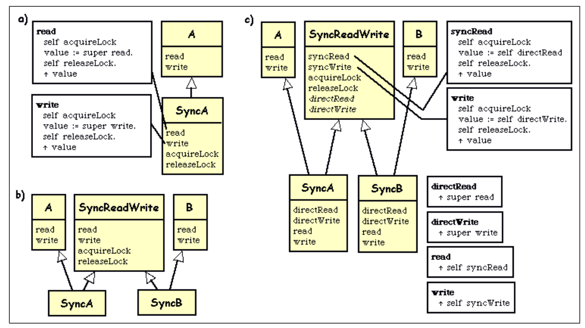
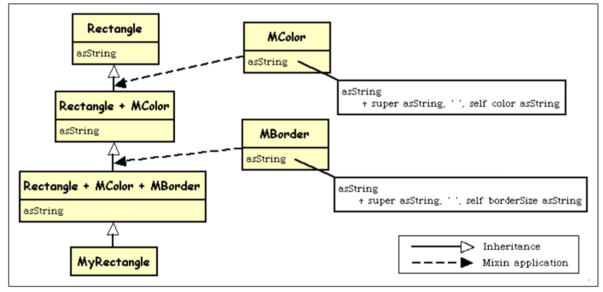
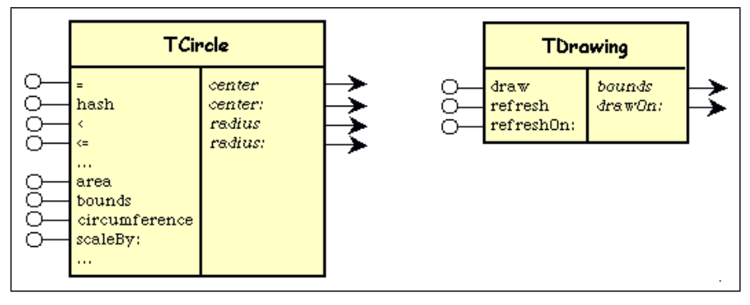
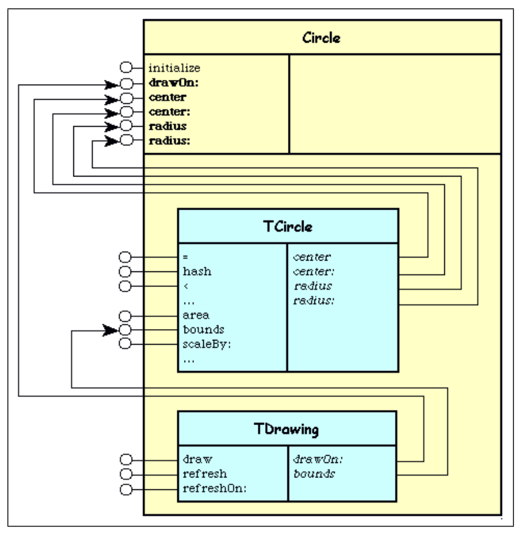
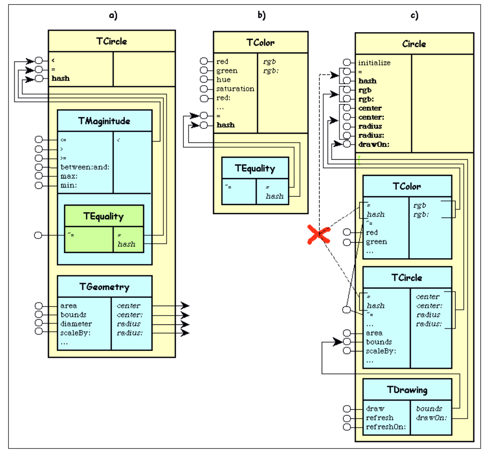
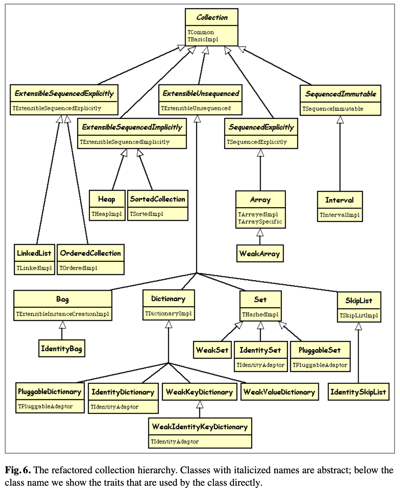

# Traits: Composable Units of Behaviour

> Conversión fiel a Markdown de Scha03aTraits.pdf (25 páginas).

**Notas de conversión:**
- El PDF no contiene hipervínculos en sus anotaciones (se verificó con pypdf); no hay URLs que extraer.
- Erratas del original, transcriptas tal cual (verificadas visualmente): p. 2 «one classeand another»; p. 8 «Traits are a completely backward-compatible»; p. 10 «uses: { TCirle . TDrawing }» (por TCircle); p. 11 «theTrait TCircle» y «the subtraits TMagnitude and TGeomery» (por TGeometry); p. 13 «in the class TCircle to make it complete» (por contexto, correspondería a la clase Circle); p. 14 «inapproprate»; p. 16 «If SyncA is defiend to be»; p. 19 «combined with the our programming tools» y «for a particualr task».
- En la Figura 1(c), la caja de código con cuerpo `value := self directWrite` está rotulada «write» en el original (por contexto correspondería a syncWrite); se transcribe tal cual.
- En la Figura 5(a), el rótulo del trait aparece como «TMaginitude» en el gráfico original (el texto del paper dice TMagnitude); se transcribe la errata en la descripción de la figura.
- Los bloques de código que el PDF maqueta en dos columnas se transcriben secuencialmente, con una línea en cursiva que declara la maquetación original.
- Los diacríticos rotos por la extracción de texto (Schärli, Stéphane, Universität, etc.) se restituyeron según el original impreso; el símbolo ≠ de la referencia 25 se restituyó igualmente.
- Cada figura lleva triple refuerzo: ASCII → imagen original incrustada (PNG) → descripción textual. Los PNG (`fuente-traits-composable-units-fig1.png` a `-fig6.png`) deben guardarse en la misma carpeta que este .md para que los links relativos funcionen; si falta un PNG, el ASCII y la descripción bastan.

Nathanael Schärli, Stéphane Ducasse, Oscar Nierstrasz, and Andrew P. Black

Software Composition Group, University of Bern, Switzerland
OGI School of Science & Engineering, Oregon Health and Science University
{schaerli, ducasse, oscar}@iam.unibe.ch, black@cse.ogi.edu

Published in ECOOP'2003, LNCS 2743, pp. 248–274, Springer Verlag, 2003

[^star]: This research was partially supported by the National Science Foundation under award CCR-0098323 and by the Swiss National Foundation project 2000-067855.02.

**Abstract.** Despite the undisputed prominence of inheritance as the fundamental reuse mechanism in object-oriented programming languages, the main variants — single inheritance, multiple inheritance, and mixin inheritance — all suffer from conceptual and practical problems. In the first part of this paper, we identify and illustrate these problems. We then present traits, a simple compositional model for structuring object-oriented programs. A trait is essentially a group of pure methods that serves as a building block for classes and is a primitive unit of code reuse. In this model, classes are composed from a set of traits by specifying glue code that connects the traits together and accesses the necessary state. We demonstrate how traits overcome the problems arising from the different variants of inheritance, we discuss how traits can be implemented effectively, and we summarize our experience applying traits to refactor an existing class hierarchy.

**Keywords:** Inheritance, mixins, multiple inheritance, traits, reuse, Smalltalk

## 1 Introduction

Although single inheritance is widely accepted as the *sine qua non* of object-orientation, programmers have long realized that single inheritance is not expressive enough to factor out common features (i.e., instance variables and methods) shared by classes in a complex hierarchy. As a consequence, language designers have proposed various forms of multiple inheritance [7, 23, 29, 35, 41], as well as other mechanisms such as mixins [3, 10, 18, 27, 32], that allow classes to be composed incrementally from sets of features.

Despite the passage of nearly twenty years, neither multiple inheritance nor mixins have achieved wide acceptance [44]. Summarizing Alan Snyder's contribution to the inheritance panel discussion at OOPSLA '87, Steve Cook wrote:

> "Multiple inheritance is good, but there is no good way to do it." [11]

The trend seems to be away from multiple inheritance; the designers of recent languages such as Java and C# decided that the complexities introduced by multiple inheritance far outweighed its utility. It is widely accepted that multiple inheritance creates some serious implementation problems [14, 43]; we believe that it also introduces serious conceptual problems. Our study of these problems has led us to the present design for traits.

Although multiple inheritance makes it possible to reuse any desired set of classes, a class is frequently not the most appropriate element to reuse. This is because classes play two competing roles. A class has a primary role as a *generator of instances*: it must therefore be complete. But as a *unit of reuse*, a class should be small. These properties often conflict. Furthermore, the role of classes as instance generators requires that each class have a *unique* place in the class hierarchy, whereas units of reuse should be applicable at *arbitrary* places.

Moon's Flavors [32] were an early attempt to address this problem: Flavors are small, not necessarily complete, and they can be "mixed in" at arbitrary places in the class hierarchy. More sophisticated notions of mixins were subsequently developed by Bracha and Cook [10], Mens and van Limberghen [27], Flatt, Krishnamurthi and Felleisen [18], and Ancona, Lagorio and Zucca [3]. These approaches all permit the programmer to create components that are designed for reuse, rather than for instantiation. However, as we shall show, they can have a negative influence on understandability.

Mixins use the ordinary single inheritance operator to extend various base classes with the same set of features. However, although this inheritance operator is well-suited for deriving new classes from existing ones, it is not appropriate for composing reusable building blocks. Specifically, inheritance requires that mixins be composed linearly; this severely restricts one's ability to specify the "glue code" that is necessary to adapt the mixins so that they fit together.

In our proposal, lightweight entities called *traits* serve as the primitive units of code reuse. The design of traits started with the observation that the conflict between reuse and understandability is more apparent than real. In general, we believe that understanding a program is easier if it is possible to view the program in multiple forms. Even though a class may have been *constructed* by composing small traits in a complex hierarchy, there is no need to require that it be *viewed* in the same way. It should be possible to view the class *either* as a flat collection of methods *or* as a composite entity built from traits. The flattened view promotes understanding; the composite view promotes reuse. There is no conflict so long as both of these views can coexist, which requires that composition be used only as a structuring tool and have *no effect on the meaning of the class*.

Traits satisfy this requirement. They provide structure, modularity and reusability *within* classes, but they can be ignored when one considers the relationships between one classeand another. Traits provide an excellent balance between reusability and understandability, while enabling better conceptual modeling. Moreover, because traits are concerned solely with the reuse of behaviour and not with the reuse of state, they avoid the implementation difficulties that characterize multiple inheritance and mixins.

Traits have the following properties.

- A trait *provides* a set of methods that implement behaviour.
- A trait *requires* a set of methods that serve as parameters for the provided behaviour.
- Traits do not specify any state variables, and the methods provided by traits never access state variables directly.
- Classes and traits can be composed from other traits, but the composition order is irrelevant. Conflicting methods must be *explicitly* resolved.
- Trait composition does not affect the semantics of a class: the meaning of the class is the same as it would be if all of the methods obtained from the trait(s) were defined directly in the class.
- Similarly, trait composition does not affect the semantics of a trait: a composite trait is equivalent to a *flattened* trait containing the same methods.

A class can be constructed by inheriting from a superclass, and adding a set of traits, the necessary state variables and the required methods. These methods represent glue that specifies how the traits are connected together and how conflicts are resolved. This approach allows a class to be decomposed into sets of coherent features — i.e., traits — and factors out the glue code that connects the features together. Because the semantics of a method is independent of whether it is defined in a trait or in a class that uses the trait, it is always possible to *flatten* a composite trait structure at any level.

The contributions of this paper are the identification of the problems associated with multiple inheritance and mixins, and the introduction of traits as a composition model that solves these problems. We proceed as follows: in section 2 we describe the problems of multiple inheritance and mixins, and in section 3 we introduce traits and illustrate their use on some small examples. In section 4 we discuss the most important design decisions and evaluate traits against the problems we identified in section 2. In section 5 we present our implementation of traits. In section 6 we summarize the results of a realistic application of traits: a refactoring of the Smalltalk-80 collection hierarchy. We discuss related work in section 7. We conclude the paper and indicate future work in section 8.

## 2 Reusability Problems with Inheritance

Inheritance is commonly regarded as one of the fundamental features of object-oriented programming, but at the same time, inheritance is also a mechanism with many competing meanings and interpretations [44]. Over the years, researchers have developed various inheritance models including single inheritance, multiple inheritance, and mixin inheritance. In this section, we give a brief overview of these models and point out their conceptual and practical shortcomings with respect to reusability. In particular we describe specific problems of mixin composition that have not been identified previously in the literature.

Note that this section is focused on reusability issues. Other problems with inheritance such as implementation difficulties [14, 43] and conflicts between inheritance and subtyping [2, 25, 26] are outside the scope of this paper.

**Single Inheritance** is the simplest inheritance model; it allows a class to inherit from at most one superclass. Although this model is well-accepted, it is not expressive enough to allow the programmer to factor out all the common features shared by classes in a complex hierarchy. Hence single inheritance sometimes forces code duplication. Note that extending single inheritance with interfaces as promoted by Java addresses the issues of subtyping and conceptual modeling, but does nothing to avoid the need to duplicate code.

**Multiple Inheritance** enables a class to inherit features from more than one parent class, thus providing the benefits of better code reuse and more flexible modeling. However, multiple inheritance uses the notion of a class in two competing roles: the generator of instances and the unit of code reuse. This gives rise to the following difficulties.

**Conflicting features.** With multiple inheritance, ambiguity can arise when conflicting features are inherited along different paths [17]. A particularly troublesome situation is the "diamond problem" [10, 38] (also known as "fork-join inheritance" [33]), which occurs when a class inherits from the same base class via multiple paths. Since classes are instance generators, they must all provide some minimal common features (e.g., the methods =, hash, and asString), which are typically inherited from a common root class such as Object. Thus, when several of these classes are reused, the common features conflict.

There are two kinds of conflicting feature: methods and state variables. Whereas method conflicts can be resolved relatively easily (e.g., by overriding), conflicting state is more problematic. Even if the declarations are consistent, it is not clear whether conflicting state should be inherited once or multiply [34].

**Accessing overridden features.** Since identically named features can be inherited from different base classes, a single keyword (e.g., super) is not enough to access inherited methods unambiguously. For example, C++ [42] forces one to explicitly name the superclass to access an overridden method; recent versions of Eiffel [29] suggest the same technique[^1]. This tangles class references with the source code, making the code fragile with respect to changes in the architecture of the class hierarchy. Explicit class references are avoided in languages such as CLOS [40] that impose a linear order on the superclasses. However, such a linearization often leads to unexpected behaviour [15, 16] and violates encapsulation, because it may change the parent-child relationships among classes in the inheritance hierarchy [38, 39].

**Factoring out generic wrappers.** Multiple inheritance enables a class to reuse features from multiple base classes, but it does not allow one to write a reusable entity that "wraps" methods implemented in as-yet unknown classes[^2].

This limitation is illustrated in figure 1. Assume that class A contains methods read and write that provide unsynchronized access to some data. If it becomes necessary to synchronize access, we can create a class SyncA that inherits from A and wraps the methods read and write. That is, SyncA defines read and write methods that call the inherited methods under control of a lock (see figure 1a).

Now suppose that class A is part of a framework that also contains another class B with read and write methods, and that we want to use the same technique to create a synchronized version of B. Naturally, we would like to factor out the synchronization code so that it can be reused in both SyncA and SyncB.

With multiple inheritance, the natural way to share code among different classes is to inherit from a common superclass. This means that we should move the synchronization code into a class SyncReadWrite that will become the superclass of both SyncA and SyncB (see figure 1b). Unfortunately this cannot work, because super-sends are statically resolved. The super-sends in the read and write methods of SyncReadWrite cannot possibly refer in one case to methods inherited from A and in the other case to methods inherited from B.

It is possible to parameterize the methods in SyncReadWrite by using self sends of abstract methods rather than explicit super sends. These abstract methods will be implemented by the subclass (see figure 1c). However, this still requires duplication of methods in each subclass. Furthermore, avoiding name clashes between the synchronized and unsynchronized versions of the read and write methods makes this approach rather clumsy, and one has to make sure that the unsynchronized methods are *not* publicly available in SyncA and SyncB.

[^1]: The ability to access an overridden method using the keyword precursor followed by an optional superclass name was added to Eiffel in 1997 [29]. In earlier versions of Eiffel, access to original methods required repeated inheritance of the same class [28].

[^2]: In C++ and Eiffel, parameterized structures such as templates [42] and generic classes [28] compensate for this limitation.

```
a)  ┌────────────────────────┐      ┌─────────┐
    │ read                   │      │    A    │
    │   self acquireLock.    │      ├─────────┤
    │   value := super read. │      │ read    │
    │   self releaseLock.    │      │ write   │
    │   ↑ value              │      └────△────┘
    └────────────────────────┘           │
    ┌────────────────────────┐      ┌────┴────────┐
    │ write                  │      │    SyncA    │
    │   self acquireLock.    │      ├─────────────┤
    │   value := super write.│─────▶│ read        │
    │   self releaseLock.    │      │ write       │
    │   ↑ value              │      │ acquireLock │
    └────────────────────────┘      │ releaseLock │
                                    └─────────────┘

b)  ┌───────┐   ┌───────────────┐   ┌───────┐
    │   A   │   │ SyncReadWrite │   │   B   │
    ├───────┤   ├───────────────┤   ├───────┤
    │ read  │   │ read          │   │ read  │
    │ write │   │ write         │   │ write │
    └──△────┘   │ acquireLock   │   └───△───┘
       │        │ releaseLock   │       │
       │        └──△─────────△──┘       │
       │           │         │          │
    ┌──┴───────────┴──┐   ┌──┴──────────┴──┐
    │      SyncA      │   │      SyncB     │
    └─────────────────┘   └────────────────┘

c)  ┌───────┐  ┌───────────────┐  ┌───────┐   ┌──────────────────────────────┐
    │   A   │  │ SyncReadWrite │  │   B   │   │ syncRead                     │
    ├───────┤  ├───────────────┤  ├───────┤   │   self acquireLock           │
    │ read  │  │ syncRead ─────┼──┼───────┼──▶│   value := self directRead.  │
    │ write │  │ syncWrite ────┼──┼───────┼─┐ │   self releaseLock.          │
    └──△────┘  │ acquireLock   │  └───△───┘ │ │   ↑ value                    │
       │       │ releaseLock   │      │     │ └──────────────────────────────┘
       │       │ *directRead*  │      │     │ ┌──────────────────────────────┐
       │       │ *directWrite* │      │     └▶│ write                        │
       │       └──△─────────△──┘      │       │   self acquireLock           │
       │          │         │         │       │   value := self directWrite. │
    ┌──┴──────────┴──┐   ┌──┴─────────┴───┐   │   self releaseLock.          │
    │      SyncA     │   │      SyncB     │   │   ↑ value                    │
    ├────────────────┤   ├────────────────┤   └──────────────────────────────┘
    │ directRead     │   │ directRead     │   ┌───────────────────┐┌───────────────────┐
    │ directWrite    │   │ directWrite    │   │ directRead        ││ directWrite       │
    │ read           │   │ read           │   │   ↑ super read    ││   ↑ super write   │
    │ write          │   │ write          │   └───────────────────┘└───────────────────┘
    └────────────────┘   └────────────────┘   ┌───────────────────┐┌───────────────────┐
                                              │ read              ││ write             │
                                              │  ↑ self syncRead  ││  ↑ self syncWrite │
                                              └───────────────────┘└───────────────────┘
```



*Descripción textual de la figura:* La figura tiene tres partes. **(a)** Un diagrama de clases: la clase A define los métodos read y write; la clase SyncA hereda de A (flecha de herencia con triángulo blanco) y define read, write, acquireLock y releaseLock. Dos cajas de código muestran los cuerpos de los métodos de SyncA: `read` = `self acquireLock. value := super read. self releaseLock. ↑ value`; `write` = `self acquireLock. value := super write. self releaseLock. ↑ value`. **(b)** Tres clases: A (read, write), SyncReadWrite (read, write, acquireLock, releaseLock) y B (read, write). SyncA hereda simultáneamente de A y de SyncReadWrite; SyncB hereda simultáneamente de SyncReadWrite y de B. Es el intento fallido de factorizar la sincronización en una superclase común. **(c)** A (read, write), SyncReadWrite (syncRead, syncWrite, acquireLock, releaseLock, y en cursiva —abstractos— directRead y directWrite) y B (read, write). SyncA hereda de A y de SyncReadWrite; SyncB hereda de SyncReadWrite y de B; cada una define directRead, directWrite, read y write (los cuatro métodos duplicados). Cajas de código: la caja `syncRead` = `self acquireLock. value := self directRead. self releaseLock. ↑ value`; la caja conectada a syncWrite está rotulada `write` en el original = `self acquireLock. value := self directWrite. self releaseLock. ↑ value`. Las cajas de los métodos de las subclases: `directRead` = `↑ super read`; `directWrite` = `↑ super write`; `read` = `↑ self syncRead`; `write` = `↑ self syncWrite`.

**Fig. 1.** In (a), the synchronization code is implemented in the subclass SyncA. In (b) we show an attempt to reuse the synchronization code in both SyncA and SyncB. However, this does not work because the methods in SyncReadWrite cannot refer to the read and write methods defined in A and B. In (c), we show how the synchronization code can be reused, but this still requires the duplication of four methods in SyncA and SyncB.

**Mixin Inheritance.** A mixin is a subclass specification that may be applied to various parent classes in order to extend them with the same set of features. Mixins allow the programmer to achieve better code reuse than single inheritance while maintaining the simplicity of the inheritance operation. However, although inheritance works well for extending a class with a single orthogonal mixin, it does not work so well for composing a class from many mixins. The problem is that usually the mixins do not *quite* fit together, *i.e.*, their features may conflict, and that inheritance is not expressive enough to resolve such conflicts. This problem manifests itself under various guises.

```
    ┌────────────────┐            ┌──────────────┐
    │   Rectangle    │            │    MColor    │
    ├────────────────┤            ├──────────────┤
    │ asString       │◀╌╌╌╌╌╌╌╌╌╌╌│ asString ────┼──▶ asString
    └───────△────────┘            └──────────────┘      ↑ super asString, ' ', self color asString
            │
    ┌───────┴────────────┐        ┌──────────────┐
    │ Rectangle + MColor │        │   MBorder    │
    ├────────────────────┤        ├──────────────┤
    │ asString           │◀╌╌╌╌╌╌╌│ asString ────┼──▶ asString
    └───────△────────────┘        └──────────────┘      ↑ super asString, ' ', self borderSize asString
            │
    ┌───────┴──────────────────────┐
    │ Rectangle + MColor + MBorder │        ──────▷  Inheritance
    ├──────────────────────────────┤        ╌╌╌╌╌╌▶  Mixin application
    │ asString                     │
    └───────△──────────────────────┘
            │
    ┌───────┴────────┐
    │  MyRectangle   │
    └────────────────┘
```



*Descripción textual de la figura:* Cadena de herencia vertical (flechas de triángulo blanco): Rectangle ← Rectangle + MColor ← Rectangle + MColor + MBorder ← MyRectangle; las tres primeras definen asString. A la derecha, los mixins MColor y MBorder (cada uno con asString) se aplican mediante flechas punteadas de "aplicación de mixin": MColor sobre Rectangle produce Rectangle + MColor; MBorder sobre Rectangle + MColor produce Rectangle + MColor + MBorder. Cajas de código: MColor>>asString = `↑ super asString, ' ', self color asString`; MBorder>>asString = `↑ super asString, ' ', self borderSize asString`. La leyenda distingue línea continua con triángulo blanco (Inheritance) de línea punteada con flecha negra (Mixin application).

**Fig. 2.** The code that interconnects the mixins is specified in the mixin MBorder. The composite entity MyRectangle cannot access the implementations of asString in the mixin MColor and the class Rectangle. The classes with + in their names are intermediaries generated by applying mixins.

**Total ordering.** Mixin composition is linear: all the mixins used by a class must be inherited one at a time. Mixins appearing later in the order override *all* the identically named features of earlier mixins. When we wish to resolve conflicts by selecting features from different mixins, we may find that a suitable total order does not exist.

**Dispersal of glue code.** With mixins, the composite entity is not in full control of the way that the mixins are composed: the conflict resolution code must be hardwired in the intermediate classes that are created when the mixins are used, one at a time. Obtaining the desired combination of features may require modifying the mixins, introducing new mixins, or, sometimes, using the same mixin twice.

Dispersal is illustrated in figure 2, where a class MyRectangle uses two mixins MColor and MBorder that both provide a method asString. The implementations of asString in the mixins first call the inherited implementation and then extend the resulting string with information about their own state. When we compose the two mixins to make the class MyRectangle, we can choose which of them should come first, but we cannot specify how the different implementations of asString are glued together. This is because the mixins must be added one at a time: in Rectangle + MColor + MBorder we can access the behaviour of MBorder and the *mixed* behaviour of Rectangle + MColor, but *not* the original behaviour of MColor and Rectangle. Thus, if we want to adapt the way the implementations of asString are composed (*e.g.*, changing the separation character between the two strings), we need to modify the involved mixins.

**Fragile hierarchies.** Because of linearity and the limited means for resolving conflicts, the use of multiple mixins results in inheritance chains that are fragile with respect to change. Adding a new method to one of the mixins may silently override an identically named method of a mixin that appears earlier in the chain. Furthermore, it may be impossible to reestablish the original behaviour of the composite without adding or changing several mixins in the chain. This problem is especially critical if one modifies a mixin that is used in many places across the class hierarchy.

As an illustration, suppose that in the previous example (see figure 2) the mixin MBorder does not initially define a method asString. This means that the implementation of asString in MyRectangle is the one specified by MColor. Now suppose that the method asString is subsequently added to the mixin MBorder. Because of the total order, this new method overrides the implementation provided by MColor. Worse, the original behaviour of the composite class MyRectangle cannot be reestablished without changing several more mixins.

## 3 Traits

We propose a compositional model as a solution to the problems illustrated in the previous section. Our model is based on lightweight entities called traits, which serve as the basic building blocks for classes and the primitive units of code reuse. Thus, traits satisfy the needs for structure, modularization and reusability within a class.

Traits, and all the examples given in this paper, are implemented in the Squeak dialect of Smalltalk-80 [22], but we believe that the same concept could also be applied to other single inheritance languages (see section 8). In the remainder of this section, we present traits in detail using a running example. We show how classes are composed from traits, how traits are composed from other traits, and how naming conflicts are resolved. Space constraints prevent us from giving a formal specification of traits and the composition operations; this is available in a companion paper [37].

### 3.1 Running Example and Notational Conventions

Suppose that we want to represent graphical objects such as circles or squares that can be drawn on a canvas. We will use traits to structure the classes and factor out the reusable behaviour. We focus on the representation of circles, but the same techniques can be applied to the other classes.

In the examples, trait names start with the letter T, and class names do not. Because the traits are implemented in Squeak, we present the code in Smalltalk. The notation ClassName>>methodName indicates that the method methodName is defined in the class ClassName.

### 3.2 Specifying Traits

A trait contains a set of methods that implement the behaviour that it provides. In general, a trait may require a set of methods that serve as parameters for the provided behaviour. Traits cannot specify any state, and never access state directly. Trait methods can access state indirectly, using required methods that are ultimately satisfied by accessors (getter and setter methods).

The purpose of traits is to decompose classes into reusable building blocks by providing first-class representations for the different aspects of the behaviour of a class. Note that we use the term "aspect" to denote an independent, but not necessarily crosscutting, concern. Traits differ from classes in that they do not define any kind of state, and that they can be composed using mechanisms other than inheritance.

```
    ┌──────────────────────────────┐       ┌───────────────────────┐
    │           TCircle            │       │       TDrawing        │
    ├───────────────┬──────────────┤       ├────────────┬──────────┤
  ○─│ =             │ *center*     │──▶  ○─│ draw       │ *bounds* │──▶
  ○─│ hash          │ *center:*    │──▶  ○─│ refresh    │ *drawOn:*│──▶
  ○─│ <             │ *radius*     │──▶  ○─│ refreshOn: │          │
  ○─│ <=            │ *radius:*    │──▶    └────────────┴──────────┘
    │ ...           │              │
  ○─│ area          │              │
  ○─│ bounds        │              │
  ○─│ circumference │              │
  ○─│ scaleBy:      │              │
    │ ...           │              │
    └───────────────┴──────────────┘
```



*Descripción textual de la figura:* Dos cajas de trait en notación UML extendida. Cada caja tiene dos columnas: la izquierda lista los métodos provistos (con conectores circulares ○ a la izquierda) y la derecha, en cursiva, los métodos requeridos (con flechas ▶ que salen a la derecha). TCircle provee =, hash, <, <=, ..., area, bounds, circumference, scaleBy:, ... y requiere center, center:, radius, radius:. TDrawing provee draw, refresh, refreshOn: y requiere bounds, drawOn:.

**Fig. 3.** The traits TDrawing and TCircle with provided methods in the left column and required methods in the right column.

*Example.* In our example, each graphical object can be decomposed into two aspects — its geometry, and the way that it is drawn on a canvas. In case of a circle, we represent the geometry with the trait TCircle and the drawing behaviour with the trait TDrawing.

Figure 3 shows these traits in an extension to UML. For each trait, the left column lists the provided methods and the right column lists the required methods. The trait TDrawing provides the methods draw, refreshOn:, and refresh, and it is parameterized by the required methods bounds and drawOn:. The code implementing this trait is shown below. The existence of the requirements is captured by methods (shown in italics) with body self requirement.

*(En el PDF, los métodos provistos aparecen en la columna izquierda y los requeridos —en cursiva— en la columna derecha; acá se transcriben secuencialmente.)*

```smalltalk
Trait named: #TDrawing uses: {}

draw
    ↑ self drawOn: World canvas

refresh
    ↑ self refreshOn: World canvas

refreshOn: aCanvas
    aCanvas form
        deferUpdatesIn: self bounds
        while: [self drawOn: aCanvas]
```

```smalltalk
"Métodos requeridos (en cursiva en el original):"
bounds
    self requirement

drawOn: aCanvas
    self requirement
```

The trait TCircle represents the geometry of a circle; it contains methods such as area, bounds, circumference, scaleBy:, =, <, and <=. TCircle requires methods center, center:, radius, and radius:, which parameterize its behaviour.

### 3.3 Composing Classes from Traits

Traits are a completely backward-compatible with single inheritance. In particular, trait composition complements, rather than subsumes, single inheritance. Whereas inheritance is used to derive one class from another, traits are used to achieve structure and reusability *within* a class definition. We summarize this relationship with the equation

*Class = Superclass + State + Traits + Glue*

This means that a class is derived from a superclass by adding the necessary state variables, using a set of traits, and implementing the *glue methods* that connect the traits together and serve as accessors for the state variables. In order for a class to be *complete*, all the requirements of the traits must be satisfied, *i.e.*, methods with the appropriate names must be provided. These methods can be implemented in the class itself, in a direct or indirect superclass, or by another trait that is used by the class.

Trait composition enjoys the *flattening property*. This property says that the semantics of a class defined using traits is exactly the same as that of a class constructed directly from all of the non-overridden methods of the traits. So, if class A is defined using trait T, and T defines methods a and b, then the semantics of A is the same as it would be if a and b were defined directly in the class A. Naturally, if the glue code of A defines a method b directly, then this b would override the method b obtained from T. Specifically, the flattening property implies that the keyword **super** has no special semantics for traits; it simply causes the method lookup to be started in the superclass of the class that *uses* the trait.

Another property of trait composition is that the composition order is irrelevant, and hence conflicting trait methods must be explicitly disambiguated (cf. section 3.5). Conflicts between methods defined in classes and methods defined by incorporated traits are resolved using the following two precedence rules.

- *Class methods take precedence over trait methods.*
- *Trait methods take precedence over superclass methods.* This follows from the flattening property, which states that trait methods behave as if they were defined in the class itself.

```
    ┌───────────────────────────────────────────────┐
    │                    Circle                     │
    ├───────────────────────────────────────────────┤
  ○─│ initialize                                    │
  ▶○│ drawOn:      ◀──────────────────────────┐     │
  ▶○│ center       ◀───────────────────┐      │     │
  ▶○│ center:      ◀──────────────────┐│      │     │
  ▶○│ radius       ◀─────────────────┐││      │     │
  ▶○│ radius:      ◀────────────────┐│││      │     │
    │                               ││││      │     │
    │  ┌──────────────────────────┐ ││││      │     │
    │  │         TCircle          │ ││││      │     │
    │  ├──────────────┬───────────┤ ││││      │     │
    │ ○│ =            │ *center*  │─┘│││      │     │
    │ ○│ hash         │ *center:* │──┘││      │     │
    │ ○│ <            │ *radius*  │───┘│      │     │
    │  │ ...          │ *radius:* │────┘      │     │
    │ ○│ area         │           │           │     │
    │▶○│ bounds ◀───┐ │           │           │     │
    │ ○│ scaleBy:   │ │           │           │     │
    │  │ ...        │ │           │           │     │
    │  └────────────┼─┴───────────┘           │     │
    │               │                         │     │
    │  ┌────────────┼─────────────┐           │     │
    │  │         TDrawing         │           │     │
    │  ├──────────────┬───────────┤           │     │
    │ ○│ draw         │ *drawOn:* │───────────┘     │
    │ ○│ refresh      │ *bounds*  │──── (a bounds   │
    │ ○│ refreshOn:   │           │      de TCircle)│
    │  └──────────────┴───────────┘                 │
    └───────────────────────────────────────────────┘
```



*Descripción textual de la figura:* La clase Circle (caja exterior) define los métodos initialize, drawOn:, center, center:, radius y radius: (glue, en negrita en el original). Dentro de la caja hay dos traits. TCircle provee =, hash, <, ..., area, bounds, scaleBy:, ... y requiere center, center:, radius, radius:; cada uno de estos cuatro requisitos se conecta con una línea al método homónimo definido en Circle. TDrawing provee draw, refresh, refreshOn: y requiere drawOn: y bounds; el requisito drawOn: se conecta al método drawOn: de Circle, mientras que el requisito bounds se conecta al método bounds provisto por TCircle (única conexión trait-a-trait del diagrama).

**Fig. 4.** The class Circle is composed from the traits TCircle and TDrawing. The requirement for TDrawing>>bounds is fulfilled by the trait TCircle. All the other requirements are fulfilled by accessor methods specified by the class.

*Example.* As illustrated in figure 4 and by the class definition hereafter, we create the class Circle by composing the traits TCircle and TDrawing. The trait TDrawing requires the methods bounds and drawOn:. The trait TCircle provides a method bounds, which already fulfills one of the requirements. Therefore, the class Circle has to provide only the methods center, center:, radius, and radius: for the trait TCircle and the method drawOn: for the trait TDrawing.

The methods center, center:, radius, and radius: are simply accessors to two instance variables. The method drawOn: draws a circle on the canvas that is passed as the argument. In addition, the class also implements a method for initializing the two instance variables.

*(En el PDF, los pares de accessors aparecen en dos columnas: center | center: aPoint y radius | radius: aNumber; acá se transcriben secuencialmente.)*

```smalltalk
Object subclass: #Circle
    instanceVariableNames: 'center radius'
    uses: { TCirle . TDrawing }

initialize
    center := 0@0.
    radius := 50

center
    ↑ center

center: aPoint
    center := aPoint

radius
    ↑ radius

radius: aNumber
    radius := aNumber

drawOn: aCanvas
    aCanvas fillOval: self bounds
        color: Color black
```

### 3.4 Composite Traits

In the same way that classes are composed from traits, traits can be composed from other traits. Unlike classes, most traits are not complete, which means that they do not define all the methods that are required by their subtraits. Unsatisfied requirements of subtraits simply become required methods of the composite trait. Again, the composition order is not important, and methods defined in the composite trait take precedence over the methods of its subtraits.

Even in case of multiple levels of composition, the flattening property remains valid. The semantics of a method does not depend on whether it is defined in a trait or in an entity that directly or indirectly uses that trait (cf. section 4.1).

*Example.* The trait TCircle contains two different aspects: comparison operators and geometric functions. In order to separate these aspects and improve code reuse, we redefine this trait as the composition of the traits TMagnitude and TGeometry as shown in figure 5(a). In addition, the trait TMagnitude is specified as a composite trait; it uses the trait TEquality, which requires the methods hash and =, and provides the method ~=. The trait TMagnitude itself requires <, and provides methods such as max:, <=, between:and:, and >=. Note that TMagnitude does not provide any of the methods required by its subtrait TEquality; this means that the requirements of TEquality are propagated as requirements of TMagnitude. Finally, as shown below, theTrait TCircle is composed from the traits TMagnitude and TGeometry. TCircle defines the methods =, hash, and < required by the trait TMagnitude. Below we show only the definition of TCircle. The first line of this definition contains the *composition clause*, which specifies that TCircle uses the subtraits TMagnitude and TGeomery.

```smalltalk
Trait named: #TCircle uses: { TMagnitude . TGeometry }

= other
    ↑ self radius = other radius and: [self center = other center]

hash
    ↑ self radius hash and: [self center hash]

< other
    ↑ self radius < other radius
```

### 3.5 Conflict Resolution

A conflict arises if and only if we combine two traits providing identically named methods that do not originate from the same trait. In particular, this means that if the *same* method (*i.e.*, from the same trait) is obtained more than once via different paths, there is no conflict. This rule is semantically sound because traits cannot specify state (cf. section 4.1).

Based on the trait composition rules presented in section 3.3, method conflicts must be explicitly resolved by defining a method in the class or in the composite trait. Trait composition enforces this by overriding the conflicting methods with a special marker method that indicates a method conflict. This guarantees that the conflict is resolved on the level of the composite, and not by another subtrait that happens to provide an appropriately named method. This behaviour makes trait composition associative as well as commutative.

To grant access to conflicting methods (and thereby avoid duplicating them), traits support an *alias* operation. Aliases are used to make a trait method available under another name; this is particularly useful if the original name is excluded by a conflict. Aliases are discussed further in section 4.1.

Trait composition also supports *exclusion*, which allows one to avoid a conflict before it occurs. The composition clause allows a programmer to exclude methods from a trait when it is composed. This suppresses these methods and allows the composite entity to acquire the otherwise conflicting implementation provided by another trait.

*Example.* Colored circles must contain color behaviour. To make this behaviour reusable, we define it in the trait TColor shown in figure 5(b). This trait provides the usual color methods such as red, green, saturation, *etc*. Because colors can also be tested for equality, TColor uses the trait TEquality, and implements the required methods = and hash as shown below.

```smalltalk
Trait named: #TColor uses: { TEquality }

hash
    ↑ self rgb hash

= other
    ↑ self rgb = other rgb
```

```
a)                              b)                          c)
 ┌────────────────────────┐     ┌──────────────────────┐     ┌──────────────────────────┐
 │        TCircle         │     │        TColor        │     │          Circle          │
 ├────────────────┬───────┤     ├─────────────┬────────┤     ├──────────────────────────┤
○│ <              │       │   ○─│ red         │ *rgb*  │   ○─│ initialize               │
○│ =              │       │   ○─│ green       │ *rgb:* │  ▶○ │ =                        │
○│ hash           │       │   ○─│ hue         │        │   ○─│ hash                     │
 │                        │   ○─│ saturation  │        │  ▶○ │ rgb                      │
 │ ┌────────────────────┐ │   ○─│ red:        │        │   ○─│ rgb:                     │
 │ │    TMaginitude     │ │     │ ...         │        │   ○─│ center                   │
 │ ├───────────────┬────┤ │  ▶○─│ =           │        │  ▶○ │ center:                  │
 │○│ <=            │ *<*│ │  ▶○─│ hash        │        │   ○─│ radius                   │
 │○│ >             │    │ │     └─────────────┴────────┘   ○─│ radius:                  │
 │○│ >=            │    │ │     ┌──────────────────┐      ▶○ │ drawOn:                  │
 │○│ between:and:  │    │ │     │    TEquality     │         │                          │
 │○│ max:          │    │ │     ├────────┬─────────┤         │ ┌──────────────────────┐ │
 │○│ min:          │    │ │     │ ~=     │ *=*     │         │ │        TColor        │ │
 │ │               │    │ │     │        │ *hash*  │         │ ├─────────────┬────────┤ │
 │ │ ┌───────────────┐  │ │     └────────┴─────────┘         │ │ =    ╲      │ *rgb*  │ │
 │ │ │   TEquality   │  │ │                                  │ │ hash  ╲     │ *rgb:* │ │
 │ │ ├───────┬───────┤  │ │            ✗ (conflicto)         │ │ ~=     ╲    │        │ │
 │○│ │ ~=    │ *=*   │  │ │           ╱ ╲                    │○│ red     ╲── │──▶ ✗   │ │
 │ │ │       │ *hash*│  │ │          ╱   ╲                   │○│ green       │        │ │
 │ │ └───────┴───────┘  │ │                                  │ │ ...         │        │ │
 │ └────────────────────┘ │                                  │ └─────────────┴────────┘ │
 │                        │                                  │ ┌──────────────────────┐ │
 │ ┌────────────────────┐ │                                  │ │        TCircle       │ │
 │ │     TGeometry      │ │                                  │ ├─────────────┬────────┤ │
 │ ├──────────┬─────────┤ │                                  │ │ =    ╲      │*center*│ │
 │○│ area     │*center* │─┼─▶                                │ │ hash  ╲──── │──▶ ✗   │ │
 │○│ bounds   │*center:*│─┼─▶                                │ │ ~=          │*center:*││
 │○│ diameter │*radius* │─┼─▶                                │ │ ...         │*radius*│ │
 │○│ scaleBy: │*radius:*│─┼─▶                                │○│ area        │*radius:*││
 │ │ ...      │         │ │                                  │▶○ bounds      │        │ │
 │ └──────────┴─────────┘ │                                  │○│ scaleBy:    │        │ │
 └────────────────────────┘                                  │ │ ...         │        │ │
                                                             │ └─────────────┴────────┘ │
                                                             │ ┌──────────────────────┐ │
                                                             │ │       TDrawing       │ │
                                                             │ ├─────────────┬────────┤ │
                                                             │○│ draw        │*bounds*│ │
                                                             │○│ refresh     │*drawOn:*││
                                                             │○│ refreshOn:  │        │ │
                                                             │ └─────────────┴────────┘ │
                                                             └──────────────────────────┘
```



*Descripción textual de la figura:* Tres partes. **(a)** El trait compuesto TCircle (caja exterior amarilla) declara como glue los métodos <, = y hash (en negrita). Contiene dos subtraits: TMagnitude (rotulado «TMaginitude» en el gráfico original) — provee <=, >, >=, between:and:, max:, min: y requiere < — que a su vez contiene el subtrait TEquality — provee ~= y requiere = y hash —; y TGeometry — provee area, bounds, diameter, scaleBy:, ... y requiere center, center:, radius, radius:, requisitos que salen con flechas del borde del compuesto (se propagan como requisitos de TCircle). Los servicios provistos de los subtraits (p. ej. max:, ~=, area) se propagan al compuesto, y los requisitos = , hash y < de los subtraits se conectan a los métodos glue definidos por TCircle. **(b)** El trait compuesto TColor: provee red, green, hue, saturation, red:, ..., y define como glue = y hash (en negrita); requiere rgb y rgb:. Contiene el subtrait TEquality (provee ~=, requiere = y hash, satisfechos por el glue de TColor). **(c)** La clase Circle: define como glue (en negrita) initialize, =, hash, rgb, rgb:, center, center:, radius, radius: y drawOn:. Contiene los traits TColor (provee =, hash, ~=, red, green, ...; requiere rgb, rgb:), TCircle (provee =, hash, ~=, ..., area, bounds, scaleBy:, ...; requiere center, center:, radius, radius:) y TDrawing (provee draw, refresh, refreshOn:; requiere bounds, drawOn:). Una gran X roja entre TColor y TCircle, conectada por líneas punteadas a los métodos = y hash de ambos traits, marca el conflicto entre sus implementaciones; los requisitos de cada trait se conectan a los métodos glue correspondientes de Circle, y el requisito bounds de TDrawing se satisface con el bounds de TCircle.

**Fig. 5.** Figure (a) shows how a trait TCircle is composed from a trait TGeometry and a composite trait TMagnitude, which contains the subtrait TEquality. Note that the provided services of the subtraits are propagated to the composite trait (*e.g.*, max:, ~=, and area), and similarly, the unsatisfied requirements of the subtraits (*e.g.*, center and radius:) are turned into required methods of the composite trait. In (b), we again use the trait TEquality to specify the comparison behaviour of the trait TColor. Figure (c) shows how a class Circle is specified by composing the traits TCircle, TColor, and TDrawing.

When the trait TColor is incorporated into the class Circle, a conflict arises because the traits TColor and TCircle provide different implementations for the methods = and hash, as shown in figure 5(c). Note that the method ~= does not give rise to a conflict because in both TCircle and TColor the implementation originates from the same trait, namely TEquality.

Figure 5(c) shows that the conflicting methods are excluded and thereby turned into requirements that have to be implemented in the class TCircle to make it complete. In the code shown below, we define the method = so that two colored circles are equal if and only if they have the same geometrical properties and the same color. To avoid code duplication, we specify aliases circleEqual:, circleHash, colorEqual:, and colorHash for the conflicting methods and use them to define the semantics of the composite.

*(En el PDF, los métodos hash y = anObject aparecen en dos columnas; acá se transcriben secuencialmente.)*

```smalltalk
Object subclass: #Circle
    instanceVariableNames: 'center radius rgb'
    uses: { TCircle @ {#circleHash -> #hash. #circleEqual: -> #=} .
            TDrawing .
            TColor @ {#colorHash -> #hash. #colorEqual: -> #=} }

hash
    ↑ self circleHash
        bitXor: self colorHash

= anObject
    ↑ (self circleEqual: anObject)
        and: [self colorEqual: anObject]
```

Alternatively, we might decide that equality of colored objects is independent of their color and takes into account only their geometrical properties. In this case, we could remove the conflicting methods = and hash from TColor. This avoids the conflicts and has the effect that the class Circle simply uses the comparison behaviour provided by the trait TCircle. The corresponding composition clause is as follows.

```smalltalk
Object subclass: #Circle
    instanceVariableNames: 'center radius rgb'
    uses: { TCircle . TDrawing − {#=. #hash} . TColor }
```

## 4 Discussion and Evaluation

In this section, we discuss some design decision that significantly influenced the properties of traits. We focus on reusability and understandability of programs that are written using traits. Finally, we present an evaluation of traits against the reusability problems discussed in section 2.

### 4.1 Design Decisions

Traits were designed with other reusability models in mind: we tried to combine their advantages, while avoiding their disadvantages. Here, we discuss the most important design decisions.

**Untangling Reusability and Classes.** Although they are inspired by mixins, traits are a new concept. They are a finer-grained unit of reuse than a class and are not tied to a specific place in the inheritance hierarchy. We believe that these two properties are essential for improving code reuse and conceptual modeling. Fine-grained reuse is important because the gulf that lies between entire classes and individual methods is too wide. Traits allow classes to be built by composing reusable behaviours rather than by implementing a large and unstructured set of methods. Hierarchy independence is important because it maximizes reusability. Because classes have a primary role as instance generators they must be complete, and are thus typically embedded in a hierarchy. This very property makes classes inapproprate for the secondary role that they are made to play in conventional languages: reusable method repositories [5].

**Single Inheritance and the Flattening Property.** Rather than replacing single inheritance, we decided to extend it with trait composition. These two operations are similar but complementary and work together nicely.

Single inheritance lets one reuse all the features (*i.e.*, methods and state variables) that are available in a class. If a class can inherit only from a single superclass, inheriting state does not cause complications, and a simple keyword (*e.g.*, super) is enough to access overridden methods. This mechanism for accessing inherited features is convenient, but it also gives semantics to the place of a method in the inheritance hierarchy.

Trait composition operates at a finer granularity than inheritance; it is used to modularize the behaviour defined within a class. As such, trait composition is designed to compose only behaviour and not state. In addition, trait composition enjoys the flattening property, which means that it does not assign any semantics to the place where a method is defined.

The flattening property combines with single inheritance to demonstrate that traits are a logical evolution of the single inheritance paradigm. A system based on traits naturally allows one to write and execute traditional single inheritance code. Moreover, with appropriate tool support, it also allows one to view and edit classes that are built from thousands of deeply composed traits in exactly the same way as one would if they were implemented without using traits at all.

**Aliasing.** Many multiple inheritance implementations provide access to overridden features by requiring the programmer to explicitly name the defining superclass in the source code. C++ uses the scope operator ::, whereas Eiffel uses the keyword precursor. With traits, we chose method aliasing in preference to placing named trait references in method bodies; this avoids the following problems.

- Named trait references contradict the flattening property, because they prevent the creation of a semantically consistent flattened view without adapting these references in the method bodies.
- Named trait references require the trait structure to be hardcoded in all the methods that use them. This means that changing the trait structure, or simply moving methods from one trait to another, potentially invalidates many methods.
- Named trait references would require an extension of the syntax of the underlying single inheritance language.

Method aliasing avoids all of these problems. It works with the flattening property because the flattening process can simply introduce a new name for the aliased method body.

Although there are some similarities between aliasing and method renaming as provided by Eiffel, there are also essential differences. Whereas aliasing just establishes an alternative name without affecting the original one, with renaming the original method name becomes undefined. As a consequence, method renaming must change all the references to the old name in other methods so that they refer to the new one. In contrast, aliasing has no effect on any references in other methods: requiring that they are changed would violate the flattening property.

**Unintentional Naming Conflicts** With traits, as with any other name-based approach to composing software features, unintentional naming conflicts may arise. For example, consider a Java class that should implement two interfaces, where each of these interfaces specifies a method with precisely the same name (and signature), but with different semantics.

At present, traits offer no real solution to this problem — when two traits are composed, it may be that each requires a semantically different method that happens to have the same name. Aliases alleviate the problem only to a small extent. In our view, a complete solution requires both good refactoring tools and explicit namespaces [1, 4].

**Conflict Strategies and the Diamond Problem** Although traits are based on single inheritance, a form of diamond problem may arise when features from the same trait are obtained multiple times via different paths. For example, consider a trait X that uses two traits Y1 and Y2, which in turn both use the trait Z.

Since traits contain no state, the most nefarious diamond problem does not arise. Nevertheless, in our example, a method foo provided by Z will be obtained by X twice. The key language design question is: should this be considered a conflict?

As explained in section 3.5, we decided that there should be no conflict if the same method is obtained more than once via different paths. This "same-operation exception", as it is called by Snyder [38], has the advantage of having a simple, intuitive semantics, but it can lead to surprises if the underlying traits are changed. Suppose that trait Y2 is re-implemented so that it no longer uses Z but still supports the same behavior (*e.g.*, the method Z>>foo is copied to the trait Y2). This causes a conflict because trait X now obtains two different methods foo. Thus, what may have appeared to be a strictly internal change to trait Y2 is visible to one of its clients.

Although it may seem that this situation will lead to fragile hierarchies, we argue that it does not. When Y2 re-implements foo, it is changing what it provides to its clients in a way that is less severe, but just as significant, as when it adds or removes methods. Any of these changes may introduce naming conflicts. However, the resulting conflict is a purely local matter, that is, it can be corrected by the direct clients of Y2 alone. X can easily resolve the resulting conflict by suppressing one foo or the other.

Let us examine two alternatives to our current rule. One alternative is for X to "automatically" obtain either one foo or the other, as happens with linearly-ordered mixins. The problem with this is that the change to Y2 would give the programmer no feedback, even though the semantics of X might have changed.

The alternative suggested by Snyder is to abandon the "same-operation exception", and announce a conflict even if the same method is obtained multiple times [38]. In our example, this means that there would already be a conflict in the original scenario, and that the programmer must arbitrarily decide which of the two foo methods should be available in X. We argue that this is more dangerous, because a later change to the foo provided by either Y1 or Y2 will not be signalled as having a possible consequence on X. With the current approach, the conflict is signalled at precisely the point in time when it arises, which is when the programmer is able to make an informed resolution.

### 4.2 Evaluation Against the Identified Problems

In section 2 we identified a set of conceptual and practical reusability problems that are associated with various forms of inheritance. The design of traits was significantly influenced by the attempt to solve these problems. In the following, we present a point by point evaluation of the results.

**Conflicting features.** Traits avoid state conflicts entirely by forbidding traits from expressing state. Method conflicts may be resolved within traits by explicitly selecting one of the conflicting methods, but more commonly conflicts are resolved in classes by overriding conflicts. In general, fewer conflicts arise than with multiple inheritance, because traits tend to remain lean, focussing on a small set of collaborating features.

**Accessing overridden/conflicting features.** Because traits are an extension of single inheritance, *classes* can still access overridden features by means of **super** calls. However, sometimes a *trait* needs to access a conflicting feature, *e.g.*, in order to resolve the conflict. These features are accessed by aliases, rather than by explicitly naming the trait that provides the desired feature. This leads to more robust trait hierarchies, since aliases remain *outside* the implementations of methods. Contrast this approach with multiple inheritance languages in which one must explicitly name the class that provides a method in order to resolve an ambiguity. The aliasing approach both avoids tangled class references in the source code, and eliminates code that is hard to understand and fragile with respect to change.

**Factoring out generic wrappers.** Generic wrappers, such as the synchronization wrappers discussed in section 2, can be expressed easily with traits. In fact, solution (b) in figure 1 would work if SyncReadWrite were a trait, since **super** in a trait is just a placeholder for the superclass of the class that will actually use that trait. If SyncA is defiend to be a subclass of A and SyncB a subclass of B, and both use trait SyncReadWrite, then the **super** send in the trait's read and write methods will be statically bound to A or B *when the trait is used to define the class*. Other kinds of generic wrappers can be defined in much the same way.

**Total ordering.** Trait composition is symmetric, so ordering is irrelevant. However, trait composition can be productively combined with inheritance to obtain a large variety of different partially ordered compositions. The basic idea is that if we want a class C to use two traits T1 and T2 in that order, we first introduce a superclass C′ that uses T1, and then we define C to inherits from C′ and use T2. This has the consequence that the methods in T2 override the methods in T1. This strategy has proved itself in practice when we refactored the Smalltalk collection hierarchy (see section 6 and figure 6).

**Dispersal of glue code.** When traits are combined, the glue code is always located in the combining entity, reflecting the idea that the combining entity is in complete control of plugging together the components that implement its aspects. This property nicely separates the glue code from the code that implements the different aspects, and it makes a class easy to understand, even if it is composed from many different components.

**Fragile hierarchies.** Any hierarchical approach to composing software is bound to be fragile with respect to certain kinds of change: if a feature that is used by many clients changes, the change will clearly impact all the clients. The important question is: how severely will the change impact the features of direct and indirect clients? Do we need to change implementations, or only glue code? Will there be a ripple effect throughout the entire hierarchy due to apparently innocuous changes? Adding or deleting methods provided by a trait may well impact clients by introducing new conflicts or requirements, but ripple effects are generally avoided. A direct client can generally resolve a conflict without reimplementing any features. Furthermore, if the direct client can preserve the interface it provides, no ripple effect will occur.

## 5 Implementation

Traits as described in this paper are implemented in Squeak [22], an open-source dialect of Smalltalk-80. Our implementation consists of two parts: an extension of the Smalltalk-80 language and an extension of the programming tools.

### 5.1 Language Extension

To add traits to Squeak, we extended the implementation of a class to include an additional instance variable to contain the information in the composition clause. This variable defines the traits used by the class, including any exclusions and aliases. In addition, we introduced a representation for traits, which are essentially stripped down classes that can define neither state nor a superclass. When a class C uses a trait T, the method dictionary of C is extended with an entry for all the methods in T that are not overridden by C. For an alias, we add to the method dictionary a second entry that associates the new name with the aliased method. Since compiled methods in traits do not usually depend on the location where they are used, the bytecode for the method can be shared between the trait that defines the method and all the classes and traits that use it. However, methods using the keyword super store an explicit reference to the superclass in their literal table. So we need to copy those methods and change the entry for the superclass appropriately. This copy could be avoided by modifying the virtual machine to compute super when needed.

In Smalltalk, classes are first-class objects; every class is instance of a metaclass that defines the shape and the behaviour of its singleton instance [19]. In our implementation, we support this concept by introducing the notion of a metatrait; a metatrait can be associated with every trait. When a trait is used in a class, the associated metatrait (if there is one) is automatically used in the metaclass. Note that a trait without a metatrait can be applied to both classes and metaclasses. To preserve metaclass compatibility [8, 20], metatraits are automatically generated for traits that send messages to the metalevel using the pseudo-message class.

Because traits are simple and completely backwards compatible with single inheritance, implementing traits in a reflective single inheritance language like Squeak is unproblematic. The fact that traits cannot specify state is a major simplification. We avoid most of the performance and space problems that occur with multiple inheritance, because these problems are related to compiling methods without knowing the indices of the instance variables in the object [14].

Our implementation requires no duplication of source code, and byte code is duplicated only if it includes sends to super. A program with traits shows essentially the same performance as a corresponding single inheritance program where all the methods provided by traits are implemented directly in the classes using the traits. This is especially remarkable because our implementation did not make any changes to the Squeak virtual machine. There may be a small performance penalty resulting from the use of accessor methods, but such methods are in any case widely used because they improve maintainability. JIT compilers routinely inline accessors, so we feel that requiring their use is entirely justifiable.

### 5.2 Programming Tools

Besides an extension of the language, our implementation also includes an extension of the programming tools, *i.e.*, the Smalltalk browser. In the following, we give a brief overview of this extended browser; a more detailed description can be found in a companion paper [36].

For each class (and each trait), the browser shows the various traits from which it is composed. The flattening property allows the browser to flatten this hierarchical structure at any level. In addition, the browser shows the programmer the provided and required methods, the overridden methods, and the glue methods, which specify how the class meets the requirements of its component traits. These features help the programmer to work with different views of the code. On the one hand, the programmer can work with the code in a flattened view, where a class consists of an unstructured set of methods and it does not matter whether the class is built from traits and whether a method is defined in a trait or in the class itself. On the other hand, the programmer can work in a composition view, where he sees how the responsibilities of the class are decomposed into several traits and how these traits are glued together in order to achieve the required behaviour. This view is especially valuable because it allows a user to understand a class by knowing the involved traits and understanding the glue methods.

As in standard Smalltalk, the browser supports incremental compilation. Whenever a trait method is added, changed or excluded, all the users of that trait are instantaneously updated. The modifications are also analyzed to infer the set of required methods. If a modification causes a new conflict or an unspecified requirement anywhere in the system, the affected classes and traits are automatically added to a "to do" list.

Our implementation features several tools that support the programmer in composing traits and generating the necessary glue code. Required methods that correspond to instance variable accessors are generated on request. Conflict elimination is also semiautomated. The programmer is presented with a list of alternative implementations; choosing one of these automatically generates the composition clause that excludes the others, and thus eliminates the conflict.

## 6 An Application of Traits

As a realistic evaluation of their usability, we used traits to refactor the Smalltalk-80 collection hierarchy as it is implemented in Squeak 3.2. In this section, we summarize the results of this work; interested readers are referred to a companion paper that contains more details [6].

The core classes of the Smalltalk-80 collection hierarchy have been improved over more than 20 years and are often considered a paradigmatic example of object-oriented programming. Each kind of collection can be characterized by properties such as being explicitly ordered (*e.g.*, Array), implicitly ordered (*e.g.*, SortedCollection), unordered (*e.g.*, Set), extensible (*e.g.*, Bag), immutable (*e.g.*, String), keyed (*e.g.*, Dictionary), or element-wise comparable (*e.g.*, using identity or a higher-level comparison operator).

However, single inheritance is not expressive enough to model such a diverse set of related classes that share many different properties in various combinations. Consequently, the implementors of the hierarchy were forced to duplicate code or to move methods higher in the hierarchy and then disable them in the subclasses to which they do not apply [12].

We solved these problems by creating traits for the different collection properties and combining them to build the required collection classes. In order to achieve maximum flexibility, we separated the properties specifying the implementation of a collection from the properties specifying the interface. This allowed us to freely combine different interfaces (*e.g.*, "sorted-extensible interface" and "sorted-extensible-immutable interface") with any of the suitable implementations (*e.g.*, "linked-list implementation" and "array-based implementation"). We use inheritance to partially order the traits; optimized methods in the more specific implementation traits take precedence over generic methods provided by the more general interface traits.

In addition to the traits that were necessary to achieve a sound hierarchy and avoid code duplication, we used additional subtraits to structure the code more finely. These subtraits allow us to reuse parts of the code outside of the collection hierarchy. As an example, we introduced traits representing the behaviour "emptiness" (which requires size and provides isEmpty, notEmpty, ifEmpty:, *etc*.) and "enumeration" (which requires do: and provides collect:, select:, detect:, *etc*.).

Although some of the collection classes are now built as the composition of as many as 22 traits, the flattening property combined with the our programming tools means that this does not impair understandability. If the trait structure is not useful for a particualr task, it is always possible to work with the hierarchy as if it were implemented with ordinary single-inheritance.

Figure 6 shows the refactored hierarchy for 21 of the more common collection classes. Besides the class name, the figure also shows the traits that each class uses. However, it does not show that each of these traits has many subtraits. The abstract class Collection is at the top; it provides a small amount of general behaviour for all collections. Then we have a layer of abstract classes that provide different combinations of traits that represent interface properties. At the bottom, we have concrete classes that use traits to provide implementations.

```
                                        ┌───────────────┐
                                        │ *Collection*  │
                                        ├───────────────┤
                                        │ TCommon       │
                                        │ TBasicImpl    │
                                        └───△△──△──△△───┘
              ┌─────────────────────────────┘│  │  │└─────────────────────────────┐
              │        ┌─────────────────────┘  │  └───────────────┐              │
┌─────────────┴────────────────┐ ┌──────────────┴───────┐ ┌────────┴─────────┐ ┌──┴──────────────────┐
│*ExtensibleSequencedExplicitly*│ │*ExtensibleUnsequenced*│ │*SequencedExplicitly*│ │*SequencedImmutable* │
├──────────────────────────────┤ ├──────────────────────┤ ├──────────────────┤ ├─────────────────────┤
│TExtensibleSequencedExplicitly│ │TExtensibleUnsequenced│ │TSequencedExplicitly│ │ TSequenceImmutable  │
└──────△△──────────────────────┘ └──────────△──────────┘ └────────△─────────┘ └──────────△──────────┘
       ││ ┌───────────────────────────────┐ │                     │                      │
       ││ │*ExtensibleSequencedImplicitly*│ │              ┌──────┴───────┐       ┌──────┴──────┐
       ││ ├───────────────────────────────┤ │              │    Array     │       │  Interval   │
       ││ │TExtensibleSequencedImplicitly │ │              ├──────────────┤       ├─────────────┤
       ││ └──────────△──△─────────────────┘ │              │ TArrayedImpl │       │TIntervalImpl│
       ││            │  │                   │              │TArraySpecific│       └─────────────┘
       ││   ┌────────┴┐ └┬────────────────┐ │              └──────△───────┘
       ││   │  Heap   │  │SortedCollection│ │                     │
       ││   ├─────────┤  ├────────────────┤ │              ┌──────┴──────┐
       ││   │THeapImpl│  │  TSortedImpl   │ │              │  WeakArray  │
       ││   └─────────┘  └────────────────┘ │              └─────────────┘
       ││                                   │
┌──────┴┐└┬──────────────────┐              │
│LinkedList│OrderedCollection │             │
├──────────┼──────────────────┤             │
│TLinkedImpl│  TOrderedImpl   │             │
└──────────┴──────────────────┘             │
        ┌───────────────────┬───────────────┼─────────────────────┬──────────────────┐
┌───────┴─────────────────┐ ┌───────┴───────┐ ┌───────┴──────┐ ┌──────┴───────┐
│           Bag           │ │  Dictionary   │ │     Set      │ │   SkipList   │
├─────────────────────────┤ ├───────────────┤ ├──────────────┤ ├──────────────┤
│TExtensibleInstanceCreationImpl│ │TDictionaryImpl│ │ THashedImpl  │ │ TSkipListImpl│
└────────────△────────────┘ └───────△───────┘ └───△──△──△───┘ └──────△───────┘
             │                      │             │  │  │            │
      ┌──────┴──────┐               │   ┌─────────┘  │  └─────────┐  │
      │ IdentityBag │               │   │            │            │  │
      └─────────────┘               │ ┌─┴───────┐ ┌──┴─────────┐ ┌┴──┴──────────┐
                                    │ │ WeakSet │ │IdentitySet │ │ PluggableSet │
                                    │ └─────────┘ ├────────────┤ ├──────────────┤
                                    │             │TIdentityAdaptor│ │TPluggableAdaptor│
                                    │             └────────────┘ └──────────────┘
    ┌───────────────────┬───────────┴───┬─────────────────────┬──────────────────┐
┌───┴───────────────┐ ┌─┴────────────────┐ ┌────────┴──────────┐ ┌───┴────────────────┐   ┌────────────────┐
│PluggableDictionary│ │IdentityDictionary│ │ WeakKeyDictionary │ │WeakValueDictionary │   │IdentitySkipList│
├───────────────────┤ ├──────────────────┤ └────────△──────────┘ └────────────────────┘   └──(← de SkipList)┘
│ TPluggableAdaptor │ │ TIdentityAdaptor │          │
└───────────────────┘ └──────────────────┘ ┌────────┴─────────────────┐
                                           │ WeakIdentityKeyDictionary│
                                           ├──────────────────────────┤
                                           │     TIdentityAdaptor     │
                                           └──────────────────────────┘
```



*Descripción textual de la figura:* Árbol de herencia (todas las flechas son de herencia, triángulo blanco apuntando a la superclase). Los nombres en cursiva son clases abstractas; debajo de cada nombre figuran los traits que la clase usa directamente. En la raíz, la abstracta **Collection** (TCommon, TBasicImpl). De ella heredan cuatro abstractas: **ExtensibleSequencedExplicitly** (TExtensibleSequencedExplicitly), **ExtensibleUnsequenced** (TExtensibleUnsequenced), **SequencedExplicitly** (TSequencedExplicitly) y **SequencedImmutable** (TSequenceImmutable), más la abstracta **ExtensibleSequencedImplicitly** (TExtensibleSequencedImplicitly), que hereda de Collection. De ExtensibleSequencedExplicitly heredan las concretas **LinkedList** (TLinkedImpl) y **OrderedCollection** (TOrderedImpl). De ExtensibleSequencedImplicitly heredan **Heap** (THeapImpl) y **SortedCollection** (TSortedImpl). De SequencedExplicitly hereda **Array** (TArrayedImpl, TArraySpecific), y de Array hereda **WeakArray** (sin traits directos). De SequencedImmutable hereda **Interval** (TIntervalImpl). De ExtensibleUnsequenced heredan cuatro concretas: **Bag** (TExtensibleInstanceCreationImpl), **Dictionary** (TDictionaryImpl), **Set** (THashedImpl) y **SkipList** (TSkipListImpl). De Bag hereda **IdentityBag** (sin traits directos). De Set heredan **WeakSet** (sin traits directos), **IdentitySet** (TIdentityAdaptor) y **PluggableSet** (TPluggableAdaptor). De Dictionary heredan **PluggableDictionary** (TPluggableAdaptor), **IdentityDictionary** (TIdentityAdaptor), **WeakKeyDictionary** (sin traits directos) y **WeakValueDictionary** (sin traits directos). De WeakKeyDictionary hereda **WeakIdentityKeyDictionary** (TIdentityAdaptor). De SkipList hereda **IdentitySkipList** (sin traits directos).

**Fig. 6.** The refactored collection hierarchy. Classes with italicized names are abstract; below the class name we show the traits that are used by the class directly.

In total, these classes use 48 different traits and implement 567 methods. This is just over 10% fewer methods than in the original implementation. In addition, the code for the trait implementation is 12% smaller than the original. This is especially remarkable because another 9% of the methods in the original implementation are implemented "too high" in the hierarchy, specifically to enable code sharing. With inheritance, the penalty for implementing a method too high is the repeated need to cancel inherited behaviour in subclasses where that behaviour does not make sense. In the trait implementation, there is no need to resort to this tactic.

## 7 Related Work

In the section 2 we have shown how multiple inheritance and mixins attempt to promote code reuse, and the problems that these approaches encounter. In this section we compare traits to some other approaches to structuring complex artifacts.

There are several other models that use entities called "traits" to share and reuse implementation. One of them is the prototype-based language Self [45]. In Self, there is no notion of class; each object conceptually defines its own format, methods, and inheritance relations. Objects are derived from other objects by cloning and modification. In addition, Self also has the notion of traits objects that serve as repositories for sharing behaviour and state among multiple objects. One or more traits objects can be dynamically selected as the parent(s) of any object. Selector lookups unresolved in the child are passed to the parents; it is an error for a selector to be found in more than one parent.

The programming language Mesa, used for implementing the software for the Xerox Star workstation, also provided entities called traits as an approach to multiple inheritance [13]. This approach has more in common with other multiple inheritance approaches than with the trait model presented in this paper. Some of the main differences from our model are that the Star traits have a different semantics regarding inheritance, have different conflict resolution capabilities, carry state, and allow multiple implementations for a single method.

The Larch family of specification languages [21] is also based on a construct called a trait; the relationship turns out to be more than name deep. Larch traits are fragments of specifications that can be freely reused at fine granularity. For example, it is possible to define a Larch trait such as IsEmpty that adds a single operation to an existing container data-type. There are, of course, significant differences, since our traits are not intended to be used to prove properties of programs, and adding a trait to a class does not formally constrain the behavior of existing methods.

The Jigsaw modularity framework, developed by Bracha in his doctoral dissertation [9], defines module composition operators merge, override, copy·as and restrict that are strikingly similar to the sum, override, alias and exclusion operators on traits. For example, Bracha's merge, like our sum, is commutative. Although there are differences in the details of the definitions (for example, in how conflicts are handled), the more significant differences are in motivation and setting. Jigsaw is intended as a complete framework for module manipulation in the large, and makes assumptions appropriate to that setting: namespaces, declared types and requirements, full renaming, and semantically meaningful nesting. Traits are intended to supplement existing languages by promoting reuse in the small, and consequently do not define namespaces, do not declare types, infer their requirements, do not allow renaming, and do not give a meaning to nesting. The Jigsaw operation set also aims for completeness, whereas in the design of traits we explicitly gave up completeness for simplicity. Nevertheless, the similarity of the core operation sets is encouraging, given that they were defined independently.

Caesar's collaboration interfaces are similar to traits in that they include the declaration of expected methods, i.e., those that classes must provide when bound to an interface [31]. Thus, Caesar's interface concept can simulate traits by binding an interface to a class and then combining it with a specific implementation. However, Caesar has no special compositional construct for dealing with conflicts. Instead, Caesar is designed to use one of the conflict resolution strategies known from multiple inheritance languages such as C++, leading to problems similar to those described in section 2. Moreover, Caesar is based on explicit wrappers, which can be costly at runtime, while the semantics of traits is compatible with single inheritance and does not create a runtime penalty.

Mezini proposed an approach to behavior composition in a class-based environment that is based on the encapsulated object model of class-based inheritance, but introduces an explicit combination layer between objects and classes [30]. The behavior definition of an evolving object is dispersed between a class that provides the standard behavior of the object and a set of mixin-like software modules, called adjustments. One of the main differences from traits is that Mezini's approach is more dynamic and complex. In fact, a combiner-metaobject is associated with each evolving object, responsible for the compositional aspects of the object's behavior. This means that the combiner-metaobject uses the adjustments to define the environment in which to evaluate the messages sent to the object.

Delegation (also known as "object-based inheritance") is another form of composition that side-steps many of the problems related to class-based inheritance [24]. In contrast to traits, delegation is designed to support dynamic component adaptation.

## 8 Conclusions and Future Work

This paper has introduced traits, a simple compositional model for building and structuring object-oriented programs. Traits are composed using a set of operators — symmetric combination, exclusion, and aliasing — that are carefully designed so that they allow a fair amount of composition flexibility without being subject to the problems and limitations that we have identified for mixins and multiple inheritance.

Thanks to the favorable composition properties, traits are an ideal extension for single inheritance languages. Traits are completely backwards compatible with Smalltalk and do not require modifying or extending the method syntax of the underlying language. Furthermore, the flattening property guarantees optimal understandability of the resulting code, because it is always possible to both view and edit the code as if it were written using single inheritance.

Having the right programming tools has proven to be crucial for giving the programmer the maximum benefit from traits. In our Squeak-based implementation, we changed the browser so that it allows the programmer to switch seamlessly between the different views and emphasizes the glue methods that define how the traits are connected.

We successfully used traits for refactoring the collection hierarchy, which is a strong indication for the usability of traits for realistic and non-trivial problems. It also showed that traits are suitable for modularizing classes that are already built, and that they raise the level of abstraction when building new classes. As we worked with the refactored hierarchy, we were impressed with the power of the flattening property, which made understanding classes that are built from composite traits quite a simple matter.

As future work we would like to (1) evaluate the impact of the introduction of namespaces and encapsulation on the flattening property, (2) consider the effects of allowing traits to specify state variables, (3) extend trait composition so that it can replace inheritance, (4) evaluate the possibility of using traits to modify the behaviour of individual instances at run-time, (5) develop a type systems for traits and identify the relationships between traits and interfaces, and (6) further explore the application of traits to the refactoring of complex class hierarchies.

We also plan to consider how best to add traits to Java, where both the type system and the syntax make the simple approach that works so well for Smalltalk more problematic. For example, the type of a method in a trait may depend on the class in which it is eventually used; Java's current type system cannot express this. There are also some annoying syntactic problems, such as the name of a constructor being the same as the name of the class: what should be the name of a constructor in a trait? However, we believe that these problems can be overcome without making major changes to the spirit of Java.

**Acknowledgements.** We would like to thank Gilad Bracha, William Cook, Erik Ernst, Robert Hirschfeld, Andreas Raab, and Roel Wuyts for their willingness to interact with us while we were developing traits and for their comments on this paper. We also thank the ECOOP referees for their valuable suggestions, which have helped to improve the presentation in many ways.

## References

1. Franz Achermann and Oscar Nierstrasz. Explicit Namespaces. In Jürg Gutknecht and Wolfgang Weck, editors, *Modular Programming Languages*, volume 1897 of *LNCS*, pages 77–89, Zürich, Switzerland, September 2000. Springer-Verlag.
2. Pierre America. Designing an object-oriented programming language with behavioural subtyping. In *Proceedings REX/FOOLS Workshop*, Noordwijkerhout, June 1990.
3. Davide Ancona, Giovanni Lagorio, and Elena Zucca. Jam - a smooth extension of java with mixins. In *Proceedings ECOOP 2000*, volume 1850 of *Lecture Notes in Computer Science*, pages 145–178, 2000.
4. Alexandre Bergel, Stéphane Ducasse, and Roel Wuyts. Classboxes: A minimal module model supporting local rebinding. In *Proceedings of the Joint Modular Languages Conference 2003*. Springer-Verlag, 2003. To appear.
5. Andrew Black, Norman Hutchinson, Eric Jul, and Henry Levy. Object structure in the Emerald system. In *Proceedings OOPSLA '86, ACM SIGPLAN Notices*, volume 21, pages 78–86, November 1986.
6. Andrew Black, Nathanael Schärli, and Stéphane Ducasse. Applying traits to the Smalltalk collection hierarchy. Technical Report IAM-02-007, Institut für Informatik, Universität Bern, Switzerland, November 2002. Also available as Technical Report CSE-02-014, OGI School of Science & Engineering, Beaverton, Oregon, USA.
7. Alan H. Borning and Daniel H.H. Ingalls. Multiple inheritance in Smalltalk-80. In *Proceedings at the National Conference on AI*, Pittsburgh, PA, 1982.
8. Noury M. N. Bouraqadi-Saadani, Thomas Ledoux, and Fred Rivard. Safe metaclass programming. In *Proceedings OOPSLA '98*, pages 84–96, 1998.
9. Gilad Bracha. *The Programming Language Jigsaw: Mixins, Modularity and Multiple Inheritance*. Ph.D. thesis, Dept. of Computer Science, University of Utah, March 1992.
10. Gilad Bracha and William Cook. Mixin-based inheritance. In *Proceedings OOPSLA/ECOOP '90, ACM SIGPLAN Notices*, volume 25, pages 303–311, October 1990.
11. Steve Cook. OOPSLA '87 Panel P2: Varieties of inheritance. In *OOPSLA '87 Addendum To The Proceedings*, pages 35–40. ACM Press, October 1987.
12. William R. Cook. Interfaces and specifications for the Smalltalk-80 collection classes. In *Proceedings OOPSLA '92, ACM SIGPLAN Notices*, volume 27, pages 1–15, October 1992.
13. Gael Curry, Larry Baer, Daniel Lipkie, and Bruce Lee. TRAITS: an approach to multiple inheritance subclassing. In *Proceedings ACM SIGOA, Newsletter*, volume 3, Philadelphia, June 1982.
14. R. Dixon, T. McKee, M. Vaughan, and P. Schweizer. A fast method dispatcher for compiled languages with multiple inheritance. In *Proceedings OOPSLA '89, ACM SIGPLAN Notices*, volume 24, pages 211–214, October 1989.
15. R. Ducournau, M. Habib, M. Huchard, and M.L. Mugnier. Monotonic conflict resolution mechanisms for inheritance. In *Proceedings OOPSLA '92, ACM SIGPLAN Notices*, volume 27, pages 16–24, October 1992.
16. R. Ducournau and Michel Habib. On some algorithms for multiple inheritance in object-oriented programming. In J. Bézivin, J-M. Hullot, P. Cointe, and H. Lieberman, editors, *Proceedings ECOOP '87*, volume 276 of *LNCS*, pages 243–252, Paris, France, June 15-17 1987. Springer-Verlag.
17. Dominic Duggan and Ching-Ching Techaubol. Modular mixin-based inheritance for application frameworks. In *Proceedings OOPSLA 2001*, pages 223–240, October 2001.
18. Matthew Flatt, Shriram Krishnamurthi, and Matthias Felleisen. Classes and mixins. In *Proceedings of the 25th ACM SIGPLAN-SIGACT Symposium on Principles of Programming Languages*, pages 171–183. ACM Press, 1998.
19. Adele Goldberg and David Robson. *Smalltalk 80: the Language and its Implementation*. Addison Wesley, Reading, Mass., May 1983.
20. Nicolas Graube. Metaclass compatibility. In *Proceedings OOPSLA '89, ACM SIGPLAN Notices*, volume 24, pages 305–316, October 1989.
21. John V. Guttag, James J. Horning, and Jeannette M. Wing. The larch family of specification languages. *IEEE Transactions on Software Engineering*, 2(5):24–36, September 1985.
22. Dan Ingalls, Ted Kaehler, John Maloney, Scott Wallace, and Alan Kay. Back to the future: The story of Squeak, A practical Smalltalk written in itself. In *Proceedings OOPSLA '97*, pages 318–326, November 1997.
23. Sonia E. Keene. *Object-Oriented Programming in Common-Lisp*. Addison Wesley, 1989.
24. Günter Kniesel. Type-safe delegation for run-time component adaptation. In R. Guerraoui, editor, *Proceedings ECOOP '99*, volume 1628 of *LNCS*, pages 351–366, Lisbon, Portugal, June 1999. Springer-Verlag.
25. Wilf LaLonde and John Pugh. Subclassing ≠ Subtyping ≠ Is-a. *Journal of Object-Oriented Programming*, 3(5):57–62, January 1991.
26. Ole Lehrmann Madsen, Boris Magnusson, and Birger Møller-Pedersen. Strong typing of object-oriented languages revisited. In *Proceedings OOPSLA/ECOOP '90, ACM SIGPLAN Notices*, volume 25, pages 140–150, October 1990.
27. Tom Mens and Marc van Limberghen. Encapsulation and composition as orthogonal operators on mixins: A solution to multiple inheritance problems. *Object Oriented Systems*, 3(1):1–30, 1996.
28. Bertrand Meyer. *Eiffel: The Language*. Prentice-Hall, 1992.
29. Bertrand Meyer. *Object-Oriented Software Construction*. Prentice-Hall, second edition, 1997.
30. Mira Mezini. Dynamic object evolution without name collisions. In *Proceedings ECOOP '97*. Springer-Verlag, June 1997.
31. Mira Mezini and Klaus Ostermann. Integrating independent components with on-demand remodularization. In *Proceedings OOPSLA 2002*, pages 52–67, November 2002.
32. David A. Moon. Object-oriented programming with flavors. In *Proceedings OOPSLA '86, ACM SIGPLAN Notices*, volume 21, pages 1–8, November 1986.
33. Markku Sakkinen. Disciplined inheritance. In S. Cook, editor, *Proceedings ECOOP '89*, pages 39–56, Nottingham, July 10-14 1989. Cambridge University Press.
34. Markku Sakkinen. The darker side of C++ revisited. *Structured Programming*, 13(4):155–177, 1992.
35. Craig Schaffert, Topher Cooper, Bruce Bullis, Mike Killian, and Carrie Wilpolt. An Introduction to Trellis/Owl. In *Proceedings OOPSLA '86, ACM SIGPLAN Notices*, volume 21, pages 9–16, November 1986.
36. Nathanael Schärli and Andrew Black. A browser for incremental programming. Technical Report CSE-03-008, OGI School of Science & Engineering, Beaverton, Oregon, USA, April 2003.
37. Nathanael Schärli, Oscar Nierstrasz, Stéphane Ducasse, Roel Wuyts, and Andrew Black. Traits: The formal model. Technical Report IAM-02-006, Institut für Informatik, Universität Bern, Switzerland, November 2002. Also available as Technical Report CSE-02-013, OGI School of Science & Engineering, Beaverton, Oregon, USA.
38. Alan Snyder. Encapsulation and inheritance in object-oriented programming languages. In *Proceedings OOPSLA '86, ACM SIGPLAN Notices*, volume 21, pages 38–45, November 1986.
39. Alan Snyder. Inheritance and the development of encapsulated software systems. In *Research Directions in Object-Oriented Programming*, pages 165–188. MIT Press, 1987.
40. Guy L. Steele. *Common Lisp The Language*. Digital Press, second edition, 1990. book.
41. Bjarne Stroustrup. *The C++ Programming Language*. Addison Wesley, Reading, Mass., 1986.
42. Bjarne Stroustrup. *The Design and Evolution of C++*. Addison Wesley, 1994.
43. Peter F. Sweeney and Joseph (Yossi) Gil. Space and time-efficient memory layout for multiple inheritance. In *Proceedings OOPSLA '99*, pages 256–275. ACM Press, 1999.
44. Antero Taivalsaari. On the notion of inheritance. *ACM Computing Surveys*, 28(3):438–479, September 1996.
45. David Ungar and Randall B. Smith. Self: The power of simplicity. In *Proceedings OOPSLA '87, ACM SIGPLAN Notices*, volume 22, pages 227–242, December 1987.

---

**FIN DEL ARCHIVO FUENTE — Traits: Composable Units of Behaviour**
