# Stateful Traits

> Conversión fiel a Markdown de Berg07aStatefulTraits.pdf (26 páginas).

## Notas de conversión

- **Diagramas:** las 13 figuras se reproducen en ASCII con descripción textual debajo. En las cajas de traits, la columna izquierda son los métodos provistos y la derecha los requeridos (en el original, los requeridos van en itálica), siguiendo la leyenda del propio paper ("Trait Name | provided methods | required methods"). Los cuerpos de métodos que el original adjunta como notas a los diagramas se transcriben en bloques de código bajo cada figura. Las figuras flotantes se ubican en el límite de párrafo más cercano a su posición original.
- **Código Eiffel a dos columnas (§8):** el original maqueta `class Component` y `class GraphicalComponent` lado a lado; acá se transcriben como dos bloques consecutivos. En el original, la cláusula `inherit … end` de `GraphicalComponent` está resaltada en negrita.
- **Errores del original transcriptos tal cual (no se corrigen en el cuerpo):** "reular Squeak" (§5.6, por "regular"); "In contrast to to stateful traits" ("to" duplicado) y "if they provide from a common superclass" (§8, Eiffel); "an non-existing variable" (§5.4); "classscope" y "the scope of t" (t minúscula) en §4.2; el título de §2.2 dice "Composing classes from mixins" aunque el contenido describe composición con traits; "Nathanel Schärli" y "Bernd Schoeller ," (espacio antes de la coma) en el Acknowledgment; "Gilad Bracha Steffen Grarup" (falta la coma) en [BGG+02]; "Magaret A. Ellis" en [SE90].
- **Diacríticos:** la extracción de texto desplazaba los acentos (p. ej. "Sch¨arli"); se restauran tal como los imprime el PDF (Schärli, Stéphane, Hölzle, Université).
- **Notación matemática:** las expresiones en itálica matemática del original (ecuación de clase, C = AB, etc.) se renden como texto en itálica o código inline.
- **Hipervínculos:** única anotación URI del PDF: la de la nota al pie 5 (transcripta inline). Las URLs de las referencias figuran como texto plano en el original.
- **Imágenes de figuras:** debajo de cada bloque ASCII se incrusta la imagen original de la figura como PNG con link relativo (`fuente-berg07a-stateful-traits-figN.png`). Los PNG deben guardarse en la misma carpeta que este .md para que los links funcionen; si falta una imagen, el ASCII y la descripción textual bastan.

---

**Alexandre Bergel¹, Stéphane Ducasse², Oscar Nierstrasz³, Roel Wuyts⁴**

1. DSG, Trinity College Dublin, Ireland
2. Language and Software Evolution – LISTIC, Université de Savoie
3. Software Composition Group, University of Bern
4. Lab for Software Composition and Decomposition, Université Libre de Bruxelles

*Advances in Smalltalk — Proceedings of 14th International Smalltalk Conference (ISC 2006), LNCS, vol. 4406, Springer, 2007, pp. 66–90*

## Abstract

Traits offer a fine-grained mechanism to compose classes from reusable components while avoiding problems of fragility brought by multiple inheritance and mixins. Traits as originally proposed are stateless, that is, they contain only methods, but no instance variables. State can only be accessed within traits by accessors, which become required methods of the trait. Although this approach works reasonably well in practice, it means that many traits, viewed as software components, are artificially incomplete, and classes that use such traits may contain significant amounts of boilerplate glue code. Although these limitations are largely mitigated by proper tool support, we seek a cleaner solution that supports stateful traits. The key difficulty is how to handle conflicts that arise when composed traits contribute instance variables whose names clash. We present a solution that is faithful to the guiding principle of stateless traits: the client retains control of the composition. Stateful traits consist of a minimal extension to stateless traits in which instance variables are purely local to the scope of a trait, unless they are explicitly made accessible by the composing client of a trait. Naming conflicts are avoided, and variables of disjoint traits can be explicitly merged by clients. We discuss and compare two implementation strategies, and briefly present a case study in which stateful traits have been used to refactor the trait-based version of the Smalltalk collection hierarchy.

## 1 Introduction

Traits are pure units of reuse consisting only of methods [SDNB03, DNS+06]. Traits can be composed to either form other traits or classes. They are recognized for their potential in supporting better composition and reuse, hence their integration in newer versions of languages such as Perl 6, Squeak [IKM+97], Scala [sca], Slate [Sla] and Fortress [for]. Although traits were originally designed for dynamically-typed languages, there has been considerable interest in applying traits to statically-typed languages as well [FR03, SD05, NDS06].

Traits make it possible for inheritance to be used to reflect conceptual hierarchy rather than for code reuse. Duplicated code can be factored out as traits, rather than being jimmied into a class hierarchy in awkward locations. At the same time, traits largely avoid the fragility problems introduced by approaches based on multiple inheritance and mixins, since traits are entirely divorced from the inheritance hierarchy.

In their original form, however, traits are stateless, i.e., traits are purely groups of methods without any instance variables. Since traits not only provide methods, but may also require methods, the idiom introduced to deal with state was to access state only through accessors. The client of a trait is either a class or a composite trait that uses the trait to build up its implementation. A key principle behind traits is that the client retains control of the composition. The client, therefore, is responsible for providing the required methods, and resolving any possible conflicts. Required accessors would propagate to composite traits, and only the composing client class would be required to implement the missing accessors and the instance variables that they give access to. In practice, the accessors and instance variables could easily be generated by a tool, so the fact that traits were stateless posed only a minor nuisance.

Conceptually, however, the lack of state means that virtually all traits are incomplete, since just about any useful trait will require some accessors. Furthermore, the mechanism of required methods is abused to cover for the lack of state. As a consequence, the required interface of a trait is cluttered with noise that impedes the understanding and consequently the reuse of a trait. Even if the missing state and accessors can be generated, many clients will consist of "shell classes" — classes that do nothing but compose traits with boilerplate glue code. Furthermore, if the required accessors are made public (as is the case in the Smalltalk implementation), encapsulation is unnecessarily violated in the client classes. Finally, if a trait is ever modified to include additional state, new required accessors will be propagated to all client traits and classes, thus introducing a form of fragility that traits were intended to avoid!

This paper describes stateful traits, an extension of stateless traits in which a single variable access operator is introduced to give clients of traits control over the visibility of instance variables. The approach is faithful to the guiding principle of stateless traits in which the client of a trait has full control over the composition. It is this principle that is the key to avoiding fragility in the face of change, since no implicit conflict resolution rules come into play when a trait is modified.

In a nutshell, instance variables are private to a trait. The client can decide, however, at composition time to access instance variables offered by a used trait, or to merge variables offered by multiple traits. In this paper we present an analysis of the limitations of stateless traits and we present our approach to achieving stateful traits. We describe and compare two implementation strategies, and we briefly describe our experience with an illustrative case study.

The structure of this paper is as follows: First we review stateless traits [SDNB03, DNS+06]. In Section 3 we discuss the limitations of stateless traits. In Section 4 we introduce stateful traits, which support the introduction of state in traits. Section 5 outlines some details of the implementation of stateful traits. In Section 6 we present a small case study in which we compare the results of refactoring the Smalltalk collections hierarchy with both stateless and stateful traits. In Section 7 we discuss some of the broader consequences of the design of stateful traits. Section 8 discusses related work. Section 9 concludes the paper.

## 2 Stateless traits

### 2.1 Reusable groups of methods

Stateless traits are sets of methods that serve as the behavioural building block of classes and primitive units of code reuse [DNS+06]. In addition to offering behaviour, traits also *require methods*, i.e., methods that are needed so that trait behaviour is fulfilled. Traits do not define state, instead they require accessor methods.

**Fig. 1.** The class `SyncStream` is composed of the two traits `TSyncReadWrite` and `TStream`

```
 ┌────────────────────────────┐          ┌──────────────────────┐
 │       TSyncReadWrite       │          │       TStream        │
 │  provided     │  required  │          │ provided │ required  │
 ├───────────────┼────────────┤          ├──────────┼───────────┤
 │ syncRead      │ read       │          │ read     │           │
 │ syncWrite     │ write      │          │ write    │           │
 │ hash          │ lock:      │          │ hash     │           │
 │               │ lock       │          └──────────┴───────────┘
 └───────────────┴────────────┘                    △△
              △△                                   │
              │  @{hashFromSync -> hash}           │  @{hashFromStream -> hash}
              │                                    │
              └───────────────┬────────────────────┘
                              │
                      ┌───────┴──────┐
                      │  SyncStream  │
                      ├──────────────┤
                      │ lock         │
                      ├──────────────┤
                      │ lock         │
                      │ lock:        │
                      │ isBusy       │
                      │ hash         │
                      └──────────────┘

 Leyenda del original:  [Trait Name | provided methods | required methods]
                        flecha con doble punta abierta (△△) = "Uses trait"
```

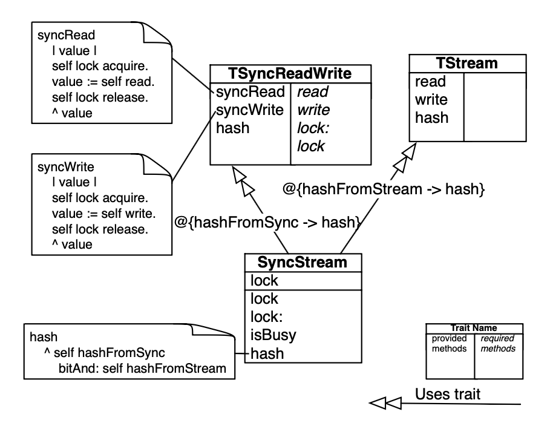

Cuerpos de métodos adjuntos como notas en la figura:

```smalltalk
syncRead
    | value |
    self lock acquire.
    value := self read.
    self lock release.
    ^ value

syncWrite
    | value |
    self lock acquire.
    value := self write.
    self lock release.
    ^ value

hash
    ^ self hashFromSync
        bitAnd: self hashFromStream
```

*Descripción: diagrama UML extendido. La clase `SyncStream` (caja con dos compartimientos: la variable `lock` arriba; los métodos `lock`, `lock:`, `isBusy` y `hash` abajo) usa dos traits mediante flechas de doble punta abierta. La flecha hacia `TSyncReadWrite` lleva el alias `@{hashFromSync -> hash}`; la flecha hacia `TStream` lleva `@{hashFromStream -> hash}`. `TSyncReadWrite` provee `syncRead`, `syncWrite` y `hash`, y requiere (en itálica) `read`, `write`, `lock:` y `lock`. `TStream` provee `read`, `write` y `hash`, sin requeridos. Los cuerpos de `syncRead`, `syncWrite` y `hash` (de `SyncStream`) cuelgan como notas.*

> In Figure 1, the trait `TSyncReadWrite` provides the methods `syncRead`, `syncWrite` and `hash`. It requires the methods `read` and `write`, and the two accessor methods `lock` and `lock:`. We use an extension to UML to represent traits (the right column lists required methods while the left one lists the provided methods).

### 2.2 Composing classes from mixins

The following equation depicts how a class is built with traits:

*class = superclass + state + trait composition + glue code*

A class is specified from a superclass, state definition, a set of traits, and some *glue methods*. Glue methods are defined in the class and they connect the traits together; i.e., they implement required trait methods (often for accessing state), they adapt provided trait methods, and they resolve method conflicts.

> In Figure 1, the class `SyncStream` defines the field `lock` and the glue methods `lock`, `lock:`, `isBusy` and `hash`. The other required methods of `TSyncReadWrite`, `read` and `write`, are also provided since the class `SyncStream` uses another trait `TStream` which provides them.

Trait composition respects the following three rules:

- Methods defined in the class take precedence over trait methods. This allows the glue methods defined in a class to override methods with the same name provided by the used traits.
- Flattening property. A non-overridden method in a trait has the same semantics as if it were implemented directly in the class using the trait.
- Composition order is irrelevant. All the traits have the same precedence, and hence conflicting trait methods must be explicitly disambiguated.

With this approach, classes retain their primary role as generators of instances, whereas traits are purely behavioural units of reuse. As with mixins, classes are organized in a single inheritance hierarchy, thus avoiding the key problems of multiple inheritance, but the incremental extensions that classes introduce to their superclasses are specified using one or more traits. In contrast to mixins, several traits can be applied to a class in a single operation: trait composition is unordered. Instead of the trait composition resulting implicitly from the order in which traits are composed (as is the case with mixins), it is fully under the control of the composing class.

### 2.3 Conflict resolution

While composing traits, method conflicts may arise. A conflict arises if we combine two or more traits that provide identically named methods that do not originate from the same trait. Conflicts are resolved by implementing a method at the level of the class that overrides the conflicting methods, or by excluding a method from all but one trait. In addition traits allow method aliasing; this makes it possible for the programmer to introduce an additional name for a method provided by a trait. The new name is used to obtain access to a method that would otherwise be unreachable because it has been overridden [DNS+06].

> In Figure 1, methods in `TSyncReadWrite` and in `TStream` are used by `SyncStream`. The trait composition associated to `SyncStream` is:
>
> `TSyncReadWrite@{hashFromSync → hash} + TStream@{hashFromStream → hash}`
>
> This means that `SyncStream` is composed of (i) the trait `TSyncReadWrite` for which the method `hash` is aliased to `hashFromSync` and (ii) the trait `TStream` for which the method `hash` is aliased to `hashFromStream`.

### 2.4 Method composition operators

The semantics of traits composition is based on four operators: sum, overriding, exclusion and aliasing [DNS+06].

The sum trait `TSyncReadWrite + TStream` contains all of the non-conflicting methods of `TSyncReadWrite` and `TStream`. If there is a method conflict, that is, if `TSyncReadWrite` and `TStream` both define a method with the same name, then in `TSyncReadWrite + TStream` that name is bound to a distinguished conflict method. The `+` operator is associative and commutative.

The overriding operator constructs a new composition trait by extending an existing trait composition with some explicit local definitions. For instance, `SyncStream` overrides the method `hash` obtained from its trait composition. This can also be done with methods, as we will discuss in more detail later.

A trait can be constructed by excluding methods from an existing trait using the exclusion operator `−`. Thus, for instance, `TStream − {read, write}` has a single method `hash`. Exclusion is used to avoid conflicts, or if one needs to reuse a trait that is "too big" for one's application.

The method aliasing operator `@` creates a new trait by providing an additional name for an existing method. For example, if `TStream` is a trait that defines `read`, `write` and `hash`, then `TStream @ {hashFromStream → hash}` is a trait that defines `read`, `write`, `hash` and `hashFromStream`. The additional method `hashFromStream` has the same body as the method `hash`. Aliases are used to make conflicting methods available under another name, perhaps to meet the requirements of some other trait, or to avoid overriding. Note that because the body of the aliased method is not changed in any way, so an alias to a recursive method is not recursive.

## 3 Limitations of stateless traits

Traits support the reuse of coherent groups of methods by otherwise independent classes [DNS+06]. Traits can be composed out of other traits. As a consequence they serve well as a medium for structuring code. Unfortunately stateless traits necessarily encode dependency on state in terms of required methods (i.e., accessors). In essence, traits are necessarily incomplete since virtually any useful trait will be forced to define required accessors. This means that the composing class must define the missing instance variables and accessors.

The incompleteness of traits results in a number of annoying limitations, namely: (i) trait reusability is impacted because the required interface is typically cluttered with uninteresting required accessors, (ii) client classes are forced to implement boilerplate glue code, (iii) the introduction of new state in a trait propagates required accessors to all client classes, and (iv) public accessors break encapsulation of the client class.

Although these annoyances can be largely addressed by proper tool support, they disturb the appeal of traits as a clean, lightweight mechanism for composing classes from reusable components. A proper understanding of these limitations is a prerequisite to entertaining any proposal for a more general approach.

### 3.1 Limited reusability

The fact that a stateless trait is forced to encode state in terms of required accessors means that it cannot be composed "off-the-shelf" without some additional action. Virtually every useful trait is incomplete, even though the missing part can be trivially fulfilled.

What's worse, however, is the fact that the required interface of a trait is cluttered with dependencies on uninteresting required accessors, rather than focussing attention on the non-trivial hook methods that clients must implement.

**Fig. 2.** The `lock` variable, the `lock` and `lock:` methods are duplicated among trait `TSyncReadWrite` users.

```
                       ┌─────────────────────────────┐
                       │        TSyncReadWrite       │
                       │  provided     │  required   │
                       ├───────────────┼─────────────┤
                       │ initialize    │ read        │
                       │ syncRead      │ write       │
                       │ syncWrite     │ lock:       │
                       │               │ lock        │
                       └───────────────┴─────────────┘
                          △△          △△          △△
                          │           │           │
                ┌─────────┴──┐ ┌──────┴─────┐ ┌───┴────────┐
                │  SyncFile  │ │ SyncStream │ │ SyncSocket │
                ├────────────┤ ├────────────┤ ├────────────┤
                │ ▓ lock     │ │ ▓ lock     │ │ ▓ lock     │
                ├────────────┤ ├────────────┤ ├────────────┤
                │ ▓ lock:    │ │ ▓ lock:    │ │ ▓ lock:    │
                │ ▓ lock     │ │ ▓ lock     │ │ ▓ lock     │
                │ read       │ │ read       │ │ read       │
                │ write      │ │ write      │ │ write      │
                └────────────┘ └────────────┘ └────────────┘

 Leyenda del original:  ▓ (sombreado gris) = "Duplicated code"
                        flecha con doble punta abierta = "Use of trait"
```

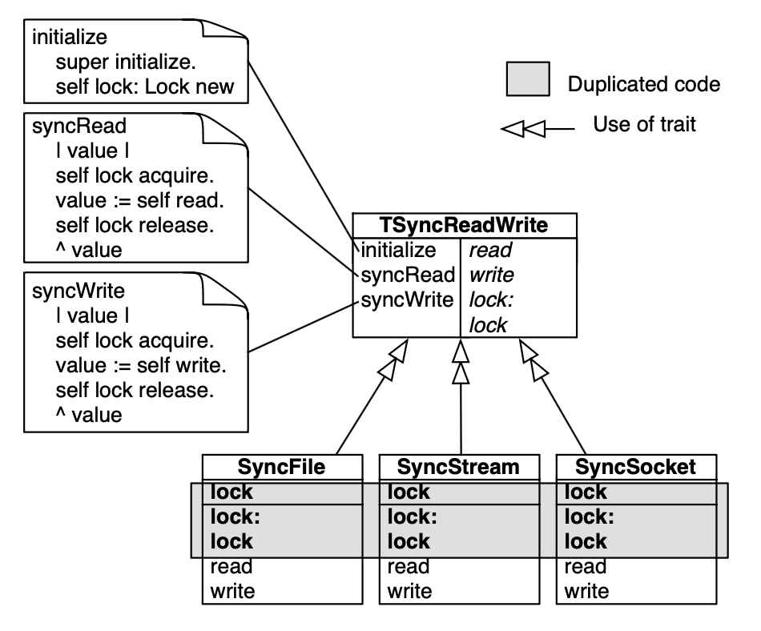

Cuerpos de métodos adjuntos como notas en la figura:

```smalltalk
initialize
    super initialize.
    self lock: Lock new

syncRead
    | value |
    self lock acquire.
    value := self read.
    self lock release.
    ^ value

syncWrite
    | value |
    self lock acquire.
    value := self write.
    self lock release.
    ^ value
```

*Descripción: el trait `TSyncReadWrite` provee `initialize`, `syncRead` y `syncWrite`, y requiere `read`, `write`, `lock:` y `lock`. Tres clases lo usan: `SyncFile`, `SyncStream` y `SyncSocket`. En cada una, la variable `lock` (compartimiento superior) y los métodos `lock:` y `lock` aparecen sombreados en gris como código duplicado; `read` y `write` no están sombreados. Los cuerpos de `initialize`, `syncRead` y `syncWrite` cuelgan como notas del trait.*

Although this problem can be partially alleviated with proper tool support that distinguishes the uninteresting required accessors from the other required methods, the fact remains that traits with required accessors can never be reused off-the-shelf without additional action by the ultimate client class.

### 3.2 Boilerplate glue code

The necessary additional client action consists essentially in the generation of boilerplate glue code to inject the missing instance variables, accessors and initialization code. Clearly this boilerplate code must be generated for each and every client class. In the most straightforward approach, this will lead to the kind of duplicated code that traits were intended to avoid.

Figure 2 illustrates such a situation where the trait `TSyncReadWrite` needs to access a lock. This `lock` variable, the `lock` accessor and the `lock:` mutator have to be duplicated in `SyncFile`, `SyncStream` and `SyncSocket`.

Once again, to avoid this situation, tool support would be required (i) to automatically generate the required instance variables and accessors, and (ii) to generate the code in such a way as to avoid actual duplication.

Another unpleasant side effect of the need for boilerplate glue code is the emergence of "shell classes" consisting of nothing but glue code. In the Smalltalk hierarchy refactored using stateless traits [BSD03], we note that 24% (7 out of 29) of the classes in the hierarchy refactored with traits are pure shell classes.

### 3.3 Propagation of required accessors

If a trait implementation evolves and requires new variables, it may impact all the classes that use it, even if the interface remains untouched. For instance, if the implementation of the trait `TSyncReadWrite` evolves and requires a new variable `numberWaiting` intended to give the number of clients waiting for the lock, then all the classes using this trait are impacted, even though the public interface does not change.

Required accessors are propagated and accumulated from trait to trait, therefore when a class is composed of deeply composed traits, a large number of accessors may need to be resolved. When a new state dependency is introduced in a deeply nested trait, required accessors can be propagated to a large number of client classes. Again, proper tool support can largely mitigate the consequences of such changes, but a more satisfactory solution would be welcome.

### 3.4 Violation of encapsulation

Stateless traits violate encapsulation in two ways. First of all, stateless traits unnecessarily expose information about their internal representation, thus muddying their interface. A stateless trait exposes every part of its needed representation as a required accessor, even if this information is of no interest to its clients. Encapsulation would be better served if traits resembled more closely abstract classes, where only abstract methods are explicitly declared as being the responsibility of the client subclass. By the same token, a client class using a trait should only see those required methods that are truly its responsibility to implement, and no others.

The second violation is about visibility. In Smalltalk, instance variables are always private. Access can be granted to other objects by providing public accessors. But if traits require accessors, then classes using these traits must provide public accessors to the missing state, even if this is not desired.

In principle, this problem could be somewhat mitigated in Java-like languages by including visibility modifiers for stateless traits in Java-like languages. A trait could then require a private or protected accessor for missing state. The client class could then supply these accessors without violating encapsulation (and optionally relaxing the required modifier). This solution, however, would not solve the problem for Smalltalk-like languages in which all methods are public, and may only be marked as "private" by convention (i.e., by placing such methods in a category named "private").

## 4 Stateful traits: reconciling traits and state

We now present stateful traits as our solution to the limitations of stateless traits. Although it may seem that adding instance variables to traits would represent a trivial extension, in fact there are a number of issues that need to be resolved. Briefly, our solution addresses the following concerns:

- Stateless traits should be a special case of stateful traits. The original semantics of stateless traits (and the advantages of that solution) should not be impacted.
- Any extension should be syntactically and semantically minimal. We seek a simple solution.
- We should address the limitations listed in Section 3. In particular, it should be possible to express complete traits. Only methods that are conceptually the responsibility of client classes should be listed as required methods.
- The solution should offer sensible default semantics for trait usage, thus enabling black-box usage.
- Consistent with the guiding principle of stateless traits, the client class should retain control over the composition, in particular over the policy for resolving conflicts. A degree of white-box usage is therefore also supported, where needed.
- As with stateless traits, we seek to avoid fragility with respect to change. Changes to the representation of a trait should normally not affect its clients.
- The solution should be largely language independent. We do not depend on obscure or exotic language features, so the approach should easily apply to most object-oriented languages.

The solution we present extends traits to possibly include instance variables. In a nutshell, there are three aspects to our approach:

1. Instance variables are, by default, private to the scope of the trait that defines them.
2. The client of a trait, i.e., a class or a composite trait, may access selected variables of that trait, mapping those variables to possibly new names. The new names are private to the scope of the client.
3. The client of a composite trait may merge variables of the traits it uses by mapping them to a common name. The new name is private to the scope of the client.

In the following subsections we provide details of the stateful traits model.

### 4.1 Stateful trait definition

A stateful trait extends a stateless trait by including private instance variables. A stateful trait therefore consists of a group of public methods and private instance variables, and possibly a specification of some additional required methods to be implemented by clients.

**Methods.** Methods defined in a trait are visible to any other trait with which it is composed. Because methods are public, conflicts may occur when traits are composed. Method conflicts for stateful traits are resolved in the same way as with stateless traits.

**Variables.** By default, variables are private to the trait that defines them. Because variables are private, conflicts between variables cannot occur when traits are composed. If, for example, traits `T1` and `T2` each define a variable `x`, then the composition of `T1 + T2` does not yield a variable conflict. Variables are only visible to the trait that defines them, unless access is widened by the composing client trait or class with the `@@` variable access operator.

**Fig. 3.** The class `SyncStream` is composed of the stateful traits `TStream` and `TSyncReadWrite`.

```
 ┌────────────────────────────┐          ┌──────────────────────┐
 │       TSyncReadWrite       │          │       TStream        │
 │ lock                       │          │ provided │ required  │
 ├───────────────┬────────────┤          ├──────────┼───────────┤
 │  provided     │  required  │          │ read     │           │
 │ initialize    │ read       │          │ write    │           │
 │ syncRead      │ write      │          │ hash     │           │
 │ syncWrite     │            │          └──────────┴───────────┘
 │ hash          │            │                    △△
 └───────────────┴────────────┘                    │
              △△                                   │
              │  @{hashFromSync -> hash}           │  @{hashFromStream -> hash}
              │  @@{syncLock -> lock}              │
              │                                    │
              └───────────────┬────────────────────┘
                              │
                      ┌───────┴──────┐
                      │  SyncStream  │
                      ├──────────────┤
                      │ isBusy       │
                      │ hash         │
                      └──────────────┘

 Leyenda del original:  [Trait Name | provided methods | required methods]
                        flecha con doble punta abierta (△△) = "Uses trait"
```

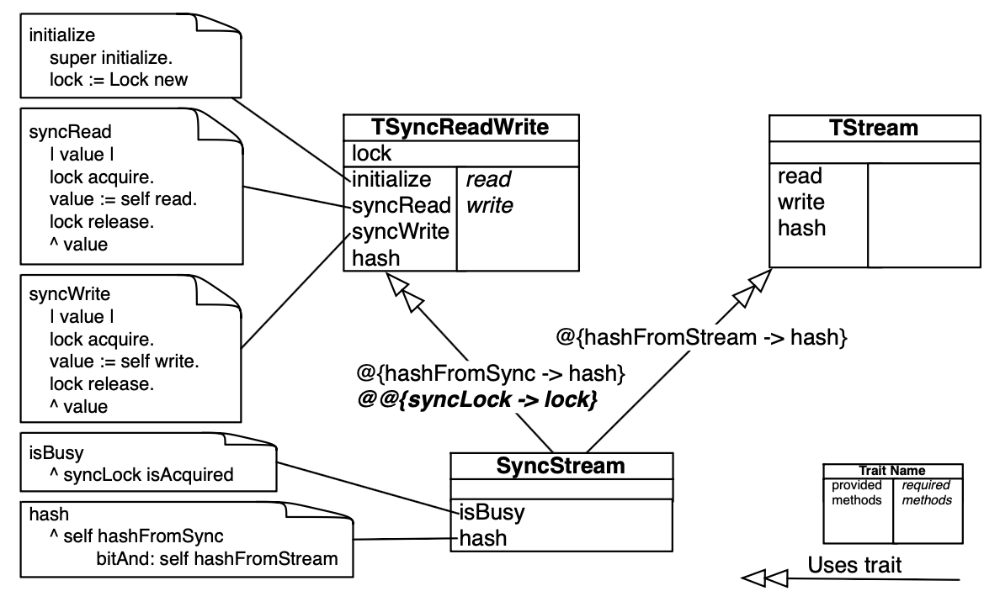

Cuerpos de métodos adjuntos como notas en la figura:

```smalltalk
initialize
    super initialize.
    lock := Lock new

syncRead
    | value |
    lock acquire.
    value := self read.
    lock release.
    ^ value

syncWrite
    | value |
    lock acquire.
    value := self write.
    lock release.
    ^ value

isBusy
    ^ syncLock isAcquired

hash
    ^ self hashFromSync
        bitAnd: self hashFromStream
```

*Descripción: reimplementación de la Fig. 1 con traits stateful. `TSyncReadWrite` ahora tiene un compartimiento de variables con `lock`; provee `initialize`, `syncRead`, `syncWrite` y `hash`, y requiere solo `read` y `write` (desaparecen los accessors requeridos `lock`/`lock:`). La clase `SyncStream` queda sin variables y define solo `isBusy` y `hash`. La flecha hacia `TSyncReadWrite` lleva dos etiquetas: el alias de método `@{hashFromSync -> hash}` y, debajo y en negrita itálica en el original, el operador de acceso a variable `@@{syncLock -> lock}`. La flecha hacia `TStream` lleva `@{hashFromStream -> hash}`. Los cuerpos de método usan la variable directamente (`lock acquire.`) en vez de `self lock acquire.`; `isBusy` de `SyncStream` accede a la variable del trait bajo el nombre `syncLock`.*

Figure 3 shows how the situation presented in Figure 1 is reimplemented using stateful traits. The class `SyncStream` is composed of the traits `TStream` and `TSyncReadWrite`. The trait `TSyncReadWrite` defines the variable `lock`, three methods `syncRead`, `syncWrite` and `hash`, and requires methods `read` and `write`.

Note that, in order to include state in traits, we must extend the mechanism for defining traits. In the Smalltalk implementation, this is achieved by extending the message sent to the `Trait` class with a new keyword argument to represent the used instance variables. For instance, we can now define the `TSyncReadWrite` trait as follows:

```smalltalk
Trait named: #TSyncReadWrite
    uses: {}
    instVarNames: 'lock'
```

The trait `TSyncReadWrite` is not composed of any other traits and it defines a variable `lock`. The `uses:` clause specifies the trait composition (empty in this case), and `instVarNames:` lists the variables defined in the trait (i.e., the variable, `lock`). The interface for defining a class as composition of traits is the same as with stateless traits. The only difference is that the trait composition expression supports an additional operator (`@@`) for granting access to variables of the used traits. Here we see how `SyncStream` is composed from the traits `TSyncReadWrite` and `TStream`:

```smalltalk
Object subclass: #SyncStream
    uses: TSyncReadWrite @ {#hashFromSync → #hash}
            @@ {syncLock → lock}
        + TStream @ {#hashFromStream → #hash}
    instVarNames: ''
    ....
```

In this example, access is granted to the `lock` variable of the `TSyncReadWrite` trait under the new name `syncLock`. As we shall now see, the `@@` operator provides a fine degree of control over the visibility of trait variables.

### 4.2 Variable access

By default, a variable is private to the trait that defines it. However, the variable access operator (`@@`) allows variables to be *accessed* from clients under a possibly new name, and possibly *merged* with other variables.

If `T` is a trait that defines a (private) instance variable `x`, then `T@@{y → x}` represents a new trait in which the variable `x` can be accessed from its client scope under the name `y`. `x` and `y` represent the same variable, but the name `x` is restricted to the scope of `t` whereas the name `y` is visible to the enclosing client scope (i.e., the composing classscope). For instance, in the following composition:

`TSyncReadWrite@{hashFromSync → hash} @@{syncLock → lock}`

the variable `lock` defined in `TSyncReadWrite` is accessible to the class `SyncStream` using that trait under the name `syncLock`. (Note that renaming is often needed to distinguish similarly named variables coming from different used traits.)

In a trait variable composition, three situations can arise: (i) variables remain private (i.e., the variable access operator is not used), (ii) access to a private variable is granted, and (iii) variables are merged.

**Fig. 4.** Keeping variables private: while composed, variables are kept separate. Traits `T1`, `T2` and `C` have their own variable `x`.

```
                                 ┌───────────────────────┐
                                 │          T1           │
                                 │ x                     │
               ┌──────────────▷▷├───────────┬───────────┤
               │                 │ getXT1    │           │
 ┌──────────┐  │                 │ setXT1:   │           │
 │    C     │  │                 └───────────┴───────────┘
 │ x        │──┤
 ├──────────┤  │                 ┌───────────────────────┐
 │ getX     │  │                 │          T2           │
 │ setX:    │  │                 │ x                     │
 └──────────┘  └──────────────▷▷├───────────┬───────────┤
                                 │ getXT2    │           │
                                 │ setXT2:   │           │
                                 └───────────┴───────────┘
```

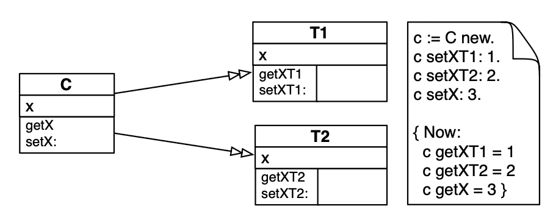

Nota de uso adjunta en la figura:

```
c := C new.
c setXT1: 1.
c setXT2: 2.
c setX: 3.

{ Now:
  c getXT1 = 1
  c getXT2 = 2
  c getX = 3 }
```

*Descripción: la clase `C` define su propia variable `x` y los métodos `getX` y `setX:`, y usa los traits `T1` y `T2` sin etiquetas en las flechas (sin operador de acceso a variables). `T1` define la variable `x` y los métodos `getXT1` y `setXT1:`; `T2` define la variable `x` y los métodos `getXT2` y `setXT2:`. La nota muestra que las tres variables `x` quedan separadas: asignar 1, 2 y 3 por cada vía devuelve 1, 2 y 3 respectivamente.*

**Keeping variables private.** By default, instance variables are private to their trait. If the scope of variables is not broadened at composition time using the variable access operator, conflicts do not occur and the traits do not share state. Figure 4 shows a case where `T1` and `T2` are composed without variable access being broadened. Each of these two traits defines a variable `x`. In addition they each define accessor methods. `C` also defines a variable `x` and two methods `getX` and `setX:`. `T1`, `T2` and `C` each have their own variable `x` as shown in Figure 4.

The trait composition of `C` is: `T1 + T2`. Note that if methods would conflict we would use the default trait strategy to resolve them by locally redefining them in `C` and that method aliasing could be used to access the overridden methods.

This form of composition is close to the module composition approach proposed in Jigsaw [Bra92] and supports a black-box reuse scenario.

**Fig. 5.** Granting access to variables: `x` of `T1` and `T2` are given access in `C`.

```
                  @@{ xFromT1 -> x }  ┌───────────────────────┐
               ┌────────────────────▷▷│          T1           │
               │                      │ x                     │
 ┌──────────┐  │                      ├───────────┬───────────┤
 │    C     │  │                      │ getXT1    │           │
 ├──────────┤──┤                      │ setXT1:   │           │
 │ sum      │  │                      └───────────┴───────────┘
 └──────────┘  │
               │  @@{ xFromT2 -> x }  ┌───────────────────────┐
               └────────────────────▷▷│          T2           │
                                      │ x                     │
                                      ├───────────┬───────────┤
                                      │ getXT2    │           │
                                      │ setXT2:   │           │
                                      └───────────┴───────────┘
```

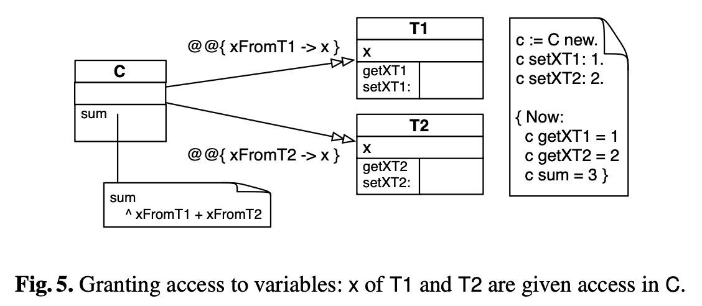

Notas adjuntas en la figura:

```smalltalk
sum
    ^ xFromT1 + xFromT2
```

```
c := C new.
c setXT1: 1.
c setXT2: 2.

{ Now:
  c getXT1 = 1
  c getXT2 = 2
  c sum = 3 }
```

*Descripción: la clase `C` define el método `sum` y usa `T1` con la etiqueta `@@{ xFromT1 -> x }` y `T2` con `@@{ xFromT2 -> x }`: la variable privada `x` de cada trait queda accesible en `C` bajo los nombres `xFromT1` y `xFromT2`. El cuerpo de `sum` devuelve `xFromT1 + xFromT2`. La nota de uso muestra que tras asignar 1 y 2 por los setters de los traits, `sum` devuelve 3.*

**Granting variable access.** Figure 5 shows how the client class `C` gains access to the private `x` variables of traits `T1` and `T2` by using the variable access operator `@@`. Because two variables cannot have the same name within a given scope, these variables have to be renamed. The variable `x` from `T1` is accessible as `xFromT1` and `x` from `T2` is accessible as `xFromT2`. `C` also defines a method `sum` that returns the value `xFromT1 + xFromT2`. The trait composition of `C` is:

```
T1 @@ {xFromT1 → x}
+ T2 @@ {xFromT2 → x}
```

`C` can therefore build functionality on top of the traits that it uses, without exposing any details to the outside. Note that methods in the trait continue to use the 'internal' name of the variable as defined in the trait. The name given in the variable access operator `@@` is only to be used in the client classes. This is similar to the method aliasing operator `@`.

**Merging variables.** Variables from several traits can be merged when they are composed by using the variable access operator to map multiple variables to a *common name* within the client scope. This is illustrated in Figure 6.

Both `T1` and `T2` give access to their instance variables `x` and `y` under the name `w`. This means that `w` is shared between all three traits. This is the reason why sending `getX`, `getY`, or `getW` to an instance of a class implementing `C` returns the same result, 3. The trait composition of `C` is:

**Fig. 6.** Merging variables: variables `x` and `y` are merged in `C` under the name `w`.

```
                  @@{w -> x}          ┌───────────────────────┐
               ┌────────────────────▷▷│          T1           │
               │                      │ x                     │
 ┌──────────┐  │                      ├───────────┬───────────┤
 │    C     │  │                      │ getX      │           │
 ├──────────┤──┤                      │ setX:     │           │
 │ getW     │  │                      └───────────┴───────────┘
 │ setW:    │  │
 └──────────┘  │  @@{w -> y}          ┌───────────────────────┐
               └────────────────────▷▷│          T2           │
                                      │ y                     │
                                      ├───────────┬───────────┤
                                      │ getY      │           │
                                      │ setY:     │           │
                                      └───────────┴───────────┘
```

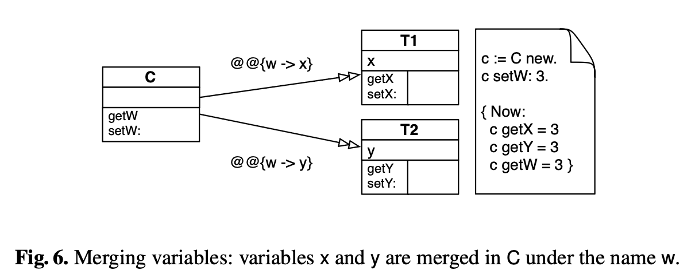

Nota de uso adjunta en la figura:

```
c := C new.
c setW: 3.

{ Now:
  c getX = 3
  c getY = 3
  c getW = 3 }
```

*Descripción: la clase `C` define `getW` y `setW:` y usa `T1` con la etiqueta `@@{w -> x}` y `T2` con `@@{w -> y}`: la variable `x` de `T1` y la variable `y` de `T2` se fusionan bajo el nombre común `w` en el scope de `C`. La nota de uso muestra que tras `c setW: 3`, los tres getters (`getX`, `getY`, `getW`) devuelven 3.*

`T1 @@ {w → x} + T2 @@ {w → y}`

Note that merging is *fully* under the control of the client class or trait. There can be no accidental name capture since visibility of instance variables is never propagated to an enclosing scope. Variable name conflicts cannot arise, since variables are private to traits unless they are explicitly accessed by clients, and variables are merged when they are mapped to common names.

The reader might well ask, what happens if the client also defines an instance variable whose name happens to match the name under which a used trait's variable is accessed? Suppose, for example, that `C` in Figure 6 attempts to additionally define an instance variable called `w`. We consider this to be an error. This situation cannot possibly arise as a side effect of changing the definition of a used trait since the client has full control over the names of instance variables accessible within its scope. As a consequence this cannot be a case of accidental name capture, and can only be interpreted as an error.

### 4.3 Requirements revisited

Let us briefly reconsider our requirements. First, stateful traits do not change the semantics of stateless traits. Stateless traits are purely a special case of stateful traits. Syntactically and semantically, stateful traits represent only a minor extension of stateless traits.

Stateful traits address the issues raised in Section 3. In particular, (i) there is no longer a need to clutter trait interfaces with required accessors, (ii) clients no longer need to provide boilerplate instance variables and accessors, (iii) the introduction of state in traits remains private to that trait, and (iv) no public accessors need be introduced in client classes. As a consequence, it is possible to define "complete" traits that require no methods, even though they make use of state.

The default semantics of stateful traits enables black-box usage since no representation is exposed, and instance variables by default cannot clash with those of the client or of other used traits. Nevertheless, the client retains control of the composition, and can gain access to the instance variables of used traits. In particular, the client may merge variables of traits, if this is desired.

Since the client retains full control of the composition, changes to the definition of a trait cannot propagate beyond its direct clients. There can be no implicit side effects.

Finally, the approach is largely language-independent. In particular, there are no assumptions that the host language provide either access modifiers for instance variables or exotic scoping mechanisms.

## 5 Implementation

We have implemented a prototype of stateful traits as an extension of our Smalltalk-based implementation of stateless traits.[^5]

[^5]: See [www.iam.unibe.ch/~scg/Research/Traits](http://www.iam.unibe.ch/~scg/Research/Traits)

As with stateless traits, method composition and reuse for stateful traits do not incur any overhead since method pointers are shared between method dictionaries of different traits and classes. This takes advantage of the fact that methods are looked up by name in the dictionary rather than accessed by index and offset, as is done to access state in most object-oriented programming languages. However, by adding state to traits, we have to find a solution to the fact that the access to instance variables cannot be linear (i.e., based on offsets) since the same trait methods can be applied to different objects [BGG+02]. A linear structure for state representation cannot be always obtained from a composition graph. This is a common problem of languages that support multiple inheritance. We evaluated two implementations: copy-down and changing object internal representation. The following section illustrates the problem.

### 5.1 The classical problem of state linearization

As pointed out by Bracha [Bra92, Chapter 7], in implementations of single inheritance languages such as Modula-3 [CDG+92], and more recently in the Jikes Research Virtual Machine [Jik], the notion of virtual functions is supported by associating to each class a table whose entries are the addresses of the methods defined for instances of that class. Each instance of a class contains a reference to the class method table. It is through this reference that the appropriate method to be invoked on an instance is located. Under multiple inheritance, this technique must be modified, since the superclasses of a class no longer share a common prefix.

Since a stateful trait may have a private state, and may be used in multiple contexts, it is not possible to have a static and linear instance variable offset list shared by all the methods of the trait and its users.

**Fig. 7.** Problem of combining multiple traits: variable's offset is not preserved.

```
 Modelo:
   ┌─────────────────────┐               ┌────────┐
   │         T1          │ ◁◁─────────── │   T3   │
   │ x, y, z             │               └────────┘
   ├─────────┬───────────┤
   │ getX    │           │ ◁◁────┐
   └─────────┴───────────┘       │       ┌────────┐
                                 ├────── │   T4   │
   ┌─────────────────────┐       │       └────────┘
   │         T2          │ ◁◁────┘
   │ v, x                │
   ├─────────┬───────────┤
   │ getV    │           │
   └─────────┴───────────┘

 Memory layout:                                      Variable
    T1        T2        T3        T4                 offsets
 ┌───────┐ ┌───────┐ ┌───────┐ ┌───────┐
 │ T1.x  │ │ T2.v  │ │ T1.x  │ │ T1.x  │                0
 │ T1.y  │ │ T2.x  │ │ T1.y  │ │ T1.y  │                1
 │ T1.z  │ └───────┘ │ T1.z  │ │ T1.z  │                2
 └───────┘           └───────┘ │ T2.v  │                3
                               │ T2.x  │                4
                               └───────┘
```

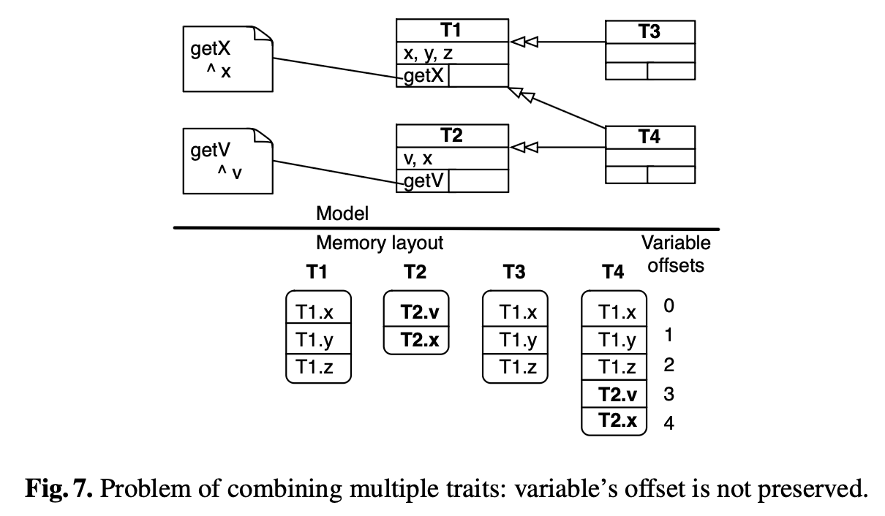

Cuerpos de métodos adjuntos como notas en la figura:

```smalltalk
getX
    ^ x

getV
    ^ v
```

*Descripción: arriba, el modelo: el trait `T1` define las variables `x`, `y`, `z` y el método `getX` (`^ x`); el trait `T2` define `v`, `x` y el método `getV` (`^ v`). `T3` usa `T1`; `T4` usa `T1` y `T2`. Abajo, el layout de memoria por offsets de cada trait: `T1` = [T1.x, T1.y, T1.z]; `T2` = [T2.v, T2.x] (resaltadas en negrita en el original); `T3` = [T1.x, T1.y, T1.z]; `T4` = [T1.x, T1.y, T1.z, T2.v, T2.x], con la columna de offsets 0–4 al costado: en `T2`, `T2.v` tiene offset 0, pero en `T4` pasa a offset 3 — el offset de la variable no se preserva.*

The top half of Figure 7 shows a trait `T3` using `T1` and a trait `T4` using `T1` and `T2`. `T1` defines 3 variables `x`, `y`, `z` and `T2` defines 2 variables `v`, `x`. The bottom part shows a possible corresponding representation in memory that uses offsets. Assuming that we start the indexing at zero, `T2.v` has zero for index, and `T2.x` has one. However, in `T4` the same two variables might have indexes three and four.[^6] So static indexes used in methods from `T1` or `T2` are no longer valid. Note that this problem occurs regardless of the composition of trait `T4` out of traits `T1` and `T2` (whether it needs access to variables, whether or not it merges variable `x`, …). The problem is due to the linear representation of variables in the underlying object model.

[^6]: We assume that the slots of `T2` are added after the ones of `T1`. In the opposite case the argument holds for the variables of `T1`.

### 5.2 Three approaches to state linearization

Three different approaches are available to represent non linear state. C++ uses intra-object pointers [SG99]. Strongtalk [BGG+02] uses a *copy-down* technique that duplicates methods that need to access variable with different offset. A third approach, as done in Python [Pyt] for example, is to keep variables in a dictionary and look them up, similar to what is done for methods.

We implemented the last two approaches for Smalltalk so that we could compare them for our prototype implementation. We did not implement C++'s solution because it would require significant effort to change the object representation to be compatible.

### 5.3 Virtual base pointers in C++

In C++ [SE90], an instance of a class *C* is represented by concatenating the representations of superclasses of *C*. Such instance is therefore composed of *subobjects*, where each *subobject* corresponds to a particular *superclass*. Each subobject has its own pointer to a suitable method table. In this case, the representation of a class is not a prefix of the representations of all of its subclasses.

Each subobject begins at a different offset from the beginning of the complete *C* object. These offsets, called *virtual base pointers* [SG99], can be computed statically. This technique was pioneered by Krogdahl [Kro85, Bra92].

For instance, let's consider the situation in C++ illustrated in Figure 8. The upper part of the figure shows a classical diamond diagram using virtual inheritance (i.e., `B` and `C` inherit virtually `A`, therefore the `w` variable is shared between `B` and `C`). The lower part shows the memory layout of an instance of `D`. This instance is composed of 4 "sub-parts" corresponding to the superclasses `A`, `B`, `C` and `D`. Note that `C`'s part, instead of assuming that the state it inherits from `A` lies immediately "above" its own state, accesses the inherited state via the virtual base pointer. In this way the `B` and `C` parts of the `D` instance can share the same common state from `A`.

**Fig. 8.** Multiple virtual inheritance in C++.

```
 Modelo (herencia virtual):
                    ┌──────────────────┐
                    │        A         │
                    │ w: int           │
                    │ getW(): int      │
                    └──────────────────┘
                       △            △
           ┌───────────┘            └───────────┐
   ┌──────────────────┐            ┌──────────────────┐
   │        B         │            │        C         │
   │ x: int           │            │ y: int           │
   │ getX(): int      │            │ getY(): int      │
   └──────────────────┘            └──────────────────┘
               △                        △
               └───────────┬────────────┘
                    ┌──────────────────┐
                    │        D         │
                    │ z: int           │
                    │ getZ(): int      │
                    └──────────────────┘

 Memory layout de una instancia de D:            VTables
        ┌──────────────┐
    A ─ │ w   ─ ─ ─ ─ ─┼─ ─ ─ ─ ─ ─ ▶ getW()
        ├──────────────┤
    B ─ │ x   ─ ─ ─ ─ ─┼─ ─ ─ ─ ─ ─ ▶ getX()
        │ ┆            │
        ├──────────────┤
    C ─ │ y   ─ ─ ─ ─ ─┼─ ─ ─ ─ ─ ─ ▶ getY()
        │ ┆            │
        ├──────────────┤
    D ─ │ z   ─ ─ ─ ─ ─┼─ ─ ─ ─ ─ ─ ▶ getZ()
        └──────────────┘
```

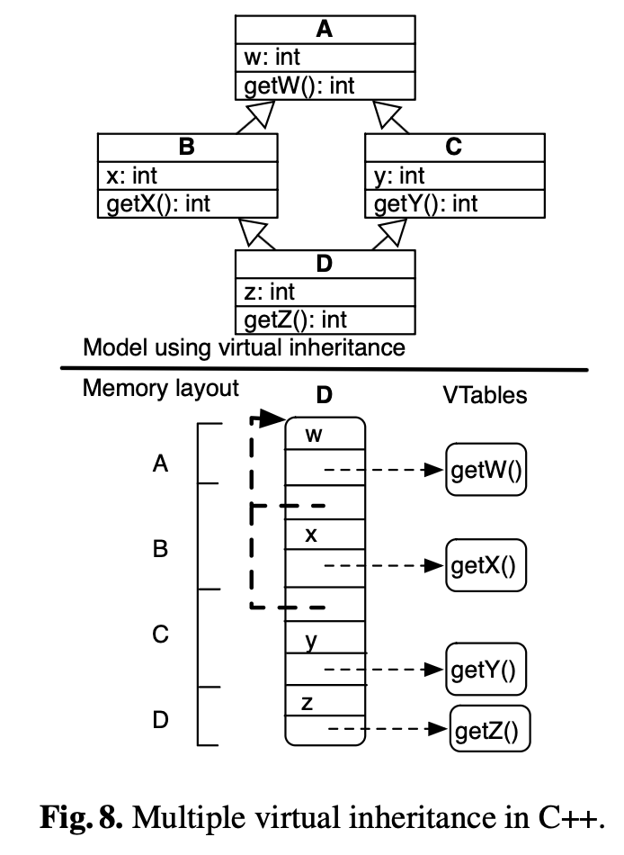

*Descripción: arriba, un diamante clásico con herencia virtual: `A` (variable `w: int`, método `getW(): int`) es heredada virtualmente por `B` (`x: int`, `getX(): int`) y `C` (`y: int`, `getY(): int`); `D` (`z: int`, `getZ(): int`) hereda de `B` y `C`. Abajo, el layout de memoria de una instancia de `D`, compuesto por 4 sub-partes rotuladas `A`, `B`, `C`, `D` con los slots `w`, `x`, `y`, `z`; de cada sub-parte sale un puntero (línea punteada) a su vtable correspondiente (`getW()`, `getX()`, `getY()`, `getZ()`). Una línea punteada vertical (┆) conecta las sub-partes `B` y `C` con el estado de `A`: es el virtual base pointer por el que acceden al estado heredado compartido.*

We did not attempt to implement this strategy in our Smalltalk prototype, as it would have required a deep modification to the Smalltalk VM. Since Smalltalk supports only single inheritance, object layout is fundamentally simpler. Accommodating virtual base pointers in the layout of an object would also entail changes to the method lookup algorithm.

### 5.4 Object state as a dictionary

An alternative implementation approach is to introduce instance variable accesses based on names and not on offsets. The variable layout has the semantics of a hash table, rather than that of an array. For a given variable, its offset is not constant anymore as shown by Figure 9. The state of an object is implemented by a hash table in which multiple keys may map to the same value. For instance, variable `y` of `T1` and variable `v` of `T2` are merged in `T4`. Therefore, an instance of `T4` has two variables (keys), `T1.y` and `T2.v`, that actually point to the same value.

**Fig. 9.** Structure of objects is similar to a hash table with multiple keys for a same entry.

```
 Modelo:
   ┌─────────────────────┐
   │         T1          │        @@ { v -> y }
   │ x, y, z             │ ◁◁──────────────┐
   ├─────────┬───────────┤                 │       ┌────────┐
   │ getX    │           │                 ├────── │   T4   │
   └─────────┴───────────┘                 │       └────────┘
   ┌─────────────────────┐        @@ { v -> v }
   │         T2          │ ◁◁──────────────┘
   │ v, x                │
   ├─────────┬───────────┤
   │ getV    │           │
   └─────────┴───────────┘

 Memory layout de T4:
 ┌──────────────┬───┐
 │ T1.x         │ ──┼───▶ val1
 │ T1.y, T2.v   │ ──┼───▶ val2
 │ T1.z         │ ──┼───▶ val3
 │ T2.x         │ ──┼───▶ val4
 └──────────────┴───┘
```

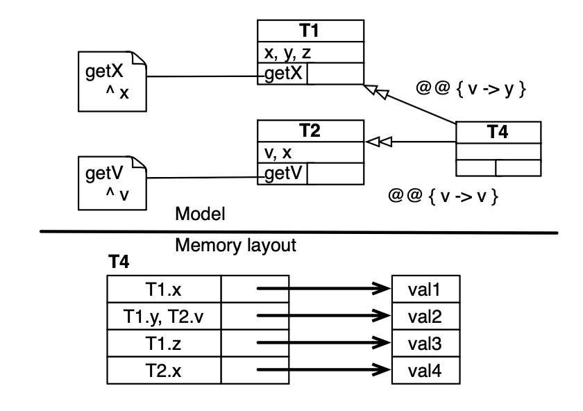

Cuerpos de métodos adjuntos como notas en la figura:

```smalltalk
getX
    ^ x

getV
    ^ v
```

*Descripción: arriba, el modelo: `T4` usa `T1` con la etiqueta `@@ { v -> y }` y `T2` con `@@ { v -> v }`, con lo cual la variable `y` de `T1` y la variable `v` de `T2` quedan fusionadas bajo el nombre `v`. Abajo, el layout de memoria de `T4` como hash table: las claves `T1.x`, `T1.z` y `T2.x` apuntan a `val1`, `val3` y `val4` respectivamente, mientras que las dos claves `T1.y` y `T2.v` apuntan a la misma entrada `val2`.*

In Python [Pyt] the state of an object is represented by a dictionary. An expression such as `self.name = value` is translated into `self.__dict__[name] = value`, where `__dict__` is a primitive to access the dictionary of an object. A variable is declared and defined simply by being used in Python. For instance, affecting a value to an non-existing variable has the effect to create a new variable. Representing the state of an object with a dictionary is a way to deal with the linearization problem of multiple inheritance.

### 5.5 Copy down methods

Strongtalk [BGG+02] is a high performance Smalltalk with a mixin-aware virtual machine. A mixin contains description of its instance variables and class variables, and a method dictionary where all the code is initially stored. One of the problems when sharing code among mixin application is that the physical layout of instances varies between mixin applications. This problem is addressed by the *copy down* mechanism: (i) Methods that do not access instance variables or `super` are shared in the mixin. (ii) Methods that access instance variables may have to be copied if the variable layout differs from that of other users of the mixin.

The copy down mechanism favors execution speed over memory consumption. There is no extra overhead to access variables. Variables are linearly ordered, and methods that access them are duplicated and adjusted with proper offset access. Moreover, in Strongtalk, only accessors are allowed to touch instance variables directly at the byte code level. The space overhead of copy-down is therefore minimal. Effective inlining by the VM takes care of the rest, except for accessors which impose no space overhead.

The dictionary-based approach has the advantage that it more directly reflects the semantics of stateful traits, and is therefore attractive for a prototype implementation. Practical performance could however become problematic, even with optimized dictionary implementations like in Python [Pyt]. The copy-down approach, however, is clearly the better approach for a fast implementation. Therefore we decided to adopt it in our implementation of stateful traits in Squeak Smalltalk.

### 5.6 Benchmarks

As mentioned in the previous section, we adopted the copy-down technique for our stateful traits implementation. In this section we compare the performance of our stateful traits prototype implementation with that of both regular Squeak without traits and that of the stateless traits implementation. We measured the performance of the following two case studies:

- the `SyncStream` example introduced in the beginning of the paper. The experiment consisted of writing and reading large objects in a stream 1000 times. This example was chosen to evaluate whether state is accessed efficiently.
- a `link checker` application that parses HTML pages to check whether URLs on a webpage are reachable or not. This entails parsing large HTML files into a tree representation and running visitors over these trees. This case study was chosen in order to have a more balanced example that consists of accessing methods as well as state.

For both case studies we compared the stateful implementation with the stateless traits implementation and with reular Squeak. The results are shown in Table 1.

|             | Without traits | Stateless traits | Stateful traits |
|-------------|----------------|------------------|-----------------|
| SyncStream  | 13912          | 13913            | 13912           |
| LinkChecker | 2564           | 2563             | 2564            |

**Table 1.** Execution times of two cases for three implementations: without traits, with stateless traits and with stateful traits (times in milliseconds).

As can be seen from the table, no overhead is introduced by accessing instance variables defined in traits and used in clients. This was to be expected: the access is still offset-based and almost no differences can be noticed. Regarding overall execution speed, we see that there is essentially no difference between the three implementations. This result is consistent with previous experience using traits, and was to be expected since we did not change the parts of the implementation dealing with methods.

## 6 Refactoring the Smalltalk collection hierarchy

We have carried out a case study in which we used stateful traits to refactor the Smalltalk collection hierarchy. We have previously used stateless traits to refactor the same hierarchy [BSD03], and we now compare the results of the two refactorings. The stateless trait-based Smalltalk collection hierarchy consists of 29 classes which are built from a total of 52 traits. Among these 29 classes there are numerous classes, which we call *shell* classes, that only declare variables and define their associated accessors. Seven classes of the 29 classes (24%) are shell classes (`SkipList`, `PluggableSet`, `LinkedList`, `OrderedCollection`, `Heap`, `Text` and `Dictionary`).

The refactoring with stateful traits results in a redistribution of the variables defined (in classes) to the traits that effectively need and use them. Another consequence is the decrease of number of required methods and a better encapsulation of the traits behaviour and internal representation.

**Fig. 10.** Fragment of the stateless trait Smalltalk collection hierarchy. The class `Heap` defines variables used by `TArrayBased` and `TSortBlockBased`.

```
                          ┌───────────────────────────┐
                          │           Heap            │
                          │ array                     │
                          │ tally                     │
                          │ sortBlock                 │
                          ├───────────────────────────┤
                          │ array                     │
                          │ array:                    │
                          │ tally                     │
                          │ tally:                    │
                          │ privateSortBlock:         │
                          │ sortBlock                 │
                          └───────────────────────────┘
                                        │
                                        ▽▽
                        ┌─────────────────────────────────────┐
                        │              THeapImpl              │
                        │  provided     │  required           │
                        ├───────────────┼─────────────────────┤
 ┌────────────────┐     │ add:          │ array               │     ┌─────────────────┐
 │ TExtensibleSeq │ ◁◁──│ copy          │ array:              │──▷▷ │ TExtensibleInst │
 │   ...  │  ...  │     │ grow          │ tally               │     │   ...  │  ...   │
 └────────────────┘     │ removeAt:     │ tally:              │     └─────────────────┘
                        │ ...           │ privateSortBlock:   │
                        │               │ sortBlock           │
                        └───────┬───────┴──────────┬──────────┘
                                ▽▽                 ▽▽
              ┌─────────────────────────┐   ┌─────────────────────────────────┐
              │       TArrayBased       │   │         TSortBlockBased         │
              │ provided │ required     │   │ provided   │ required           │
              ├──────────┼──────────────┤   ├────────────┼────────────────────┤
              │ size     │ array        │   │ sortBlock: │ privateSortBlock:  │
              │ capacity │ array:       │   │            │ sortBlock          │
              │ ...      │ tally        │   └────────────┴────────────────────┘
              │          │ tally:       │
              └──────────┴──────────────┘
```

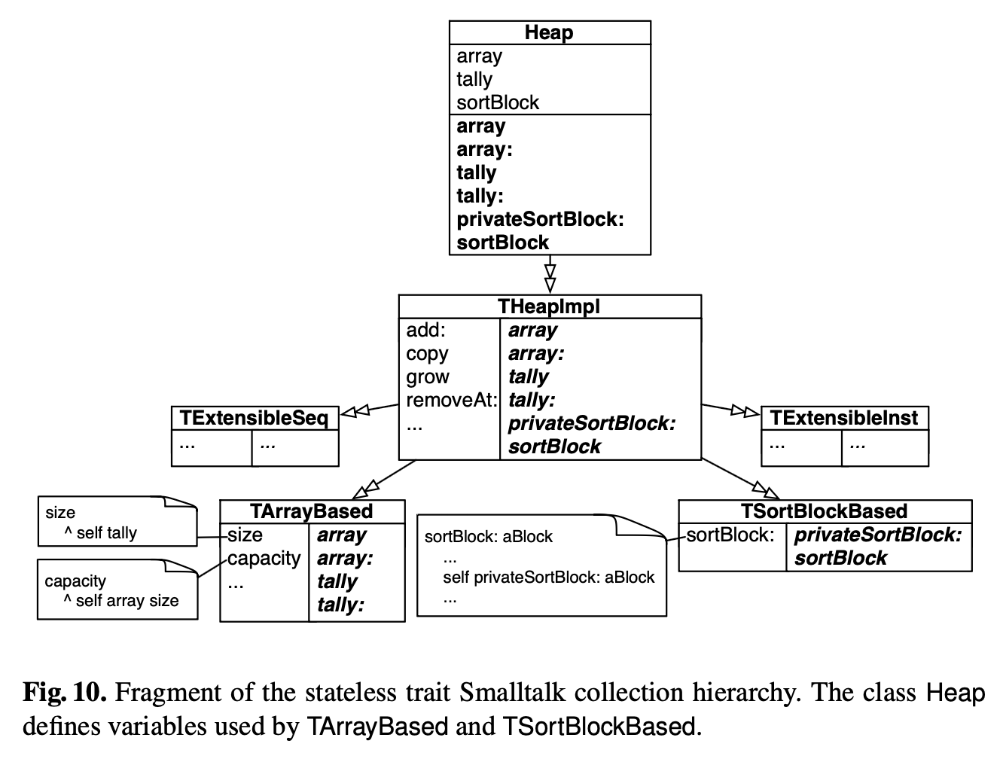

Cuerpos de métodos adjuntos como notas en la figura:

```smalltalk
size
    ^ self tally

capacity
    ^ self array size

sortBlock: aBlock
    ...
    self privateSortBlock: aBlock
    ...
```

*Descripción: la clase `Heap` define las variables `array`, `tally` y `sortBlock`, y los métodos (resaltados en negrita en el original) `array`, `array:`, `tally`, `tally:`, `privateSortBlock:` y `sortBlock`. `Heap` usa el trait `THeapImpl`, que provee `add:`, `copy`, `grow`, `removeAt:`, … y requiere (en negrita itálica en el original) los seis accessors `array`, `array:`, `tally`, `tally:`, `privateSortBlock:` y `sortBlock`. `THeapImpl` usa a su vez `TExtensibleSeq` y `TExtensibleInst` (contenidos abreviados como "…" en el original), `TArrayBased` (provee `size`, `capacity`, …; requiere `array`, `array:`, `tally`, `tally:`; con notas `size ^ self tally` y `capacity ^ self array size`) y `TSortBlockBased` (provee `sortBlock:`; requiere `privateSortBlock:` y `sortBlock`; con nota `sortBlock: aBlock … self privateSortBlock: aBlock …`).*

Figure 10 shows a typical case arising with stateless traits where the class `Heap` must define 3 variables (`array`, `tally`, and `sortBlock`). The behaviour of this class is limited to the initialization of objects and providing accessors for each of these variables. It uses the trait `THeapImpl`, which requires all these accessors. These requirements are necessary for `THeapImpl` since it is composed of `TArrayBased` and `TSortBlockBased` which require such state. These two traits need access to the state defined in `Heap`.

Figure 11 shows how `Heap` is refactored to use stateful traits. All variables have been moved to the places where they were needed, leading to the result that `Heap` becomes empty. The variables previously defined in `Heap` are rather defined in the traits that effectively require them. `TArrayBased` defines two variables `array` and `tally`, therefore it does not need to specify any accessors as required methods. It is the same situation with `TSortBlockBased` and the variable `sortBlock`.

**Fig. 11.** Refactoring of the class `Heap` with stateful traits but keeping the trait `THeapImpl`.

```
                          ┌───────────────┐
                          │     Heap      │
                          ├───────────────┤
                          └───────┬───────┘
                                  ▽▽
                  ┌───────────────────────────────┐
                  │           THeapImpl           │
                  │  provided       │  required   │
                  ├─────────────────┼─────────────┤
                  │ add:            │             │
                  │ copy            │             │
                  │ grow            │             │
                  │ removeAt:       │             │
                  │ ...             │             │
                  └─┬───────┬───────┴──┬───────┬──┘
          ┌─────────┘       │          │       └──────────┐
          ▽▽                ▽▽         ▽▽                 ▽▽
 ┌────────────────┐ ┌──────────────────┐ ┌─────────────────┐ ┌─────────────────┐
 │ TExtensibleSeq │ │   TArrayBased    │ │ TSortBlockBased │ │ TExtensibleInst │
 │   ...  │  ...  │ │ array            │ │ sortBlock       │ │   ...  │  ...   │
 └────────────────┘ │ tally            │ ├────────────┬────┤ └─────────────────┘
                    ├──────────┬───────┤ │ sortBlock: │    │
                    │ size     │       │ │ ...        │    │
                    │ capacity │       │ └────────────┴────┘
                    │ ...      │       │
                    └──────────┴───────┘
```

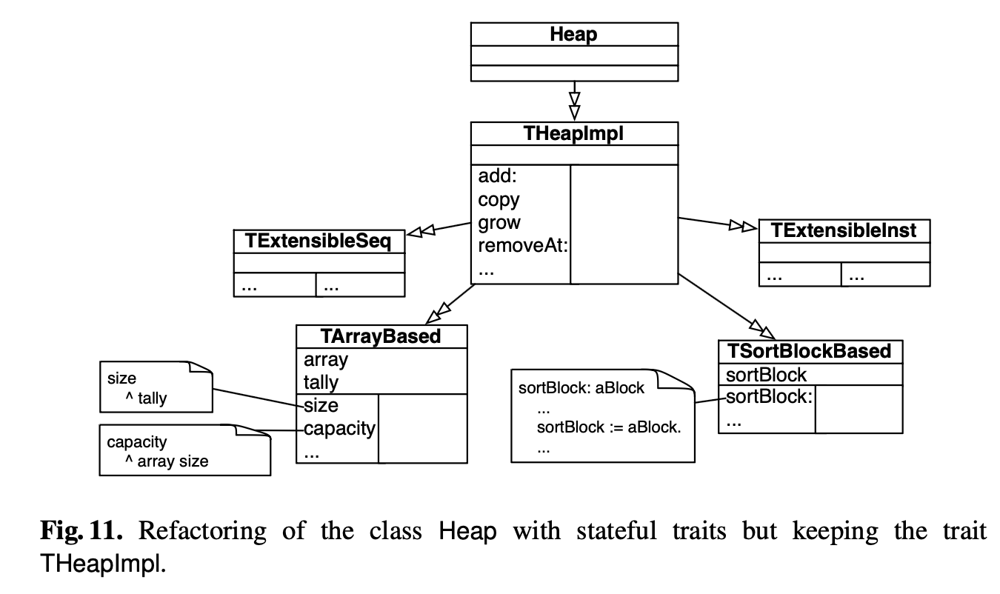

Cuerpos de métodos adjuntos como notas en la figura:

```smalltalk
size
    ^ tally

capacity
    ^ array size

sortBlock: aBlock
    ...
    sortBlock := aBlock.
    ...
```

*Descripción: mismo fragmento que la Fig. 10 refactorizado con traits stateful. La clase `Heap` queda vacía (sin variables ni métodos) y usa `THeapImpl`, que ahora provee `add:`, `copy`, `grow`, `removeAt:`, … sin ningún método requerido. `TArrayBased` define las variables `array` y `tally` y provee `size`, `capacity`, …; `TSortBlockBased` define la variable `sortBlock` y provee `sortBlock:`, …. Los cuerpos de las notas acceden a las variables directamente (`^ tally`, `^ array size`, `sortBlock := aBlock.`), sin `self` ni accessors.*

If we are sure that `THeapImpl` is not used by any other class or trait, then we can further simplify this new composition by moving the implementation of the trait `THeapImpl` to `Heap` and eliminating `THeapImpl`. Figure 12 shows the resulting hierarchy. The class `Heap` defines methods like `add:` and `copy`.

**Fig. 12.** Refactoring of the class `Heap` with stateful traits removing the trait `THeapImpl`.

```
                          ┌───────────────┐
                          │     Heap      │
                          ├───────────────┤
                          │ add:          │
                          │ copy          │
                          │ grow          │
                          │ removeAt:     │
                          │ ...           │
                          └─┬────┬───┬──┬─┘
          ┌─────────────────┘    │   │  └─────────────────┐
          ▽▽                     ▽▽  ▽▽                   ▽▽
 ┌────────────────┐ ┌──────────────────┐ ┌─────────────────┐ ┌─────────────────┐
 │ TExtensibleSeq │ │   TArrayBased    │ │ TSortBlockBased │ │ TExtensibleInst │
 │   ...  │  ...  │ │ array            │ │ sortBlock       │ │   ...  │  ...   │
 └────────────────┘ │ tally            │ ├────────────┬────┤ └─────────────────┘
                    ├──────────┬───────┤ │ sortBlock: │    │
                    │ size     │       │ │ ...        │    │
                    │ capacity │       │ └────────────┴────┘
                    │ ...      │       │
                    └──────────┴───────┘
```

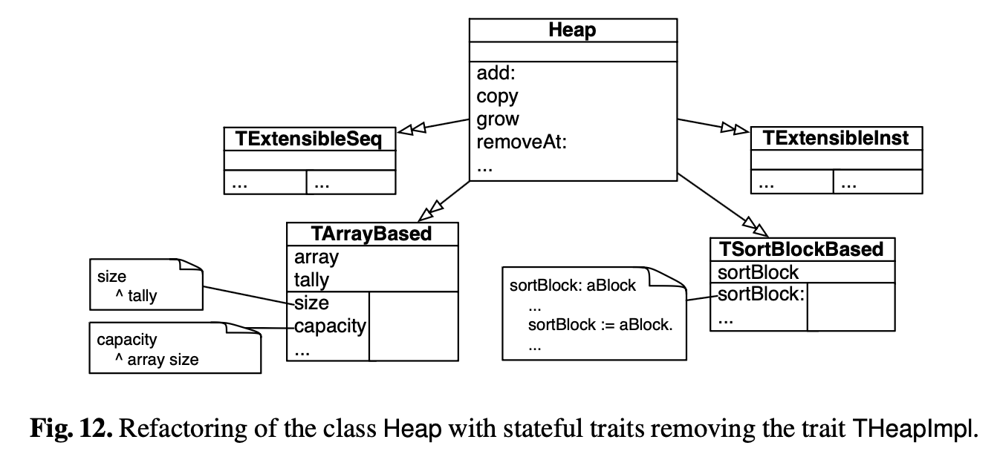

Cuerpos de métodos adjuntos como notas en la figura:

```smalltalk
size
    ^ tally

capacity
    ^ array size

sortBlock: aBlock
    ...
    sortBlock := aBlock.
    ...
```

*Descripción: variante de la Fig. 11 en la que `THeapImpl` fue eliminado: la clase `Heap` define directamente `add:`, `copy`, `grow`, `removeAt:`, … y usa los cuatro traits `TExtensibleSeq`, `TArrayBased`, `TSortBlockBased` y `TExtensibleInst`, con los mismos contenidos y notas que en la Fig. 11.*

Refactoring the Smalltalk class hierarchy using stateful traits yields multiple benefits:

- Encapsulation is preserved: Internal representation is not unnecessarily revealed to client classes.
- Fewer method definitions: Unnecessary variable accessors are avoided. Accessors that were defined in `Heap` are removed.
- Fewer method requirements: Since variables are defined in the traits that used them, we avoid specifying required accessors. Variable accessors for `THeapImpl`, `TArrayBased`, and `TSortBlockBased` are not required anymore. There is no propagation of required methods due to state usage.

## 7 Discussion

### 7.1 Flattening property

In the original stateless trait model [DNS+06], trait composition respects the flattening property, which states that a non-overridden method in a trait has the same semantics as if it were implemented directly in the class. This implies that traits can be inlined to give an equivalent class definition that does not use traits. It is natural to ask whether such an important property is preserved with stateful traits. In short, the answer is yes, though trait variables may have to be alpha-renamed to avoid name clashes.

In order to preserve the flattening property with stateful traits, we must ensure that instance variables introduced by traits remain private to the scope of that trait's methods, even when their scope is broadened to that of the composing class. This can be done in a variety of ways, depending on the scoping mechanisms provided by the host language. Semantically, however, the simplest approach is to alpha-rename the private instance variables of the trait to names that are unique in the client's scope. Technically, this could be achieved by the common technique of name-mangling, i.e., by prepending the trait's name to the variable's name when inserting it in the client's scope. Renaming and merging are also consistent with flattening, since variables can simply be renamed or merged in the client's scope.

### 7.2 Limiting change impact

Any approach to composing software is bound to be fragile with respect to certain kinds of change: if a feature that is used by several clients changes, the change will affect the clients. Extending a trait so that it provides additional methods may well affect clients by introducing new conflicts. However, the design of trait composition based on explicit resolution ensures that such changes cannot lead to implicit and unexpected changes in the behaviour of direct or indirect clients. A direct client can generally resolve a conflict without changing or introducing any other traits, so no ripple effect will occur [DNS+06].

In stateful traits adding a variable to a trait does not affect clients because variables are private. Removing or renaming a variable may require its direct clients to be adapted only if this variable is explicitly accessed by these clients. However, once the direct clients have been adapted, no ripple effect can occur in indirect clients. By avoiding required method propagation, stateful traits limit the effect of changes.

### 7.3 About variable access

By default a trait variable is private, thereby enforcing black-box reuse. At the same time we offer an operator enabling the direct client to access the private variables of the trait. This may appear to be a violation of encapsulation [Sny86]. However this approach is consistent with our vision that traits serve as building blocks for composing classes, whether in a black-box or a white-box fashion. Furthermore it is consistent with the principle that the client of a trait is in control of the composition. It is precisely this fact that ensures that the effects of changes do not propagate to remote corners of the class hierarchy.

## 8 Related work

We briefly review some of the numerous research activities that are relevant to stateful traits.

**Self.** The prototype based language Self [US87] does not have a notion of class. Conceptually, each object defines its own format, methods, and delegation relations. Objects are derived from other objects by cloning and modification. Objects can have one or more parent objects; messages that are not found in the object are looked for and delegated to a parent object. Self is based around the notion of slots, which unifies methods and instance variables.

Self uses trait objects to factor out common features [UCCH91]. Nothing prevents a trait object from also containing state. Similar to the notion of traits presented here, these trait objects are essentially groups of methods. But unlike our traits, Self's trait objects do not support specific composition operators; instead, they are used as ordinary parent objects.

**Interfaces with default implementation.** Mohnen [Moh02] proposed an extension of Java in which interfaces can be equipped with a set of default implementations of methods. As such, classes that implement such an interface can explicitly state that they want to use the default implementation offered by that interface (if any). If more than one interface mentions the same method, a method body must be provided. Conflicts are flagged automatically, but require the developer to resolve them manually. State cannot be associated with the interfaces. Scala [sca] also supports traits i.e., partially defined interfaces. While the composition of traits in Scala does not follow exactly the one in stateless traits, traits in Scala cannot define state.

**Mixins.** Mixins [BC90] use the ordinary single inheritance operator to extend various parent classes with a bundled set of features. Although this inheritance operator is well-suited for deriving new classes from existing ones, it is not necessarily appropriate for composing reusable building blocks. Specifically, because mixin composition is implemented using single inheritance, mixins are composed linearly. This gives rise to several problems. First, a suitable total ordering of features may be difficult to find, or may not even exist. Second, "glue code" that exploits or adapts the linear composition may be dispersed throughout the class hierarchy. Third, the resulting class hierarchies are often fragile with respect to change, so that conceptually simple changes may impact many parts of the hierarchy [DNS+06].

**Eiffel.** Eiffel [Mey92] is a pure object-oriented language that supports multiple inheritance. Features, i.e., method or instance variables, may be multiply inherited along different paths. Eiffel provides the programmer mechanisms that offer a fine degree of control over whether such features are shared or replicated. In particular, features may be *renamed* by the inheriting class. It is also possible to *select* a particular feature in case of naming conflicts. Selecting a feature means that from the context of the composing subclass, the selected feature takes precedence over the possibly conflicting ones.

Despite the similarities between the inheritance scheme in Eiffel and the composition scheme of stateful traits, there are some significant differences:

- *Renaming vs. aliasing* – In Eiffel, when a subclass is created, inherited features can be renamed. Renaming a feature has the same effect as (i) giving a new name to this feature and (ii) changing all the references to this feature. This implies a kind of mapping to be performed when a renamed method is accessed through the static type of the superclass.

  For instance, let's assume a class `Component` defines a method `update`. A subclass `GraphicalComponent` renames `update` into `repaint`, and redefines this `repaint` with a new implementation. The following code illustrates this situation:

  ```eiffel
  class Component
  feature
      update is
          do
              print ('1')
          end
  end
  ```

  ```eiffel
  class GraphicalComponent
  inherit
      Component
          rename
              update as repaint
          redefine
              repaint
          end
  repaint is
      do
          print ('2')
      end
  end
  ```

  In essence, the method `repaint` acts as an override of `update`. It means that if `update` is sent to an instance of `GraphicalComponent`, then `repaint` is called. This is illustrated in the following example:

  ```eiffel
  f (c: Component) is
      do
          c.update
      end

  f (create{GraphicalComponent})
  ==> 2
  ```

  This is the way Eiffel preserves polymorphism while supporting renaming.

  In stateful traits, aliasing a method or granting access to a variable assigns a new name to it. The method or the variable can therefore still be invoked or accessed through its original name.

- *Merging variables* – In contrast to to stateful traits, variables can be merged in Eiffel only if they provide from a common superclass. In stateful traits, variables provided by two traits can be merged regardless of how these traits are formed.

**Jigsaw.** Jigsaw [Bra92] has a module system in which a module is a self-referential scope that binds names to values (i.e., constant and functions). A module acts as a class (object generator) and as a coarse-grained structural software unit. Modules can be nested, therefore a module can define a set of classes. A set of operators is provided to compose modules. These operators are instantiation, merge, override, rename, restrict, and freeze.

Although there are some differences between the definition of a Jigsaw module and stateful traits, for instance with the rename operator, the more significant differences are in motivation and setting. Jigsaw is a framework for defining modular languages. Jigsaw supports full renaming, and assigns a semantic interpretation to nesting. In Jigsaw, a renaming is equivalent to a textual replacement of all occurrences of the attribute. The *rename* operator distributes over *override*. It means that Jigsaw has the following property:

*(m1 rename a to b) override (m2 rename a to b) = (m1 override m2) rename a to b*

Traits are intended to supplement existing languages by promoting reuse in the small, do not declare types, infer their requirements, and do not allow renaming. Stateless traits do not assign any meaning to nesting. Stateful traits are sensitive to nesting only to the extent that instance variables are private to a given scope. The Jigsaw operation set also aims for completeness, whereas in the design of traits we sacrifice completeness for simplicity.

A notable difference between Jigsaw and stateful traits is with the merging of variables. In Jigsaw, a module can have state, however variables cannot be shared between modules. With stateful traits the same variable can be accessed by the traits that use it. A Jigsaw module acts as a black-box. A module encapsulates its bindings and cannot be opened. While we value black-box composition, stateful traits do not take such a restrictive approach, but rather let the client assume responsibility for the composition, while being protected from the impact of changes.

It is worth mentioning typing issues raised when implementing Jigsaw. Bracha [Bra92, Chapter 7] pointed out that the difficulty in implementing inheritance in Jigsaw (which is operator-based) stems from the interaction between structural subtyping and the algebraic properties of the inheritance operators (e.g., *merge* and *override*).

**Fig. 13.** `E` and `F` are structurally equivalent but may have different representations.

```
 ┌───┐          ┌───┐          ┌───┐
 │ A │          │ B │          │ D │
 └───┘          └───┘          └───┘
 ┌───┐
 │ C │                ┌───┐          ┌───┐
 └───┘                │ E │          │ F │
                      └───┘          └───┘

 Flechas de subclase (subclase ─▷ superclase, punta abierta):
   C ─▷ A     C ─▷ B
   E ─▷ D     E ─▷ C
   F ─▷ D     F ─▷ A     F ─▷ B
```

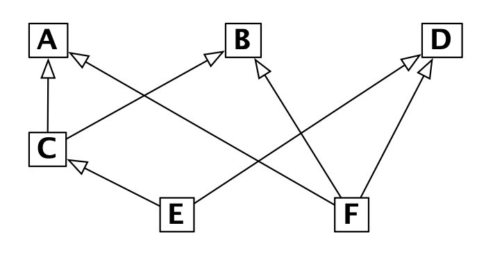

*Descripción: grafo de herencia con seis clases. `A`, `B` y `D` en la fila superior; `C` debajo de `A`; `E` y `F` en la fila inferior. Las flechas de punta triangular abierta apuntan de cada subclase a sus superclases: `C` hereda de `A` y `B`; `E` hereda de `D` y `C`; `F` hereda de `D`, `A` y `B`. Las flechas de `E` y `F` se cruzan en el original al atravesar el diagrama hacia las clases superiores.*

For example, let's consider the following classes *A*, *B*, *C*, *D*, *E* and *F* where *C* is a subclass of *A* and *B*. *E* is a subclass of *D* and *C*. *F* is a subclass of *D*, *A* and *B*. We have *C = AB*, *E = DC* and *F = DAB* where in *C*<sub>new</sub> *= C₁C₂...Cₙ* the superclasses of *C*<sub>new</sub> are denoted *Cᵢ*. (See Figure 13.) Expanding the definitions of all names (as dictated by structural typing), one finds that by associativity *E = F*. This equivalence dictates that all three classes have the same type, so that they can be used interchangeably. This in turn requires that all three have the same representation. However, using the techniques of C++ (Section 5.3), these three classes have different representations. This problem is avoided in traits where a trait does not define a type.

**Cecil.** Cecil [Cha92] is a purely object-oriented language that combines a classless object model, a kind of dynamic inheritance and an optional static type checking. Cecil's static type system distinguishes between subtyping and code inheritance even if the more common case is when the subtyping hierarchy parallels the inheritance hierarchy. Cecil supports multiple inheritance. Inheriting from the same ancestor more than once, whether directly or indirectly, has no effect other than to place the ancestor in relation to other ancestors: Cecil has no repeated inheritance. Inheritance in Cecil requires a child to accept all of the fields and methods defined in the parents. These fields and methods may be overridden in the child, but facilities such as excluding fields or methods from the parents or renaming them as part of the inheritance are not present in Cecil. This is an important difference with respect to stateful traits.

## 9 Conclusion

Stateless traits offer a simple compositional approach for structuring object-oriented programs. A trait is essentially a group of pure methods that serves as a building block for classes and as a primitive unit of code reuse. However this simple model suffers from several limitations, in particular (i) trait reusability is impacted because the required interface is typically cluttered with uninteresting required accessors, (ii) client classes are forced to implement boilerplate glue code, (iii) the introduction of new state in a trait propagates required accessors to all client classes, and (iv) public accessors break encapsulation of the client class.

We have proposed a way to make traits *stateful* as follows: First, traits can have private variables. Second, classes or traits composed from traits may use the *variable access operator* to (i) access variables of the used traits, (ii) attribute local names to those variables, and (iii) merge variables of multiple used traits, when this is desired. The flattening property can be preserved by alpha-renaming variable names that clash.

Stateful traits offer numerous benefits: There is no unnecessary propagation of required methods, traits can encapsulate their internal representation, and the client can identify the essential required methods more clearly. Duplicated boilerplate glue code is no longer needed. A trait encapsulates its own state, therefore an evolving trait does not break its clients if its public interface remains unmodified.

Stateful traits represent a relatively modest extension to single-inheritance languages that enables the expression of classes as compositions of fine-grained, reusable software components. An open question for further study is whether trait composition can subsume class-based inheritance, leading to a programming language based on composition rather than inheritance as the primary mechanism for structuring code following Jigsaw design.

## Acknowledgment

We gratefully acknowledge the financial support of the Swiss National Science Foundation for the project "A Unified Approach to Composition and Extensibility" (SNF Project No. 200020-105091/1), and of Science Foundation Ireland and Lero — the Irish Software Engineering Research Centre.

We also thank Nathanel Schärli, Gilad Bracha, Bernd Schoeller , Dave Thomas and Orla Greevy for their valuable discussions and comments. Thanks to Ian Joyner for his help with the MacOSX Eiffel implementation.

## References

- **[BC90]** Gilad Bracha and William Cook. Mixin-based inheritance. In *Proceedings OOPSLA/ECOOP '90, ACM SIGPLAN Notices*, volume 25, pages 303–311, October 1990.
- **[BGG+02]** Lars Bak, Gilad Bracha Steffen Grarup, Robert Griesemer, David Griswold, and Urs Hölzle. Mixins in Strongtalk. In *ECOOP '02 Workshop on Inheritance*, June 2002.
- **[Bra92]** Gilad Bracha. *The Programming Language Jigsaw: Mixins, Modularity and Multiple Inheritance*. PhD thesis, Dept. of Computer Science, University of Utah, March 1992.
- **[BSD03]** Andrew P. Black, Nathanael Schärli, and Stéphane Ducasse. Applying traits to the Smalltalk collection hierarchy. In *Proceedings OOPSLA'03 (International Conference on Object-Oriented Programming Systems, Languages and Applications)*, volume 38, pages 47–64, October 2003.
- **[CDG+92]** Luca Cardelli, Jim Donahue, Lucille Glassman, Mick Jordan, Bill Kalsow, and Greg Nelson. Modula-3 language definition. *ACM SIGPLAN Notices*, 27(8):15–42, August 1992.
- **[Cha92]** Craig Chambers. Object-oriented multi-methods in cecil. In O. Lehrmann Madsen, editor, *Proceedings ECOOP '92*, volume 615 of *LNCS*, pages 33–56, Utrecht, the Netherlands, June 1992. Springer-Verlag.
- **[DNS+06]** Stéphane Ducasse, Oscar Nierstrasz, Nathanael Schärli, Roel Wuyts, and Andrew Black. Traits: A mechanism for fine-grained reuse. *ACM Transactions on Programming Languages and Systems*, 28(2):331–388, March 2006.
- **[for]** The fortress language specification. http://research.sun.com/projects/plrg/fortress0866.pdf.
- **[FR03]** Kathleen Fisher and John Reppy. Statically typed traits. Technical Report TR-2003-13, University of Chicago, Department of Computer Science, December 2003.
- **[IKM+97]** Dan Ingalls, Ted Kaehler, John Maloney, Scott Wallace, and Alan Kay. Back to the future: The story of Squeak, A practical Smalltalk written in itself. In *Proceedings OOPSLA '97, ACM SIGPLAN Notices*, pages 318–326. ACM Press, November 1997.
- **[Jik]** The jikes research virtual machine. http://jikesrvm.sourceforge.net/.
- **[Kro85]** S. Krogdahl. Multiple inheritance in simula-like languages. In *BIT 25*, pages 318–326, 1985.
- **[Mey92]** Bertrand Meyer. *Eiffel: The Language*. Prentice-Hall, 1992.
- **[Moh02]** Markus Mohnen. Interfaces with default implementations in Java. In *Conference on the Principles and Practice of Programming in Java*, pages 35–40. ACM Press, Dublin, Ireland, jun 2002.
- **[NDS06]** Oscar Nierstrasz, Stéphane Ducasse, and Nathanael Schärli. Flattening Traits. *Journal of Object Technology*, 5(4):129–148, May 2006.
- **[Pyt]** Python. http://www.python.org.
- **[sca]** Scala home page. http://lamp.epfl.ch/scala/.
- **[SD05]** Charles Smith and Sophia Drossopoulou. Chai: Typed traits in Java. In *Proceedings ECOOP 2005*, 2005.
- **[SDNB03]** Nathanael Schärli, Stéphane Ducasse, Oscar Nierstrasz, and Andrew Black. Traits: Composable units of behavior. In *Proceedings ECOOP 2003 (European Conference on Object-Oriented Programming)*, volume 2743 of *LNCS*, pages 248–274. Springer Verlag, July 2003.
- **[SE90]** Bjarne Stroustrup and Magaret A. Ellis. *The Annotated C++ Reference Manual*. Addison Wesley, 1990.
- **[SG99]** Peter F. Sweeney and Joseph (Yossi) Gil. Space and time-efficient memory layout for multiple inheritance. In *Proceedings OOPSLA '99*, pages 256–275. ACM Press, 1999.
- **[Sla]** Slate. http://slate.tunes.org.
- **[Sny86]** Alan Snyder. Encapsulation and inheritance in object-oriented programming languages. In *Proceedings OOPSLA '86, ACM SIGPLAN Notices*, volume 21, pages 38–45, November 1986.
- **[UCCH91]** David Ungar, Craig Chambers, Bay-Wei Chang, and Urs Hölzle. Organizing programs without classes. *LISP and SYMBOLIC COMPUTATION: An international journal*, 4(3), 1991.
- **[US87]** David Ungar and Randall B. Smith. Self: The power of simplicity. In *Proceedings OOPSLA '87, ACM SIGPLAN Notices*, volume 22, pages 227–242, December 1987.

---

**FIN DEL ARCHIVO FUENTE — Stateful Traits**
